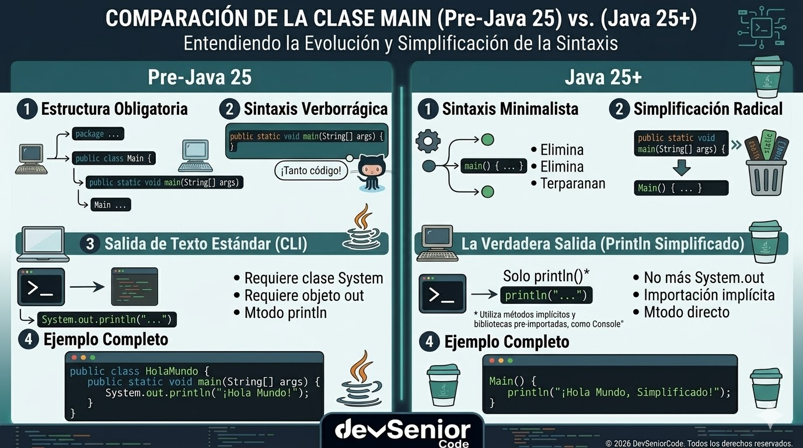

# Unidad 1 - Clase 1: Configuración del Entorno y Primeros Pasos

**Objetivo**: Dominar la arquitectura integral de la plataforma Java, comprender su relevancia estratégica en la industria actual (especialmente en entornos de IA y Big Data) y configurar un ecosistema de desarrollo de alto rendimiento optimizado para Java 25.

## 🚀 Setup de Clase

Para un Desarrollador Senior, el entorno no es solo una herramienta, es una extensión de su capacidad lógica. Sigue este orden estrictamente para garantizar la compatibilidad total con las nuevas características de Java 25:

### 1. Instalación y Configuración del JDK 25 (El Motor)

Java 25 requiere un entorno limpio para ejecutar las nuevas JEPs de clases implícitas y métodos de instancia.

- **Descarga**: Dirígete a [Adoptium](https://adoptium.net/es) y descarga el binario correspondiente a tu sistema operativo (x64 o AArch64 para Mac M1/M2/M3).
- **Instalación**:
  - **Windows**: Ejecuta el instalador `.msi`. Asegúrate de marcar la opción _"Set JAVA_HOME variable"_ y _"Add to PATH"_.
  - **macOS/Linux**: Descomprime el archivo en /Library/Java/JavaVirtualMachines/ o /usr/lib/jvm/.
  - **Verificación**: Abre una terminal y ejecuta `java -version`. Debes ver "openjdk 25" para proceder.

### 2. Instalación de Visual Studio Code (La Cabina)

VS Code se ha consolidado como el editor preferido para microservicios y scripting moderno por su ligereza y soporte de LSP.

- **Descarga**: Ve a [code.visualstudio.com](https://code.visualstudio.com/) y descarga la versión estable.
- **Configuración Inicial**: Al abrirlo por primera vez, utiliza el atajo `Ctrl+Shift+P` (o `Cmd+Shift+P`) y busca _"Shell Command: Install 'code' command in PATH"_ para poder abrir proyectos desde la terminal.
- **Optimización**: En los settings (`JSON`), asegúrate de tener activada la opción `"java.configuration.runtimes"`, apuntando a tu instalación de JDK 25 como el runtime por defecto.

### 3. Instalación de Extensiones Críticas (El Arsenal)

Para que VS Code se comporte como un IDE de alto nivel, instalaremos las extensiones mediante el Marketplace (`Ctrl+Shift+X`):

- **Extension Pack for Java (Microsoft)**: Busca _"Java Extension Pack"_ e instálalo. Este paquete es un _"meta-pack"_ que incluye soporte para lenguaje, debugger, build tools (Maven/Gradle) y testing.
- **Error Lens (Alexander)**: Busca _"Error Lens"_ e instálalo. Esta extensión resalta errores y warnings directamente en la línea de código, evitando que tengas que revisar constantemente la pestaña _"Problems"_.

## 🧠 Inmersión Teórica: La Plataforma Java en el Siglo XXI

### 1. ¿Qué es la Programación y el Arte de ser Programador Senior?

La **programación** trasciende la mera escritura de instrucciones. Es el arte de la **Modelización de la Realidad**: tomamos problemas del mundo físico, financiero o científico y los abstraemos en modelos computacionales (Algoritmos).


[](https://youtu.be/cDA3_5982h8)

En la era de la IA, el programador ya no es solo un "escritor de código", sino un **Auditor de Lógica**. Con herramientas de generación de código, el valor del programador Senior reside en su capacidad para validar la arquitectura, la seguridad y la eficiencia del software generado.

Para ser un **buen programador** en este nuevo paradigma, se requieren facultades de _"Pensamiento Sistémico"_:

1. **Pensamiento Lógico y Abstracción**: No solo resolver el problema, sino entender cómo ese componente afecta a todo el sistema. Es la diferencia entre un _"script"_ y una _"arquitectura"_.
2. **Aprendizaje Continuo (The 6-Month Cycle)**: Java 25 es el resultado de una evolución acelerada. Un profesional debe dedicar al menos el 20% de su tiempo a la investigación (R&D) para no quedar obsoleto.
3. **Mantenibilidad y Clean Code**: El código se lee 10 veces más de lo que se escribe. Un buen programador escribe para humanos, no solo para máquinas.
4. **Resiliencia y Debugging**: Entender que el error es una fuente de información. Un Senior no _"parchea"_, sino que encuentra la causa raíz (_Root Cause Analysis_).
5. **Ética y Seguridad**: En un mundo impulsado por datos, el programador es el guardián de la integridad de la información.

### 2. ¿Qué es Java hoy? (Más allá del lenguaje)

Java no es simplemente un lenguaje de programación; es un **ecosistema de ejecución masivo**. En el contexto moderno, se define como una plataforma multipropósito, tipada de forma estática y orientada a objetos (aunque cada vez más funcional), que se ejecuta sobre la **Java Virtual Machine (JVM)**.

Su importancia en el desarrollo actual radica en tres pilares:

1. **Escalabilidad Crítica**: Es el motor de sistemas que manejan miles de millones de transacciones (Fintech, E-commerce como Amazon/Netflix).
2. **Seguridad de Memoria**: A diferencia de C++, Java gestiona la memoria de forma automática, eliminando clases enteras de vulnerabilidades de seguridad.
3. **Modernización Continua (Cadencia de 6 meses)**: Desde Java 9, el lenguaje evoluciona rápidamente. Java 25 representa la cúspide de esta evolución, integrando características como **Virtual Threads** (Project Loom) que permiten manejar millones de solicitudes concurrentes con hardware mínimo.

### 3. Disección del Triunvirato: JDK, JRE y JVM


Un desarrollador debe conocer los componentes internos que garantizan el rendimiento:

- **JVM (Java Virtual Machine)**: No solo ejecuta código; lo optimiza. El **JIT (Just-In-Time Compiler)** analiza qué partes del código se usan más (hotspots) y las recompila a código máquina altamente optimizado durante la ejecución. Java 25 mejora el _"Tiered Compilation"_, haciendo que las aplicaciones alcancen su máximo rendimiento mucho más rápido.
- **JRE (Java Runtime Environment)**: Históricamente era un instalador pesado. Hoy, gracias a la **Modularidad (Project Jigsaw)**, el JRE se construye a medida. Usamos la herramienta `jlink` para incluir solo los módulos que nuestra app necesita, reduciendo la superficie de ataque y el consumo de recursos.
- **JDK (Java Development Kit)**: Incluye herramientas de diagnóstico como `jdb` (debugger), `jmap` (análisis de memoria) y `jstack` (análisis de hilos). Un Senior domina estas herramientas para diagnosticar cuellos de botella en producción.

## 🔍 Deep Dive: La Revolución del Lanzamiento y la API IO

La transición de Java hacia un lenguaje más _"amigable"_ no es estética, es estratégica. El objetivo de Java 25 es capturar el mercado de scripts y ciencia de datos donde Python domina, pero ofreciendo la seguridad de tipos de Java.

### 1. El Flujo de Eventos: De la Rigidez a la Flexibilidad


### 2. Clases Declaradas Implícitamente (Implicitly Declared Classes)

Históricamente, el nombre del archivo debía coincidir con el de la clase (`public class MyFile`). En Java 25, si omitimos la declaración, la JVM asume que el archivo es la clase. Internamente, se crea un objeto de una clase anónima que hereda de `Object`. Esto permite que métodos como `println` parezcan funciones globales, cuando en realidad son métodos de la instancia que la JVM ha creado para nosotros.

### 3. El fin del modificador `static` en el arranque

¿Por qué es importante el **Instance Main Method**? Al eliminar `static`, permitimos que el punto de entrada de la aplicación tenga un ciclo de vida de objeto real. Esto facilita la integración con frameworks de Inyección de Dependencias y permite que las variables globales del script sean campos de instancia (`instance fields`), lo cual es mucho más seguro y fácil de testear que el estado global estático.

### 4. Disección de `java.lang.IO`: El nuevo estándar de E/S

Antes, `System.out.println` era la única forma. Sin embargo, `System.out` es un `PrintStream` que arrastra legacy de hace 30 años. La nueva clase `java.lang.IO` (introducida en JEP 495) ofrece:

- **Importación Estática Automática**: La JVM inyecta import static `java.lang.IO.*` en cada clase implícita.
- **Abstracción de Flujos**: `println()` y `print()` son más inteligentes al manejar diferentes tipos de datos y codificaciones de caracteres, preparando el terreno para una consola más interactiva en futuras versiones.



## 📖 Conceptos del lenguaje

### Sentencias (Statements)

Son las instrucciones que le das a la computadora para que realice una acción. La mayoría de las sentencias en Java terminan con un **punto y coma** (`;`).

```Java
int edad = 30; // Esta es una sentencia
println("Hola"); // Esta es otra sentencia
```

### Bloques de código (`{ }`)

Son grupos de una o más sentencias encerrados entre llaves `{ }`. Los bloques se usan para agrupar código que pertenece a una clase, un método, una estructura condicional (`if`, `else`), un bucle (`for`, `while`), etc. Definen el alcance de las variables locales.

  ```Java
  public class MiClase { // Este es el bloque de la clase

      public static void main(String[] args) { // Este es el bloque del método main
          // Sentencias dentro del bloque main
          if (true) { // Este es el bloque de un if
              // Sentencias dentro del bloque if
          } // Fin del bloque if
      } // Fin del bloque main
  } // Fin del bloque de la clase
  ```

### Nombres

Java es **sensible a mayúsculas y minúsculas**. Esto significa que `miVariable` es diferente de `mivariable`, `System` es diferente de `system`, y `main` es diferente de `Main`. Debes escribir las palabras clave, nombres de variables y nombres de clases exactamente como están definidas.

#### Palabras clave (keywords)

Java tiene un conjunto de [palabras reservadas](https://www.abrirllave.com/java/palabras-clave.php) que tienen un significado especial para el compilador (ej. `public`, `static`, `void`, `class`, `int`, `if`, `for`, etc.). No puedes usar estas palabras clave como nombres de variables, métodos o clases.

#### Identificadores

Son los nombres que le das a tus variables, métodos, clases, etc. Deben seguir ciertas reglas (empezar con letra, `_` o `$`, no contener espacios, no ser palabras clave). Se recomienda usar nombres descriptivos.

### Comentarios

Los comentarios son notas que los programadores añaden a su código para hacerlo más claro y comprensible, tanto para ellos mismos en el futuro como para otros desarrolladores. El compilador de Java **ignora por completo** los comentarios; no afectan cómo se ejecuta el programa.

Hay tres tipos principales de comentarios en Java:

- **Comentarios de una sola línea**: Comienzan con dos barras inclinadas (`//`) y continúan hasta el final de la línea. Son útiles para explicaciones cortas o para comentar una sola línea de código.

  ```Java
  int edad = 30; // Declara una variable para almacenar la edad
  // println("Esta línea está comentada y no se ejecutará");
  ```

- **Comentarios de bloque (o multi-línea)**: Comienzan con `/*` y terminan con `*/`. Pueden abarcar varias líneas y son útiles para explicaciones más largas o para comentar secciones completas de código temporalmente.

  ```Java
  /*
  Este es un comentario de bloque.
  Puede usarse para describir la funcionalidad
  de una sección de código o un método.
  */
  double precioTotal = precioUnitario * cantidad;
  ```

- **Comentarios de documentación (Javadoc)**: Comienzan con `/**` y terminan con `*/`. Se usan para generar documentación automática del código.

  ```Java
  /**
   * Este método suma dos números enteros.
   * @param a El primer número a sumar.
   * @param b El segundo número a sumar.
   * @return La suma de a y b.
   */
  int sumar(int a, int b) {
      return a + b;
  }
  ```

**¿Por qué usar comentarios?**

- **Claridad**: Explican la lógica compleja o las decisiones de diseño.
- **Documentación**: Ayudan a otros (y a tu futuro yo) a entender rápidamente qué hace el código.
- **Depuración**: Puedes "comentar" temporalmente líneas de código para probar si son la causa de un error.

Acostúmbrate a usar comentarios de forma regular para mantener tu código bien documentado y fácil de entender.

## 💻 Laboratorio de Aplicación Práctica

- **Escenario de Negocio**: Una firma de corretaje de bolsa necesita un script de auditoría que se ejecute en los servidores de borde (Edge Computing). El script debe verificar la salud de la JVM y el estado de la memoria para decidir si el nodo puede procesar más transacciones de alta frecuencia.

- 💡 **VS Code Pro-Tip**: Para maximizar la productividad, utiliza el comando `Java: Clean Java Language Server Workspace` si notas que el autocompletado se vuelve lento. Esto suele ocurrir tras actualizar versiones del JDK o cambiar configuraciones críticas de entorno.

### 🚀 Reto de Consolidación: "Mi Primer Script Moderno"

Este ejercicio busca confirmar que tu entorno está correctamente configurado y que comprendes la nueva estructura de Java 25. No busques la complejidad, busca la precisión.

1. **Verificación de Entorno**: Ejecuta `java --version`. Si no ves "25", el laboratorio no es válido.
2. **Creación**: Crea un archivo `MasterSetup.java`. No escribas class `MasterSetup { ... }`.
3. **Implementación**:
    - Escribe un método `void main()`.
    - Usa `println()` para imprimir un saludo personalizado.
    - Usa `print()` para imprimir el número de núcleos disponibles: `Runtime.getRuntime().availableProcessors()`.

    ```java
    void main() {
        println("Hola, mi nombre es César");
        print("Cores: ");
        print(Runtime.getRuntime().availableProcessors());
        println();
    }
    ```

4. **Ejecución**: Usa el comando de ejecución directa: `java MasterSetup.java`.

## 💪 Atrévete a poner a prueba tu conocimiento

Los ejercicios propuestos son tu oportunidad para consolidar lo aprendido y descubrir el verdadero poder de Java 25. Resolverlos te ayudará a dominar el entorno, entender la nueva sintaxis y desarrollar habilidades prácticas que te diferenciarán como programador. No te quedes solo en la teoría: cada reto es un paso hacia la excelencia profesional. ¡Acepta el desafío y demuestra de lo que eres capaz!

### 1. Siendo cortes

Usando como ejemplo el archivo HolaMundo, crea un archivo llamado `SaludoPersonal` que imprima: `Cesar, bienvenido al curso de Programación en Java!!!`

## 2. Poniéndole el rostro a la programación

Escriba un archivo llamado `ImprimirCara` que imprima una cara usando caracteres de texto.  

```text
 @@@@@@@
@| O O |@
(|  ^  |)
 | [_] |
 +-----+
```

## 3. Un mundo de joyas

Escriba un archivo llamado `ImprimirDiamante` que imprima un diamante usando caracteres de texto.  

```text
   *
  ***
 *****
*******
 *****
  ***
   *
```

## Ejercicio 4

Pida tres palabras por parte del usuario y la salida de las tres palabras en la pantalla.
Por ejemplo,

```text
Introduzca palabra 1: Adiós
Introduzca palabra 2: y
Introduzca palabra 3: Hola
Adiós y Hola
```

## 📚 Recursos de Maestría

- [JEP 495: Implicitly Declared Classes and Instance Main Methods](https://openjdk.org/jeps/495): La biblia técnica de la simplificación de Java. Explica la motivación detrás de eliminar la verbosidad en los puntos de entrada.
- [JEP 458: Launch Multi-File Source-Code Programs](https://openjdk.org/jeps/458): Detalla cómo Java 25 puede orquestar aplicaciones de múltiples archivos tratándolos como scripts, eliminando la necesidad de build-tools pesadas para tareas pequeñas.
- [Inside Java: The Java Launch Protocol](https://inside.java/): Podcast y blog oficial de los desarrolladores de Java (Brian Goetz, Mark Reinhold). Imprescindible para entender el "por qué" de cada cambio.
- [Visual Studio Code: Java Professional Setup](https://code.visualstudio.com/docs/java/java-tutorial): Documentación sobre cómo transformar VS Code en un IDE de grado profesional con shortcuts y configuraciones de debugging.
- [Adoptium (Temurin) Project](https://adoptium.net/): La fuente más confiable de binarios OpenJDK certificados por la comunidad y listos para producción.
- [HotSpot JVM Internals Wiki](https://openjdk.org/groups/hotspot/): Para aquellos que desean entender la gestión de registros, la optimización de bucles y la ingeniería interna de la máquina virtual.

## 🎬 Videos adicionales (Recomendados)

### Por esto te cuesta programar

[](https://youtu.be/c3NRsitewTc)

## El problema de "Aprender" programación

[](https://youtu.be/d1XlxVm2sA0)

## 5 Errores al Aprender a Programar

[](https://youtu.be/kgxWf1GFyVI)

## Lógica de programación

[](https://www.youtube.com/watch?v=OyPJpud974E&list=PLeJNEiFH8nIBf9UxeJ1WvjdztOKKrdtOI)

---

**¡Felicidades!** Has dado un gran paso en tu viaje de programación en Java. Ahora, ¡a practicar!
