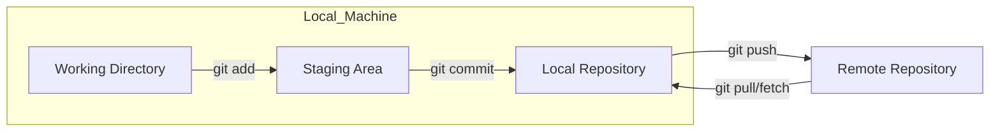
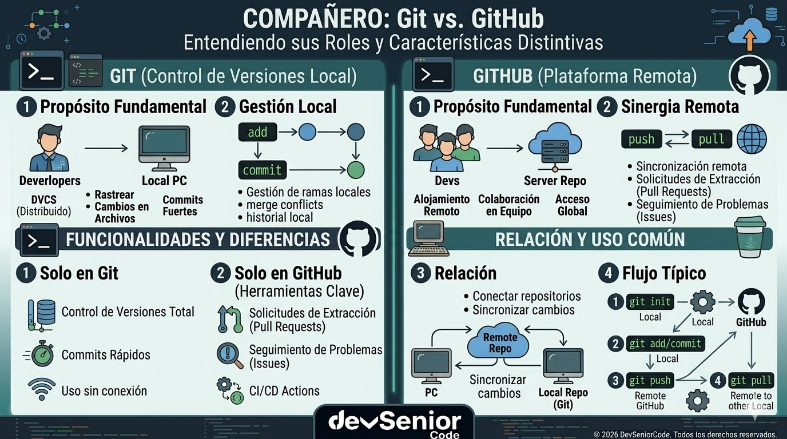

# Unidad 1 - Clase 2: Git y GitHub en la Era del Desarrollo Distribuido

**Objetivo**: Establecer una base sólida de trazabilidad y colaboración mediante el dominio de Git y GitHub. El estudiante aprenderá a gestionar el ciclo de vida del código de un proyecto Java 25, configurando entornos profesionales en VS Code y aplicando estándares de industria para la auditoría y persistencia de software.

## 🚀 Setup de Clase

Para un Desarrollador Senior, el entorno debe ser predecible y automatizado. Configuraremos primero el motor local (Git) y luego la plataforma de integración (GitHub).

### 1. Instalación de Git

Asegúrate de tener la versión 2.48 o superior. A continuación, los métodos recomendados para cada sistema operativo utilizando gestores de paquetes:

#### A. Windows

Para un control total sobre las opciones de compatibilidad, utilizaremos el instalador oficial:

1. **Descarga**: Accede a git-scm.com y descarga el instalador "64-bit Git for Windows Setup".
2. **Ejecución**: Ejecuta el .exe con permisos de administrador.
3. **Configuraciones Críticas**:
    - **Editor**: Selecciona _"Use Visual Studio Code as Git's default editor"_.
    - **PATH**: Asegúrate de que esté seleccionada la opción _"Git from the command line and also from 3rd-party software"_ (recomendado).
    - **Line Endings**: Selecciona _"Checkout Windows-style, commit Unix-style line endings"_. Esto es vital en Java para evitar conflictos con servidores Linux.
    - **Terminal**: Selecciona _"Use MinTTY"_ (el terminal por defecto de Git Bash).

#### B. macOS

Si tienes instalado **Homebrew** (el estándar de facto en Mac):

1. Abre la terminal.
2. Ejecuta: `brew install git`
3. Alternativa: Si instalas las herramientas de línea de comandos de Xcode, Git se incluirá automáticamente: `xcode-select --install`.

#### C. Linux

Dependiendo de tu distribución, utiliza el gestor de paquetes correspondiente:

- **Debian / Ubuntu**:

  ```bash
  sudo apt update
  sudo apt install git
  ```

- **Fedora / RHEL / CentOS**:

  ```bash
  sudo dnf install git
  ```

- **Arch Linux**:

  ```bash
  sudo pacman -S git
  ```

#### Verificación Final

Independientemente del SO, reinicia tu terminal y ejecuta:

```bash
git --version
```

### 2. Creación y Configuración de Cuenta en GitHub

Una vez instalado el cliente local, preparamos la infraestructura remota:

1. **Registro**: Accede a [Github](https://github.com) y haz clic en **Sign up**.
2. **Identidad Profesional**: Utiliza un correo electrónico que revises habitualmente. Elige un `username` que refleje tu identidad profesional (ej. `nombre-apellido-dev`).
3. **Verificación**: Completa el puzzle de seguridad y verifica tu dirección de correo electrónico con el código enviado.
4. **Seguridad Senior (Recomendado)**: Una vez dentro, ve a _Settings > Password and authentication_ y activa la **Two-factor authentication (2FA)**. Para un buen desarrollador, la seguridad de sus repositorios es innegociable.

### 3. Configuración de Identidad Local

Configura tu firma digital para que cada commit sea atribuido correctamente a tu perfil de GitHub:

```bash
git config --global user.name "Tu Nombre Real"
git config --global user.email "tu-email-registrado-en-github@ejemplo.com"
git config --global core.editor "code --wait"
```

### 4. Extensiones de VS Code Recomendadas

- **GitLens — Git supercharged**: Imprescindible para ver la autoría de cada línea (Blame) y navegar por la historia de forma visual.

## 🧠 Inmersión Teórica: Control de Versiones Distribuido (DVCS)

### El Arte de ser Senior: Pensamiento Sistémico y Auditoría

Un desarrollador Junior ve a Git como un "botón de guardado". Un **Desarrollador Senior** lo ve como una **herramienta de auditoría forense**.

- **Atomicidad**: Los commits deben ser pequeñas unidades de cambio funcional.
- **Trazabilidad**: Cada cambio debe responder al "qué" y al "por qué" (vinculado a un ID de ticket o requerimiento).
- **Higiene del Repositorio**: Saber qué NO subir al repositorio es tan importante como saber qué subir.

### Disección Técnica: El Almacenamiento de Contenido (CAS)

Git no es un sistema de control de versiones basado en deltas; es un **Content Addressable Storage (CAS)**. Esto significa que Git no guarda "qué líneas cambiaron", sino que guarda el contenido completo de los archivos en una estructura de objetos inmutables:

1. **Blobs (Binary Large Objects)**: Representan el contenido de un archivo. Si cambias un solo carácter en `HolaMundo.java`, Git crea un nuevo `blob` con el contenido completo. No guarda metadatos (como el nombre del archivo), solo el contenido.
2. **Trees (Árboles)**: Son el equivalente a directorios. Un `tree` contiene referencias (punteros) a `blobs` u otros `trees`, junto con sus nombres de archivo y permisos. Esto permite que Git reutilice objetos: si un archivo no cambia entre commits, el nuevo `tree` simplemente apunta al blob existente.
3. **Commits**: Es el snapshot de nivel superior. Apunta a un `tree` específico y contiene metadatos: autor, fecha, mensaje y, crucialmente, el hash del **commit padre**.

Esta estructura forma un **Merkle Tree**, donde el hash final (el ID del commit) depende de todo el contenido inferior. Si alguien intentara alterar un archivo en el pasado, el hash del blob cambiaría, lo que invalidaría el árbol, lo que a su vez invalidaría el commit, rompiendo la cadena. Actualmente, Git utiliza **SHA-1** por defecto, pero está migrando a `SHA-256` para mitigar ataques de colisión y cumplir con estándares criptográficos modernos.

## 🔍 Deep Dive: El Ciclo de Vida del Objeto en Git

Bajo el capó, Git opera en cuatro áreas lógicas. Entender este flujo es vital para resolver conflictos complejos en proyectos de gran escala.

### Diagrama de Flujo de Datos (Git Flow Interno)



### Definición de las Áreas de Influencia

Para un desarrollador, estas áreas representan estados de confianza de la información:

- **Working Directory (Directorio de Trabajo)**: Es el estado "sucio" o de edición. Aquí es donde tus archivos residen físicamente en el disco duro. En esta etapa, Git es consciente de los cambios pero no los protege ni los rastrea oficialmente.
- **Staging Area (Área de Preparación / Index)**: Es un archivo técnico (el index) que actúa como un borrador para el próximo commit. Aquí es donde seleccionas qué cambios son atómicos y coherentes para formar una unidad de trabajo. Permite separar un archivo "sucio" en múltiples commits si fuera necesario.
- **Local Repository (Repositorio Local)**: Es la base de datos de Git oculta en la carpeta .git. Una vez haces un commit, los datos son inmutables y están permanentemente guardados en tu máquina. Si tu disco falla y no has hecho push, los datos se pierden, por eso existe la cuarta área.
- **Remote Repository (Repositorio Remoto)**: Generalmente GitHub. Es la versión del proyecto que vive en un servidor. Facilita la colaboración y sirve como el "Punto Único de Verdad" para el despliegue y la integración continua (CI/CD).

### Análisis de la Estructura `.git`

Cuando ejecutas `git init`, se crea una carpeta oculta. Un Desarrollador debe saber que:

- `HEAD`: Apunta a la rama actual donde estás trabajando.
- `index`: Es el área de staging, un archivo binario que prepara el siguiente commit.
- `objects`: El cerebro de Git, donde se almacenan los datos comprimidos.

## 📖 Conceptos del Lenguaje y Herramientas



### Comandos Fundamentales (Local)

Para dominar el flujo de trabajo en tu máquina, es vital entender estos comandos utilizados en el laboratorio:

- `git init -b main`: Crea un nuevo repositorio local. Usamos `-b main` para establecer explícitamente el nombre de la rama principal, alineándonos con los estándares modernos de GitHub.
- `git status`: El comando de diagnóstico por excelencia. Muestra qué archivos están en el Working Directory (untracked o modified) y cuáles están en el Staging Area.
- `git add <archivo>` o `git add .`: Mueve los cambios al Staging Area. Es el paso previo a la confirmación, donde preparas el contenido de tu próximo snapshot.
- `git commit -m "mensaje"`: Registra permanentemente los cambios en el repositorio local.
  - **Conventional Commits**: Es una convención ligera sobre los mensajes de los commits que proporciona un conjunto de reglas para crear un historial de commits explícito. Un commit profesional sigue la estructura: `<tipo>: <descripción>`. Los tipos principales son:
    - `feat`: Una nueva característica para el usuario.
      - _Ejemplo_: `feat: add biometric authentication to login flow`
    - `fix`: Corrige un error (bug) en el código.
      - _Ejemplo_: `fix: prevent null pointer exception on empty transaction history`
    - `docs`: Cambios únicamente en la documentación.
      - _Ejemplo_: `docs: update readme with deployment instructions`
    - `style`: Cambios que no afectan al significado del código (formato, espaciado, etc.).
      - _Ejemplo_: `style: align indentations in main java file`
    - `refactor`: Un cambio en el código que ni corrige un error ni añade una característica.
      - _Ejemplo_: `refactor: simplify interest calculation logic`
    - `test`: Añadir pruebas que faltaban o corregir pruebas existentes.
      - _Ejemplo_: `test: add unit tests for transaction service`
    - `chore`: Cambios en el proceso de construcción o herramientas auxiliares.
      - _Ejemplo_: _chore: update spring boot to version 3.4.1_
  - `git restore <archivo>`: Recupera la versión del archivo tal como estaba en el último commit, funcionando como una red de seguridad ante errores.
  - `git log --oneline --graph --all`: Comando de visualización avanzada. Permite ver el historial como un grafo, mostrando ramificaciones y commits de forma compacta para entender la evolución del proyecto.

### Comandos de Interacción Remota (GitHub)

Para un Senior, la nube es el punto de verdad y colaboración. Estos comandos gestionan esa conexión:

- `git remote add origin <url>`: Vincula tu repositorio local con un servidor remoto (GitHub). "origin" es el nombre estándar por convención.
- `git push -u origin main`: Sube tus commits locales a la rama main en GitHub. El flag `-u` establece un rastreo permanente.
- `git fetch`: Consulta el servidor remoto para ver si hay cambios nuevos, pero no los aplica a tus archivos. Es una operación de "solo lectura" segura.
- `git pull`: Descarga los cambios del remoto y trata de integrarlos (`merge`) automáticamente en tu rama actual. Es un fetch seguido de un merge.
- `git clone <url>`: Descarga una copia completa de un repositorio remoto a tu máquina local, configurando automáticamente el remoto origin.

### La Carta de Presentación: `README.md`

El archivo `README.md` es el documento más importante de cualquier repositorio. Utiliza el lenguaje de marcado **Markdown**.

#### ¿Por qué es importante?

Un repositorio sin README es como una aplicación sin interfaz. Un Senior lo utiliza para:

- **Onboarding**: Explicar a otros desarrolladores cómo configurar el proyecto.
- **Contexto de Negocio**: Definir qué problema resuelve el software.
- **Documentación de API/Uso**: Mostrar ejemplos de código para usar la librería o aplicación.

#### El Alfabeto del Desarrollador: Markdown Básico

Los bloques más comunes que usaremos en nuestros READMEs son:

- **Títulos**: `#` Titulo principal, `##` Titulo secundario, `###` Titulo terciario.
- **Negritas/Cursivas**: `**texto**` para _resaltar_, `_texto_` para _énfasis_.
- **Listas**: `-` elemento no ordenada o `1.` elemento ordenado.
- **Enlaces**: `[Texto](URL)`.
- **Bloques de código**: Inicia con `` ```[lenguaje] `` y termina con `` ``` ``

**Ejemplo de un README de Nivel Senior**:

A continuación, se muestra una implementación de referencia que sigue las mejores prácticas de la industria:

```markdown
# 🏦 Alpha Bank - Core Transaccional


Módulo central encargado de la orquestación y validación de transferencias interbancarias de alta disponibilidad.

## 🎯 Objetivo del Proyecto
Este sistema implementa la lógica de persistencia y auditoría para transacciones financieras, cumpliendo con los estándares de seguridad bancaria y utilizando las últimas características de **Java 25**.

## 🛠️ Tecnologías
- **Lenguaje**: Java 25 (OpenJDK).
- **Control de Versiones**: Git & GitHub.
- **Herramienta de Construcción**: Maven 3.9+.

## 🚀 Instalación y Uso
Para ejecutar este proyecto localmente, asegúrate de tener instalado el JDK 25.

1. Clonar el repositorio:
   ```bash
   git clone https://github.com/usuario/alpha-bank-core.git
   `` ` 
2. Compilar el proyecto:
   ```bash
   mvn clean install
   `` `
3. Ejecutar la aplicación:
   ```bash
   java --enable-preview -jar target/alpha-bank.jar
   `` `

## 📖 Ejemplo de Código
Uso de la nueva sintaxis simplificada para el punto de entrada:
```java
void main() {
    var transaction = new TransactionService();
    transaction.procesar(100.50);
}
`` `

## ⚖️ Licencia
Distribuido bajo la Licencia MIT. Ver `LICENSE` para más información.
```

### Higiene del Repositorio: El archivo `.gitignore`

En el ecosistema Java 25 y Angular 21+, el ruido en los commits es el enemigo. El archivo `.gitignore` no es opcional; es una pieza de infraestructura.

#### ¿Por qué es crucial?

- **Seguridad**: Evita subir archivos `.env`, llaves `.pem` o credenciales.
- **Consistencia**: Los archivos del IDE (`.vscode/`, `.idea/`) dependen de la configuración personal. Subirlos causa conflictos innecesarios entre desarrolladores.
- **Performance**: No queremos versionar la carpeta `target/` o `node_modules/` porque contienen miles de archivos generados que ralentizan operaciones como `git status` o `git clone`.

#### El "Cero Técnico" del Senior

Si por error subiste un archivo que debía ser ignorado, ejecuta la _"limpieza del índice"_:

```bash
git rm --cached <nombre_archivo>
```

#### Plantilla Profesional para Java 25

```plain
# --- Artefactos de Compilación ---
/target/
*.class
*.jar

# --- Entorno e IDE ---
.vscode/
.idea/

# --- Seguridad ---
.env
*.jks
```

## 💻 Laboratorio de Aplicación Práctica

### Escenario de Negocio: Infraestructura Bancaria "Alpha"

Estamos iniciando el desarrollo de un módulo de transacciones financieras. El cumplimiento normativo exige que todo el código esté versionado y que solo los archivos fuente (no los binarios de compilación) residan en el servidor.

### 💡 VS Code Pro-Tip

Usa `Ctrl+Shift+G` para saltar directamente a la pestaña de **Source Control**. Allí puedes ver los cambios línea por línea y hacer _"Stage"_ (el botón `+`) de forma selectiva.

### Implementación de Referencia

#### 1. Preparación del Proyecto Java 25

Creamos nuestra clase `HolaMundo.java`

```java
// HolaMundo.java
void main() {
    println("Hola Mundo desde Java 25 - Gestión de Código Activa");
}
```

#### 2. Ciclo de Git en Terminal

1. Inicializar:

    ```bash
    git init -b main
    ```

2. Crear .`gitignore`

    ```bash
    echo "target/\n.vscode/" > .gitignore
    ```

3. Primer tracking

    ```bash
    git add .gitignore HolaMundo.java
    ```

4. Commit con estándar profesional

    ```bash
    git commit -m "chore: initial project setup with java 25"
    ```

#### 3. Conexión con GitHub

Crea un repo vacío en GitHub llamado `JavaSeniorAI-U1-Clase2`.

#### 4. Conecta y sube

```bash
git remote add origin https://github.com/TU_USUARIO/JavaSeniorAI-U1-Clase2.git
git push -u origin main
```

## 💪 Reto de Consolidación: "El Guardián del Repositorio"

1. Modifica tu archivo `HolaMundo.java` para que imprima tu nombre completo.
2. Crea un nuevo archivo llamado `README.md` que contenga una descripción técnica del proyecto usando los bloques de Markdown aprendidos.
3. Sube ambos cambios en un solo commit con el mensaje `feat: add date output and project documentation`.
4. Entra a tu perfil de GitHub y verifica que el folder .vscode no aparezca en el repositorio (gracias al .gitignore).

### Ejercicios adicionales

- **Simulacro de Desastre**: Borra accidentalmente el archivo `HolaMundo.java` de tu carpeta local y recupéralo usando `git restore HolaMundo.java`.
- **Historial Visual**: Usa `git log --oneline --graph --all` para ver tu progreso.

## 📚 Recursos de Maestría

- [Pro Git Book](https://git-scm.com/book/en/v2): La biblia oficial de Git. Un libro gratuito y exhaustivo que cubre desde los fundamentos hasta la administración de servidores y el uso de Git en entornos empresariales.
- [Atlassian Git Tutorials](https://www.atlassian.com/git/tutorials): Guías visuales de alta calidad orientadas a equipos. Son excelentes para entender flujos de trabajo avanzados como Gitflow, Rebasing y Pull Requests.
- [Conventional Commits Specification](https://www.conventionalcommits.org/en/v1.0.0/): El estándar de la industria para redactar mensajes de commit. Define una estructura clara (`feat`, `fix`, `chore`, `docs`) que facilita la automatización de versiones y la lectura de historiales.
- [Git Internals: How Git Works Under the Hood (Video)](https://youtu.be/RxHJdapz2p0): Una charla técnica magistral que desglosa el funcionamiento interno de Git, explicando cómo los objetos (blobs, trees, commits) se almacenan físicamente y cómo se garantiza la integridad criptográfica mediante hashes.

---

**En el mundo Senior**, si no está en Git con un buen mensaje de commit, el cambio no existe.
