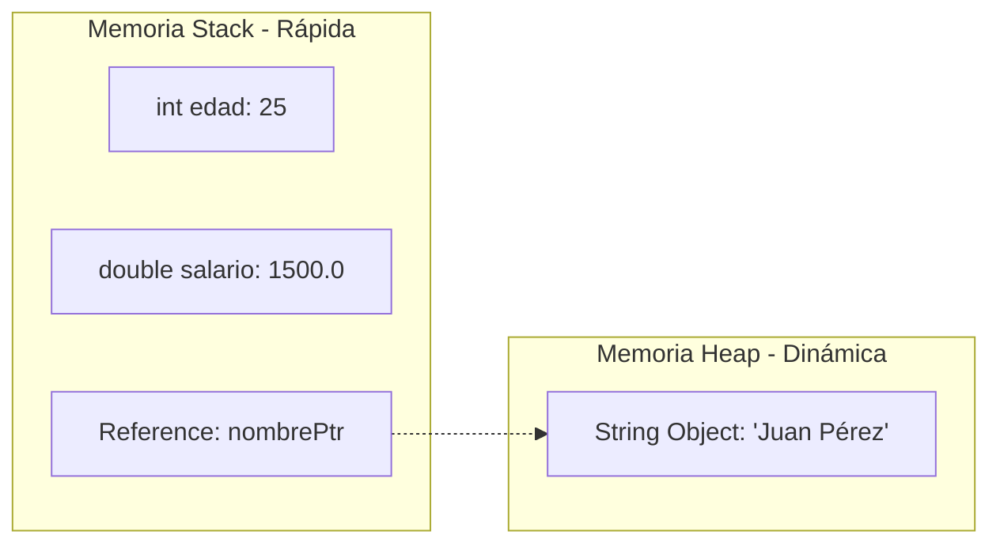
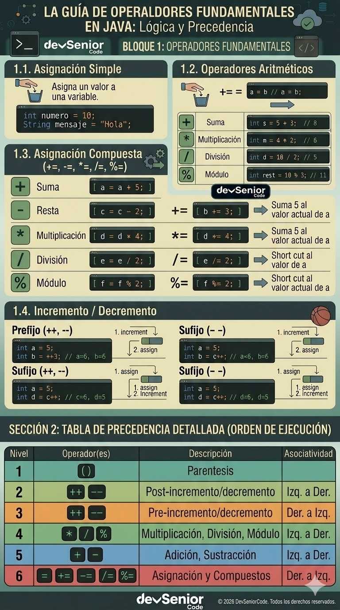
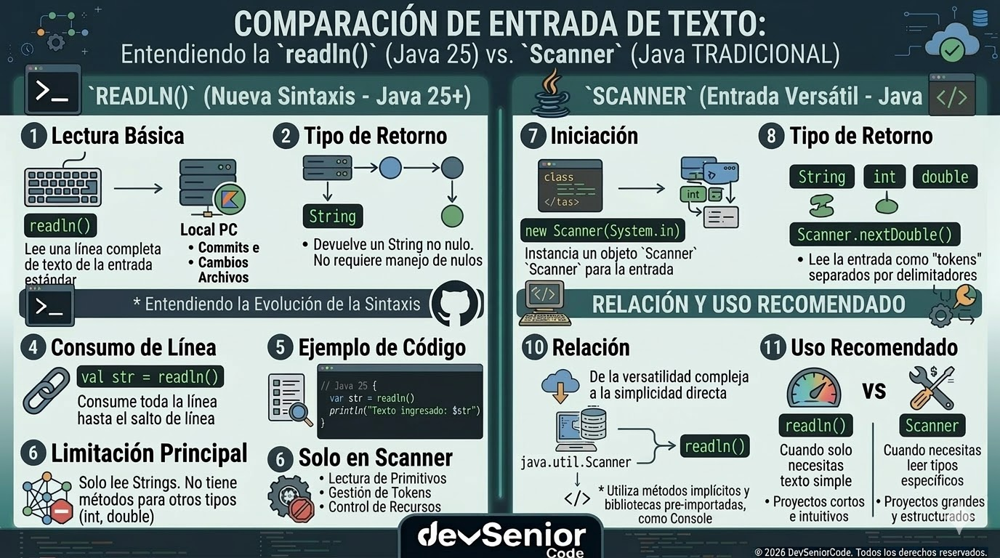
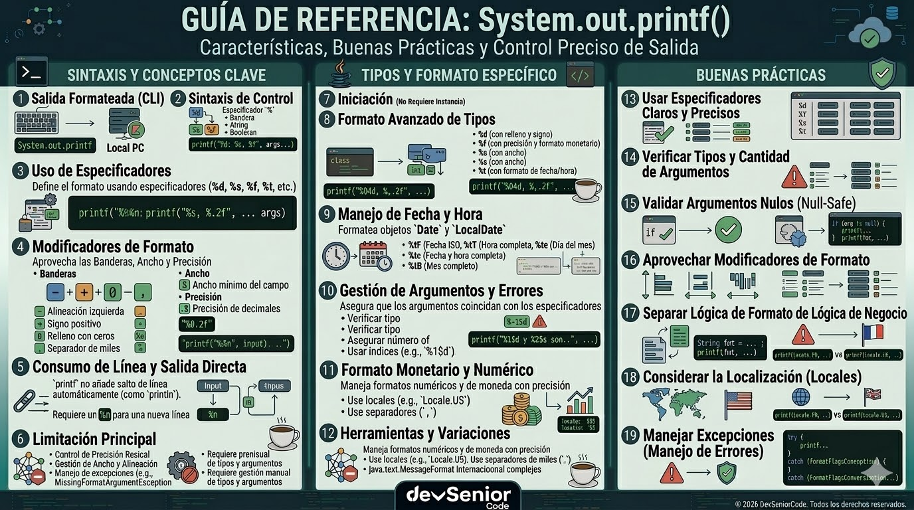

# Unidad 1 - Clase 3: La Anatomía de la Memoria y el Flujo de Entrada en Java 25

**Objetivo**: Dominar la gestión de estados mediante tipos de datos primitivos e inferencia de tipos, comprendiendo la jerarquía de operadores y la captura de flujos de datos externos. Al finalizar, el estudiante podrá construir aplicaciones interactivas con una lógica de procesamiento de datos optimizada para el entorno de ejecución moderno.

## 🚀 Setup de Clase

Para esta sesión, aprovecharemos las capacidades de **Java 25** que permiten simplificar el código boilerplate.

1. **JDK**: Asegúrate de tener instalado el **JDK 25** (o la versión más reciente del soporte de vanguardia).
2. **VS Code Extensions**:
    - _Extension Pack for Java (Microsoft)_.

## 🧠 Inmersión Teórica: La Anatomía de la Variable y la Memoria

### El Arte de ser Senior: Pensamiento Sistémico en los Datos

Un desarrollador Senior no ve una variable como un nombre; la ve como un **contrato de acceso a la memoria**. Elegir el tipo de dato correcto y limitar su ámbito (scope) no es solo estética, es una estrategia para reducir la superficie de errores y optimizar el trabajo del recolector de basura (Garbage Collector).

### 🔍 El Concepto de Variable en la JVM

En el contexto de Java 25, una variable es una abstracción que vincula un identificador con un valor o una referencia en la memoria.

- **Ciclo de Vida**: En arquitecturas modernas, buscamos que las variables sean "efímeras". Cuanto menos tiempo viva una variable en el Stack, más eficiente será la ejecución del hilo.
- **Ámbito (Scope)**: La regla de oro es el _Principio de Menor Privilegio_: una variable solo debe existir donde es estrictamente necesaria.

### 🔒 Constantes: El Modificador final

Un Desarrollador Senior sabe que si un valor no debe cambiar, **no debe ser una variable**. Para esto usamos el modificador `final`. Una vez que se asigna un valor a una variable declarada como `final`, este se vuelve inmutable y cualquier intento de reasignación provocará un error de compilación.

- **Sintaxis**: `final tipo NOMBRE_CONSTANTE = valor;`
- **Convención Senior**: Se utiliza `UPPER_SNAKE_CASE` (mayúsculas con guiones bajos) para identificar constantes rápidamente en el código.
- **Propósito**: Eliminar "números mágicos" y garantizar la integridad de los datos críticos (como tasas de impuestos, límites de velocidad o configuraciones de sistema).
- **Ejemplo**: `final double TASA_IVA = 0.19;`

### ⚡ Gestión de Memoria: Stack vs. Heap

La JVM divide la memoria para optimizar el acceso:

1. **The Stack (La Pila)**:
    - Aquí residen las **variables locales** y los **tipos primitivos**.
    - Cada vez que se invoca un método (incluyendo el `main` implícito de Java 25), se crea un _Stack Frame_.
    - Es memoria LIFO (Last-In, First-Out), extremadamente rápida y con limpieza automática al terminar el bloque.
2. **The Heap (El Montón)**:
    - Aquí residen los **objects** y las instancias de clases.
    - Las variables de referencia (como un `String`) guardan la dirección de memoria en el Stack, pero el contenido real vive en el Heap.

### Evolución Comparativa: De la Verbosidad a la Eficiencia

| Característica | Era Legacy (Java 8/11) | Era Moderna (Java 25+) |
| --- | --- | --- |
| **Declaración** | `List<String> list = new ArrayList<>();` | `var list = new ArrayList<String>();` |
| **Estructura** | Obligatorio public static void main | Clases implícitas y métodos de instancia (JEP 495) |
| **Entrada de Datos** | `Scanner` con gestión manual | `readln()` directo y parseo explícito |
| **Memoria** | Gestión estándar del Stack | Optimizaciones JIT para variables locales efímeras |

### Inferencia de Tipos con `var`: La Guía Senior

Introducido como **Local Variable Type Inference**, `var` permite que el compilador deduzca el tipo de una variable local basándose en el inicializador. Es fundamental entender que **Java sigue siendo un lenguaje estáticamente tipado**; `var` no es `any` de JavaScript ni `dynamic` de C#.

#### 🛠️ Reglas Técnicas y Restricciones

- **Solo Variables Locales**: No puede usarse en campos de clase (atributos), parámetros de métodos o tipos de retorno.
- **Inicialización Obligatoria**: Al declarar con `var`, el compilador debe conocer el tipo inmediatamente. No se permite `var x;`.
- **Prohibido el Nulo inicial**: No puedes escribir `var x = null;` porque el compilador no puede inferir una clase específica a partir de un literal nulo.

#### 🧠 El Pensamiento del Desarrollador: ¿Cuándo usarlo?

1. **Legibilidad sobre Verbosidad**: Úsalo cuando el tipo es evidente.
    - ✅ `var usuarios = new ArrayList<User>();` (Claro y conciso).
    - ❌ `var data = servicio.obtenerInfo();` (Ambiguo: ¿es una lista?, ¿un objeto?, ¿un booleano?).
2. **Tipos Genéricos Complejos**: Es ideal para simplificar tipos extremadamente largos.
    - ✅ `var mapa = Map.of("id", List.of(new ConfigDTO()));`
3. **Mantenimiento**: Facilita refactorizaciones. Si cambias el tipo de retorno de un constructor, no tienes que actualizar la declaración de la variable local en múltiples lugares.

## 🔍 Deep Dive: Análisis Interno y Precedencia

### Análisis Interno (Bajo el Capó)

Cuando declaras una variable en una **clase implícita (JEP 495)** de Java 25, el compilador genera un método de instancia. Esto significa que tus variables locales residen en el Stack del hilo principal.

### Análisis de Memoria en Java 25

- Los tipos primitivos no requieren "boxing" si se gestionan correctamente, evitando presión innecesaria sobre el Heap.
- La nueva API `java.lang.IO` utiliza flujos optimizados que reducen la huella de memoria en comparación con el antiguo `Scanner`.

### Diagrama de Flujo de Datos en Memoria



## 📖 Conceptos del Lenguaje

### Tipos Primitivos

Son los tipos básicos que no son objetos y se almacenan directamente en el Stack.

| Tipo | Memoria | Rango / Valor | Cuándo usarlo (Senior Mindset) |
| --- | --- | --- | --- |
| `byte` | 8 bits | -128 a 127 | Buffers de archivos, protocolos de red o arrays masivos para ahorrar memoria. |
| `short` | 16 bits | -32,768 a 32,767 | APIs legacy o sistemas embebidos. Casi obsoleto en aplicaciones de negocio modernas. |
| `int` | 32 bits | ~-2 mil millones a 2 mil millones | **Default** para contadores, índices de arrays y lógica matemática general. |
| `long` | 64 bits | ~-9 quintillones a 9 quintillones | IDs de bases de datos, marcas de tiempo (Epoch), y números que superen los 2 mil millones. |
| `float` | 32 bits | Precisión simple | Gráficos 3D o bibliotecas donde la memoria es más crítica que la precisión extrema. |
| `double` | 64 bits | Precisión doble | **Default** para cálculos científicos y pesos de redes neuronales (IA). |
| `char` | 16 bits | 0 a 65,535 (Unicode) | Almacenar un única carácter. Útil en parsing de texto de bajo nivel. |
| `boolean` | 1 bit | `true` o `false` | Banderas lógicas, estados binarios y control de flujo. |

_**Nota**: El tamaño de `boolean` no está definido de forma precisa por la especificación de la JVM, pero generalmente ocupa 1 byte por alineación de memoria._

#### 🧠 Guiones Bajos en Literales (Legibilidad Senior)

Para mejorar la legibilidad de números grandes o complejos, Java permite el uso de guiones bajos (`_`) como separadores visuales. El compilador los ignora completamente al generar el bytecode.

- **Uso**: Se suelen colocar cada tres dígitos (estilo miles) o en bloques lógicos.
- **Restricción**: No pueden ir al inicio, al final, junto al punto decimal o antes del sufijo (`L`, `F`, `D`).
- **Ejemplo**: `int unMillon = 1_000_000;` es mucho más legible que `int unMillon = 1000000`;.

#### Sufijos de Literales (Identificación de Tipos)

En Java, los números escritos directamente (literales) tienen un tipo por defecto. Para forzar un tipo específico, utilizamos sufijos:

- **Enteros**: Por defecto son `int`. Usamos `L` para indicar un `long`.
  
  ```java
  long distanciaEstelar = 9_460_730_472_580L; // Obligatorio L si supera el rango de int`
  long deudaNacional = 35_000_000_000_000L; // Sin la L, daría error de compilación
  long idUsuario = 1024L; // Aunque cabe en int, la L define el tipo destino desde el inicio
  ```

- **Decimales**: Por defecto son double. Usamos `F` para indicar un float y 'd' para confirmar que el numero es decimal (double).

  ```java
  float precioDolar = 4150.50F; // Sin la F, el compilador lo ve como double y arroja error
  float gravedad = 9.806_65f; // La 'f' minúscula también es válida

  double piPreciso = 3.141_592_653_59D; // El sufijo D hace explícita la precisión de 64 bits
  double coordenadaLat = -12.04637d;
  ```

#### 🌏 El tipo char y el Estándar Unicode

A diferencia de otros lenguajes antiguos, el `char` en Java no es un simple byte ASCII; es un tipo numérico sin signo de 16 bits que representa caracteres en **Unicode (UTF-16)**. Esto permite que Java sea nativamente internacional.

- **Literales de Carácter**: Se definen con comilla simple `'`.

  ```java
  char letra = 'A';              // Carácter estándar
  char simbolo = '$';            // Símbolo especial
  char numeral = '7';            // El carácter 7 (no el número 7)
  ```

- **Representación Unicode Hexadecimal**: Se puede declarar usando el prefijo `\u`.

  ```java
  char delta = '\u0394';         // Letra griega Delta (Δ)
  char copyright = '\u00A9';     // Símbolo de Copyright (©)
  char espacioJapones = '\u3000';// Espacio en blanco IDEOGRAPHIC SPACE
  ```

#### 🛡️ Carácter de Escape y Secuencias Especiales

Para representar caracteres que tienen un significado especial para Java (como la propia comilla) o caracteres de control (como un salto de línea), utilizamos el **carácter de escape barra invertida (`\`)**. Este le indica al compilador que el siguiente carácter debe tratarse de forma distinta.

| Secuencia | Descripción Técnica | Uso común |
| --- | --- | --- |
| `\'` | Comilla simple | Insertar ' dentro de un literal char. |
| `\"` | Comilla doble | Insertar " dentro de un String. |
| `\\` | Barra invertida | Representar la propia ruta de un archivo o escape. |
| `\n` | Newline (LF) | Salto de línea (Control de flujo de consola). |
| `\r` | Carriage Return (CR) | Retorno de carro. |
| `\t` | Tabulación | Alineación de columnas en reportes de texto. |
| `\b` | Backspace | Retroceso de un espacio. |

```java
char comillaSimple = '\''; 
String rutaIA = "C:\\modelos\\red_neuronal.bin"; 
println("Log: Ejecución finalizada\n\tEstado: OK\n\tPrecisión: 98%"); 
```

### 🌟 La Clase String: El Tipo "Especial"

Aunque no es un tipo primitivo, `String` es la clase más importante en Java y recibe un tratamiento especial por parte de la JVM para optimizar el rendimiento.

#### 1. Inmutabilidad

Un objeto `String` es **inmutable**: una vez creado, su contenido no puede ser modificado. Cualquier operación que parezca modificarlo (como concatenar) en realidad crea un nuevo objeto en el Heap.

#### 2. String Pool (Internamiento)

Para ahorrar memoria, la JVM utiliza el **String Pool**, un espacio en el Heap donde almacena una única copia de cada literal de cadena.

#### 3. Compact Strings (Optimización de Memoria)

Desde Java 9+, los strings que solo contienen caracteres latinos se almacenan internamente como `byte[]` (1 byte por carácter) en lugar de `char[]` (2 bytes).

#### 4. Bloques de Texto (Text Blocks)

Introducidos como estándar en Java 15, los **Bloques de Texto** permiten definir cadenas multi-línea de forma legible sin necesidad de concatenaciones o escapes de comillas dobles. Se inician y terminan con triples comillas dobles (`"""`).

- **Regla de Oro**: La apertura `"""` debe ir seguida obligatoriamente de un salto de línea. El contenido comienza en la línea siguiente.
- **Gestión Automática de la Sangría (Indentation)**: Java distingue entre el **espacio en blanco incidental** (el que usas para alinear el código con el resto de la clase) y el **espacio en blanco esencial** (el que quieres que forme parte del texto final).
  - **Algoritmo de Limpieza**: El compilador analiza todas las líneas y elimina el prefijo de espacios comunes a todas ellas.
  - **El rol del cierre `"""`**: La posición horizontal de las comillas de cierre determina el margen izquierdo. Si desplazas el `"""` hacia la izquierda más allá del texto, añadirás sangría manual al resultado.

```java
String promptIA = """
    {
        "role": "expert",
        "task": "Análisis de sentimientos",
        "context": "Fintech"
    }
    """; // El margen izquierdo se define por la línea con menos sangría o la posición de este cierre.
```

### 📦 Clases Wrapper: El Puente entre Primitivos y Objetos

Las **clases Wrapper** encapsulan los tipos primitivos para que puedan participar en el ecosistema de objetos (colecciones, genéricos y APIs modernas).

| Primitivo | Wrapper | Métodos Clave y Funcionalidad Senior |
| --- | --- | --- |
| `byte` | `Byte` | `parseByte(s)`: Parsing de flujos de red. `MIN_VALUE` / `MAX_VALUE`. |
| `short` | `Short` | `parseShort(s)`: Compatibilidad con sistemas embebidos legacy. |
| `int` | `Integer` | `parseInt(s)`, `toHexString(i)` (debug de memoria), `compare(x,y)`. |
| `long` | `Long` | `parseLong(s)`, `sum(x,y)`, `bitCount(i)` (análisis de banderas). |
| `float` | `Float` | `parseFloat(s)`, `isNaN(f)`, `compare(f1, f2)`. |
| `double` | `Double` | `parseDouble(s)`, `isInfinite(d)`, `doubleToLongBits(d)`. |
| `char` | `Character` | `isDigit(c)`, `isLetter(c)`, `isWhitespace(c)`, `toUpperCase(c)`. |
| `boolean` | `Boolean` | `parseBoolean(s)`, `logicalAnd(a,b)`, `logicalOr(a,b)`. |

#### 🧠 Autoboxing y Unboxing

Java realiza conversiones automáticas entre primitivos y sus envoltorios:

- **Autoboxing**: Conversión de primitivo a objeto (ej. `Double d = 3.14;`).
- **Unboxing**: Conversión de objeto a primitivo (ej. `double p = d;`).

**Senior Tip**: _Evita el autoboxing dentro de bucles de alto rendimiento_. El unboxing de un Wrapper `null` lanzará un `NullPointerException`, un error clásico que debemos auditar.

### 🔄 Conversión de Tipos (Casting)

En Java, el movimiento de datos entre diferentes tipos de variables requiere entender la jerarquía de precisión para evitar pérdida de información.

#### 1. Conversión Implícita (Widening Casting)

Ocurre automáticamente cuando pasamos un valor de un tipo con menor rango a uno de mayor rango (ej. de int a double). No hay pérdida de datos.

```java
int entero = 100;
double decimal = entero; // Automático: 100.0 (Promoción de 32 a 64 bits)

char letra = 'A';
int codigoAscii = letra; // Automático: 65 (Un char cabe en un int)

byte pequeño = 50;
long grande = pequeño;   // Automático: 50L (Extensión de signo preservada)
```

#### 2. Conversión Explícita (Narrowing Casting)

Debe hacerse manualmente cuando pasamos de un tipo con mayor rango a uno de menor rango (ej. de double a int). Existe riesgo de pérdida de precisión o datos.

```java
double precio = 199.99;
int precioTruncado = (int) precio; // Resultado: 199 (Pérdida de la parte decimal)

long idGrande = 2147483648L; 
int idPequeño = (int) idGrande;    // Resultado: -2147483648 (Overflow/Desbordamiento)

int numero = 130;
byte valorByte = (byte) numero;    // Resultado: -126 (Debido al rango de byte -128 a 127)

float decimalPreciso = 5.5555555f;
float decimalReducido = (float) 5.5555555555; // Pérdida de precisión decimal
```

**Senior Alert**: El casting manual no es un redondeo, es un **truncamiento** de la parte fraccionaria o una **reinterpretación de bits** (en caso de desbordamiento). En sistemas financieros o de misión crítica, realizar un narrowing casting sin validación previa es una mala práctica grave.

### Operadores

#### Operador de asignación

El **operador de asignación** (`=`) es el mecanismo fundamental para almacenar un valor en una variable. En Java, este operador toma el valor del lado derecho y lo asigna a la variable del lado izquierdo.

Por ejemplo, `int edad = 25;` asigna el valor `25` a la variable `edad`.

Es importante recordar que la asignación no es comparación; el operador de comparación es `==`. La asignación puede involucrar tipos compatibles, y si los tipos difieren, puede requerir un casting explícito.

**Ejemplo básico**: `double salario = 1500.0;` Asigna 1500.0 a la variable `salario`

**Senior Tip:** Siempre inicializa tus variables al declararlas para evitar errores de referencia y mejorar la legibilidad del código.

#### Operadores Aritméticos

- **Suma** (`+`) y **Resta** (`-`): Operaciones aditivas.
- **Multiplicación** (`*`): Operación multiplicativa.
- **División** (`/`): Operación de partición. Su comportamiento depende estrictamente de los tipos de los operandos.

  Uno de los errores más comunes en la lógica de negocio es esperar decimales de una división entre enteros.

  1. **División entre Enteros** (`int` / `int`): El resultado es **siempre un entero**. Java no redondea; trunca (elimina la parte decimal).
  2. **División de Punto Flotante**: Si al menos un operando es `double` o `float`, Java promociona la operación y el resultado mantiene los decimales.
  3. **Pérdida de Precisión por Casting Tardío**:
      - ❌ `double d = 10 / 3;`: d será 3.0 (La división entera ocurre primero, luego se asigna a double).
      - ✅ `double d = (double) 10 / 3;`: d será 3.333... (Forzamos la precisión desde el inicio).

- **Módulo** (`%`): Devuelve el residuo de una división entera.

  En ingeniería de software senior, el módulo no es solo el "sobrante"; es la herramienta para gestionar la **ciclicidad** y el **agrupamiento**.

  1. **Detección de Paridad (Lógica Binaria)**:
      - `numero % 2 == 0` (Par) | `numero % 2 != 0` (Impar).
  2. **Buffers Circulares / Índices Rotativos**: Mantiene un índice dentro de un rango sin usar condicionales.

      ```java
      var indiceActual = 0;
      var capacidad = 10;
      // Al llegar a 9, el siguiente valor será 0 automáticamente
      indiceActual = (indiceActual + 1) % capacidad;
      ```

  3. **Conversión de Magnitudes**: Extraer componentes de una unidad mayor.

      ```java
      int totalSegundos = 3665;
      int segundosRestantes = totalSegundos % 60; // Extrae segundos (5s) tras descontar minutos.
      ```

  4. **Control de Flujo por Lotes (Batching)**: Ejecutar tareas cada $N$ elementos procesados.

      ```java
      if (itemProcesado % 50 == 0) {
          println("Checkpoint: 50 elementos adicionales enviados a la base de datos.");
      }
      ```

#### Operadores de Asignación Compuesta

Permiten realizar una operación aritmética y una asignación en una única instrucción, optimizando la claridad del código y la gestión de tipos.

##### Catálogo de Operadores y Ejemplos

- **Suma y Asigna (`+=`)**:
  - `distancia += 10.5;` $\rightarrow$ Incrementa el valor actual de `distancia`.
- **Resta y Asigna (`-=`)**:
  - `vidas -= 1;` $\rightarrow$ Decrementa el contador de estado.
- **Multiplica y Asigna (`*=`)**:
  - `salario *= 1.10;` $\rightarrow$ Aplica un factor (ej. aumento del 10%) directamente.
- **Divide y Asigna (`/=`)**:
  - `stock /= 2;` $\rightarrow$ Reduce a la mitad la `disponibilidad`.
- **Módulo y Asigna (`%=`)**:
  - `indice %= bufferSize;` $\rightarrow$ Asegura que el índice permanezca cíclico.

##### 🧠 El Secreto Senior: Casting Implícito

A diferencia de la asignación simple, estos operadores incluyen un **casting automático** al tipo de la variable de destino.

- **Escenario**: `byte b = 10;`
- **Error**: `b = b + 5;` Error de compilación: `b + 5` se promociona a `int`
- **Éxito**: `b += 5;` Compila: Equivale a `b = (byte)(b + 5)`

#### Operadores de Incremento y Decremento

Utilizados para aumentar o disminuir el valor de una variable numérica en $1$. Aunque parecen simples, su comportamiento cambia drásticamente dependiendo de su posición respecto a la variable.

##### Pre-incremento (`++x`) / Pre-decremento (`--x`)

La operación se realiza **antes** de que la variable sea utilizada en la expresión actual.

- **Mecánica**: `Incrementa/Decrementa` $\rightarrow$ `Devuelve el nuevo valor`.
- **Ejemplo**:

  ```java
  int a = 5;
  int b = ++a; // 'a' sube a 6, luego 'b' recibe ese 6. 
  // Resultado: a=6, b=6
  ```

##### Post-incremento (`x++`) / Post-decremento (`x--`)

La operación se realiza **después** de que el valor actual de la variable ha sido utilizado en la expresión.

- **Mecánica**: `Devuelve valor actual` $\rightarrow$ `Incrementa/Decrementa en memoria`.
- **Ejemplo**:

  ```java
  int x = 5;
  int y = x++; // 'y' recibe el 5 actual, luego 'x' sube a 6 en memoria.
  // Resultado: x=6, y=5
  ```

##### 🧠 El Arte de ser Senior: Evitar Efectos Secundarios

En arquitecturas limpias, **evitamos** usar incrementos/decrementos dentro de expresiones complejas.

- ❌ **Código Confuso**: `int resultado = ++i + j-- * i++;` (Carga cognitiva necesaria).
- ✅ **Código Senior**:

  ```java
  i++;
  int resultado = i + j * i;
  j--;
  i++;
  ```

Esto mejora la legibilidad e identifica errores de precedencia difíciles de depurar.

#### Precedencia de operadores

| Precedencia | Operador | Descripción | Ejemplo | Resultado |
| --- | --- | --- | --- | --- |
| 1 (más alta) | `()` | Paréntesis (agrupación) | `(a + b) * c` | Fuerza el orden de evaluación |
| 2 | `++`, `--` | Incremento/Decremento (pre/post) | `++x`, `x--` | Aumenta o disminuye en 1 |
| 3 | `*`, `/`, `%` | Multiplicación, División, Módulo | `a * b`, `a / b`, `a % b` | Calcula producto, cociente, residuo |
| 4 | `+`, `-` | Suma, Resta | `a + b`, `a - b` | Calcula suma o diferencia |
| 5 | `=` | Asignación | `x = 5` | Asigna valor a variable |
| 6 | `+=`, `-=`, `*=`, `/=`, `%=` | Asignación compuesta | `x += 2`, `y *= 3` | Opera y asigna en una sola instrucción |

**Notas Senior**:

- Los operadores de incremento/decremento pueden ser pre (`++x`) o post (`x++`), afectando el orden de evaluación.
- La multiplicación, división y módulo tienen mayor precedencia que suma y resta.
- La asignación simple y compuesta se evalúan al final de la expresión.
- El uso correcto de la precedencia evita errores lógicos y mejora la legibilidad del código.



### ⌨️ Maestría en la Entrada de Datos: `readln()` y `Scanner`

La interacción por teclado en Java permite que el usuario ingrese datos durante la ejecución del programa, haciendo posible la creación de aplicaciones dinámicas y personalizadas. Este proceso consiste en mostrar mensajes o instrucciones en la consola, esperar la entrada del usuario y capturarla para su procesamiento.

#### 1. Método Moderno: `readln()`

En **Java 25**, el método `readln()` facilita esta tarea, permitiendo leer líneas completas de texto de manera sencilla y eficiente. Así, el flujo de entrada se convierte en el primer punto de contacto entre el sistema y el usuario, habilitando la toma de decisiones, cálculos y generación de reportes basados en información proporcionada en tiempo real.

**Variaciones del Método**:

1. `readln(String prompt)`: Muestra un mensaje informativo en la consola y espera la entrada del usuario en la misma línea.

    - _Uso_: `var nombre = readln("Escriba su nombre: ");`

2. `readln()`: Lee directamente la siguiente línea de la entrada estándar sin emitir ningún mensaje previo.
    - Uso: `var entradaDirecta = readln();`

- Lee una línea de texto y la retorna como `String`.
- No requiere gestión manual de recursos ni manejo explícito de excepciones.
- Ideal para scripts rápidos y clases implícitas.

#### 2. Método Tradicional: `Scanner` (Java 8/11+)

Antes de **Java 25**, la captura de datos por teclado se realizaba comúnmente usando la clase `Scanner`:

```java
import java.util.Scanner;

Scanner sc = new Scanner(System.in);
System.out.print("Ingrese su nombre: ");
String nombre = sc.nextLine();
sc.close();
```

- Permite leer distintos tipos de datos (`nextInt()`, `nextDouble()`, `nextLine()`, etc.).
- Requiere cerrar el recurso (`sc.close()`) para evitar fugas de memoria.
- Puede generar problemas con saltos de línea residuales al alternar métodos de lectura.

**Comparación Senior**:



- `readln()` simplifica el flujo y evita errores comunes de Scanner.
- `Scanner` sigue siendo útil en proyectos legacy o cuando se necesita leer tipos primitivos directamente, pero requiere mayor cuidado en la gestión de recursos y validación de entradas.

#### Ventajas Sistémicas de `readln()` sobre `Scanner`

- **Inmutabilidad de Flujo**: A diferencia de `Scanner`, `readln()` captura la línea completa y libera el cursor, evitando el residuo del carácter `\n` (salto de línea) que solía corromper las lecturas posteriores.
- **Retorno Consistente**: Siempre devuelve un objeto `String`. Esto obliga al desarrollador a realizar un parseo explícito (ej. `Integer.parseInt()`), lo cual es una práctica más robusta para el manejo de excepciones y validación de tipos.
- **Gestión Automática**: No requiere que el desarrollador invoque `close()` ni maneje `IOException` de forma explícita en scripts rápidos o clases implícitas.

### 🖨️ Maestría en la Salida de Datos: `System.out`

Aunque Java 25 simplifica la salida con `println`, el objeto `System.out` (una instancia de `PrintStream`) sigue siendo la herramienta definitiva para el control de la consola.

#### 1. Métodos Estándar

`System.out.print(msg)`: Envía los datos al flujo de salida sin agregar un salto de línea.

`System.out.println(msg)`: Envía los datos y añade automáticamente un separador de línea dependiente del sistema operativo (`\n` en Linux/macOS, `\r\n` en Windows).

#### 2. Deep Dive: `printf` (Formatted Output)

Para un Desarrollador Senior, la legibilidad de los reportes es innegociable. `printf` permite inyectar valores en una plantilla de texto utilizando **especificadores de formato**.

**Sintaxis**: `System.out.printf("Cadena de formato", argumentos...);`

**Especificadores Fundamentales**:

- `%s`: Strings.
- `%d`: Enteros (Decimal).
- `%f`: Punto flotante (Decimales).
- `%b`: Booleanos.
- `%n`: Salto de línea independiente de la plataforma (mejor que `\n`).

**Control de Precisión y Alineación (Maestría Técnica)**:

- **Control de decimales**: `%.2f` muestra solo 2 decimales con redondeo automático.
- **Ancho de campo**: `%10s` reserva 10 espacios y alinea a la derecha. `%-10s` alinea a la izquierda.
- **Relleno de ceros**: `%05d` para un número como 7 mostrará `00007`.

**Ejemplo Senior de Reporte**:

```java
String item = "Dron AI-X";
int cantidad = 5;
double precio = 1250.758;

System.out.printf("Item: [%-10s] | Cant: %03d | Total: $%,.2f%n", 
                  item, cantidad, (precio * cantidad));
// Salida: Item: [Dron AI-X  ] | Cant: 005 | Total: $6,253.79
```



## 💻 Laboratorio de Aplicación Práctica: "Sistema de Nómina Senior"

**Escenario**: Una Fintech requiere una herramienta de consola para calcular el salario neto anual de un consultor, aplicando bonos e impuestos automáticos.

💡 **VS Code Pro-Tip**: Al usar clases implícitas, puedes ejecutar el código simplemente presionando `F5` sin necesidad de envolver todo en una clase formal.

```java
/**
 * Aplicación de Cálculo de Nómina Java 25.
 * Demuestra: var, readln() y gestión de memoria eficiente con Wrappers y Strings.
 */
void main() { 
    println("=== SISTEMA DE NÓMINA CORPORATIVA ===");

    // 1. Entrada de Datos simplificada (Inmutabilidad preferida)
    final String nombre = readln("Ingrese nombre del consultor: ");
    
    // Parseo explícito usando la clase Wrapper Double e Integer
    // Aquí convertimos la entrada (String) a tipos primitivos
    double salarioMensual = Double.parseDouble(readln("Ingrese salario mensual base: "));
    int edad = Integer.parseInt(readln("Ingrese edad: "));

    // 2. Lógica de Negocio (Operadores y Casting)
    final var TASA_IMPUESTO = 0.15; 
    var salarioAnualBruto = salarioMensual * 12;
    
    // Aplicamos incremento por bono de antigüedad mediante asignación compuesta
    salarioAnualBruto += 500.0; 

    var montoImpuestos = salarioAnualBruto * TASA_IMPUESTO;
    var salarioNeto = salarioAnualBruto - montoImpuestos;

    // Ejemplo de Casting Explícito
    int salarioEnteroRepresentativo = (int) salarioNeto;

    // 3. Salida Formateada con printf para un reporte profesional
    println("\n--- Resumen de Pago ---");
    System.out.printf("Consultor : %s %n", nombre);
    System.out.printf("Edad      : %d años %n", edad);
    System.out.printf("Anual Bruto: $%,.2f %n", salarioAnualBruto);
    System.out.printf("Impuestos  : $%,.2f %n", montoImpuestos);
    System.out.printf("Neto Final : $%,.2f %n", salarioNeto);
}
```

## 💪 Reto de Consolidación: "El Desarrollador de Geometría e IA"

**Contexto**: Estás diseñando un módulo de visión artificial para un dron. El dron captura las dimensiones de una zona de aterrizaje rectangular.

**Requisitos**:

1. Solicitar por teclado la base y la altura usando `readln()`.
2. Calcular el **Área** ($Area = base \times altura$) y el **Perímetro** ($Perimetro = 2 \times (base + altura)$).
3. Determinar si el área es suficiente para un aterrizaje (mínimo $50.0\ m^2$) usando un booleano.
4. Imprimir los resultados usando `System.out.printf`.

### 🛠️ Ejercicios Adicionales

#### Kiosco de Registro en Eventos IA

Desarrolla un sistema que capture nombre y apellido por separado, genere un saludo personalizado de bienvenida y asigne un número de ticket incremental utilizando operadores de incremento.

#### Monitor de Telemetría Térmica para Data Centers

Crea un script que lea la temperatura en grados Fahrenheit de un sensor, realice la conversión a Celsius ($C = (F - 32) \times 5/9$) y alerte si la temperatura supera los $35^\circ C$ mediante una bandera booleana.

#### Microservicio de Facturación para propina

Implementa un programa que solicite el total de una factura y el porcentaje de propina deseado. Calcula el monto de la propina y el total final, aplicando operadores de asignación compuesta para actualizar los montos y mostrando un desglose formateado con printf.

## 📚 Recursos de Maestría

- [JEP 495: Implicitly Declared Classes and Instance Main Methods](https://openjdk.org/jeps/495): Especificación oficial sobre la simplificación de la estructura de programas Java, eliminando la necesidad de clases ceremoniales para el inicio de aplicaciones.
- [Java `java.lang.IO` API Documentation](https://docs.oracle.com/en/java/javase/23/docs/api/java.base/java/io/IO.html): Referencia completa de los nuevos métodos de entrada/salida simplificados (readln, print, println) disponibles en las versiones más recientes.
- [Oracle Java Tutorial: Operators](https://docs.oracle.com/javase/tutorial/java/nutsandbolts/operators.html): Guía detallada sobre la jerarquía, precedencia y uso correcto de todos los operadores del lenguaje.
- [Inside Java: Compact Strings and String Performance](https://inside.java/2020/09/30/compact-strings/): Análisis técnico profundo sobre cómo la JVM optimiza el almacenamiento de cadenas de texto para reducir la huella de memoria.
- [Baeldung: Java Stack and Heap Memory Management](https://www.baeldung.com/java-stack-heap): Un recurso fundamental para entender la diferencia entre la gestión de memoria de variables locales y objetos dinámicos.

---

**¡Atrévete a ir más allá!** No te conformes con que el código funcione; pregúntate por qué funciona y cómo puedes hacerlo más eficiente. **¡Nos vemos en el próximo reto!**
