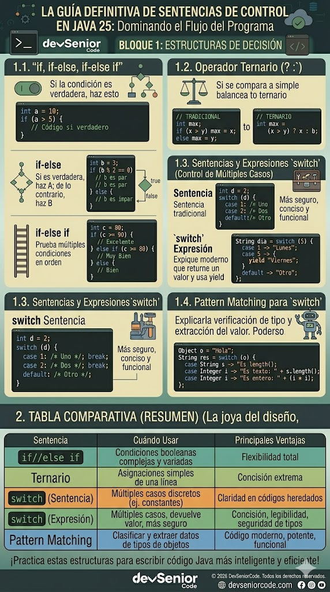

# Unidad 1 - Clase 3: Dominio de la Toma de Decisiones: De Sentencias Imperativas a Expresiones Declarativas en Java

**Objetivo**: Dominar el control de flujo en Java 25 utilizando archivos de fuente simple (JEP 495). El estudiante comprenderá la diferencia crítica entre sentencias (`if`, `switch` tradicional) y expresiones (Operador ternario, `switch expression`), aprendiendo a diseñar algoritmos con baja complejidad ciclomática y alta eficiencia en la JVM.

## 🚀 Setup de Clase

Para esta sesión, eliminaremos la ceremonia innecesaria de la POO clásica para centrarnos en la lógica pura.

1. **JDK**: Java 25 instalado y configurado.
2. **VS Code**: Instalar el "Extension Pack for Java".

## 🧠 Inmersión Teórica: El Cerebro del Algoritmo

### ¿Qué son las Estructuras de Control?

Imagina que tu programa es un vehículo. Hasta ahora, el vehículo solo sabía ir en línea recta (flujo secuencial). Las **estructuras de control** son el volante y el GPS: nos permiten decidir si giramos a la derecha, si nos detenemos ante un semáforo o si tomamos una ruta alternativa según el tráfico.

En Java, esto se traduce en evaluar si una condición es **verdadera** o **falsa** para ejecutar bloques de código específicos.

### El Arte de ser Senior: Código que "Habla"

Un desarrollador senior no escribe código para que lo entienda la computadora (ella entiende binario), lo escribe para que lo entienda otro ser humano.

- **Intención Clara**: Si una decisión tiene solo dos caminos, usa un `if`. Si tiene múltiples opciones fijas, usa un `switch`.
- **Evitar la "Sopa de if"**: Anidar muchos `if` dentro de otros es como entrar en un laberinto. Un desarrollador busca mantener el camino lo más recto y plano posible para evitar errores.

### Evolución Comparativa: ¿Por qué Java 25 es diferente?

Incluso para alguien que está empezando, es vital saber que el lenguaje ha evolucionado para hacernos la vida más fácil y segura:

| Concepto | Antes (Forma Tradicional) | Ahora (Java 25 Moderno) | ¿Por qué importa? |
| --- | --- | --- | --- |
| **Escritura** | Sentencias que "hacen" cosas. | Expresiones que "devuelven" valores. | Menos código, menos errores. |
| **Seguridad** | Podías olvidar un break y causar desastres. | La flecha -> termina sola el proceso. | Evita comportamientos inesperados. |
| **Control** | Tú tenías que recordar cubrir cada caso. | El compilador te avisa si falta algo. | El lenguaje trabaja para ti. |

### Tipos de Decisiones

1. **Binarias (Si/No)**: "¿El usuario tiene saldo?". Usamos `if-else`.
2. **Múltiples (A, B o C)**: "¿Qué tipo de suscripción tiene?". Usamos `switch`.
3. **Inmediatas**: "Si es VIP, descuento de 10; si no, 0". Usamos el **Operador Ternario**.

## 🔍 Deep Dive: Lógica Booleana y Predicados

La arquitectura de software moderna descansa sobre los hombros del Álgebra de Boole. Antes de codificar flujos complejos, debemos entender cómo se construyen las unidades mínimas de decisión.

### 1. Proposiciones: El Átomo de la Lógica

En programación, una **proposición** es una expresión declarativa que solo puede tener dos valores de verdad: Verdadero ($T$) o Falso ($F$).

- **Proposiciones Simples**: Son declaraciones directas que no dependen de conectores. En Java, suelen ser evaluaciones de variables.
  - _Ejemplo_: `edad >= 18` o `esUsuarioActivo == true`.
- **Proposiciones Compuestas**: Resultan de la unión de dos o más proposiciones simples mediante operadores lógicos.
  - _Ejemplo_: `(edad >= 18) AND (tienePermiso == true)`.

### 2. Operadores de Comparación e Igualdad

Estos operadores son los bloques fundamentales para construir predicados. Se dividen en dos categorías críticas:

#### A. Igualdad y Desigualdad

- **Igualdad (`==`)**: Evalúa si dos valores son idénticos. En tipos primitivos compara el valor; en objetos, la dirección de memoria.
- **Desigualdad (`!=`)**: Evalúa si dos valores son distintos. Es la negación lógica de la igualdad.

### B. Operadores de Orden (Relacionales)

Son vitales para trabajar con magnitudes y rangos. Evalúan la relación posicional entre dos operandos numéricos o de caracteres (`char`):

1. **Mayor que (`>`)**: Devuelve `true` si el operando de la izquierda es estrictamente superior al de la derecha.
    - _Caso de uso_: Verificar si un stock ha superado el límite de seguridad.
    - _Ejemplo_: `10 > 5` $\rightarrow$ `true`.
2. **Menor que (`<`)**: Devuelve `true` si el operando izquierdo es estrictamente inferior al derecho.
    - `Caso de uso`: Validar si el saldo es insuficiente para una compra.
    - _Ejemplo_: `3 < 8` $\rightarrow$ `true`.
3. **Mayor o igual que (`>=`)**: Devuelve `true` si el operando izquierdo es superior o exactamente igual al derecho.
    - _Caso de uso_: Determinar si una persona tiene la edad mínima legal (incluyendo el día que cumple años).
    - _Ejemplo_: `18 >= 18` $\rightarrow$ `true`.
4. **Menor o igual que (`<=`)**: Devuelve `true` si el operando izquierdo es inferior o idéntico al derecho.
    - _Caso de uso_: Validar si un usuario ha alcanzado el máximo de intentos permitidos.
    - _Ejemplo_: `5 <= 5` $\rightarrow$ `true`.

### 3. Operadores Lógicos: Construyendo Complejidad

Para elevar proposiciones simples a **compuestas**, Java utiliza conectores lógicos con semántica de corto circuito:

- **AND (`&&`)**: La proposición compuesta es verdadera solo si **ambas** partes son verdaderas ($P \land Q$).
  - _Corto Circuito_: Si la primera parte es falsa, Java ni siquiera evalúa la segunda (ahorro de procesamiento).
- **OR (`||`)**: Es verdadera si al menos una de las partes es verdadera ($P \lor Q$).
  - _Corto Circuito_: Si la primera parte es verdadera, la segunda se ignora.
- **NOT (`!`)**: Operador unario que invierte el valor de verdad ($\neg P$). Es vital para flags de estado como `!isReadOnly`.

#### Tablas de Verdad

El rigor matemático nos permite predecir el comportamiento del software sin ejecutarlo:

$$\begin{array}{|c|c|c|c|}
\hline
A & B & A \land B \text{ (\&\&)} & A \lor B \text{ (||)} \\
\hline
T & T & T & T \\
T & F & F & T \\
F & T & F & T \\
F & F & F & F \\
\hline
\end{array}$$

$$
\begin{array}{|c|c|}
\hline
A & \neg A \text{ (!)} \\
\hline
T & F \\
F & T \\
\hline
\end{array}
$$

#### Leyes de De Morgan: Simplificación de Código

Un Desarrollador Senior utiliza estas leyes para refactorizar y "aplanar" condiciones difíciles de leer:

1. **Negación de la Conjunción**: `!(A && B)` es equivalente a `(!A || !B)`.
2. **Negación de la Disyunción**: `!(A || B)` es equivalente a `(!A && !B)`.

_Implicación_: Transformar `if (!(esAdulto && tieneSaldo))` en `if (!esAdulto || !tieneSaldo)` suele mejorar la claridad cognitiva del código.

#### Tabla de Precedencia de Operadores

Cuando combinamos múltiples operadores en una sola línea, Java sigue un orden estricto (jerarquía). Es fundamental conocerlo para evitar resultados inesperados.

| Orden | Tipo de Operador | Símbolos |
| --- | --- | --- |
| 1 | Paréntesis | `()` |
| 2 | Incremento / Decremento (Postfijo) | `expr++`, `expr--` |
| 3 | Incremento / Decremento (Prefijo) y Unarios | `++expr`, `--expr`, `+`, `-`, `!` |
| 4 | Multiplicativos (Aritméticos) | `*`, `/`, `%` |
| 5 | Aditivos (Aritméticos) | `+`, `-` |
| 6 | Relacionales (Orden) | `<`, `>`, `<=`, `>=` |
| 7 | Igualdad | `==`, `!=` |
| 8 | Lógico AND | `&&` |
| 9 | Lógico OR | `\|\|` |
| 10 | Condicional (Ternario) | `? :` |
| 11 | Asignación Simple y Compuesta | `=`, `+=`, `-=`, `*=`, `/=`, `%=` |

**Nota Senior**: Aunque la precedencia existe, un buen desarrollador usa **paréntesis** para hacer la intención del código explícita y no obligar al lector a memorizar la tabla.

## 📖 Conceptos del Lenguaje

### 1. El Bloque `if`: Estructura y Variantes

La sentencia `if` es la estructura de control más potente y versátil. Se utiliza cuando el camino que debe tomar el programa depende de una evaluación dinámica que no se puede reducir a un simple mapeo de valores constantes.

#### ¿Cuándo es necesario usar if?

1. **Rangos no discretos**: Cuando evaluamos si un valor está entre dos puntos (ej. `precio > 100 && precio < 500`).
2. **Condiciones Multi-variable**: Cuando la decisión depende de variables de distinto tipo (ej. `esSocio && intentos < 3`).
3. **Validaciones de Estado**: Comprobar si un objeto es nulo o si un flag ha cambiado.

#### Estructura y Variantes

- **`if` Simple (Decisión Unilateral)**: Se usa cuando solo nos interesa actuar si se cumple la condición. Si es falsa, el programa simplemente sigue adelante.

  ```java
  if (temperatura > 35) {
      println("Alerta: Calor extremo");
  }
  ```

- **`if-else` (Decisión Binaria)**: Define dos caminos mutuamente excluyentes. No hay "tercera opción".

  ```java
  if (puntuacion >= 60) {
      println("Aprobado");
  } else {
      println("Reprobado");
  }
  ```

- **`if-else if-else` (Escalera de Decisiones)**: Permite evaluar múltiples condiciones en orden. En cuanto una es verdadera, el resto se ignora. Es ideal para categorizaciones.

  ```java
  if (edad < 13) {
      categoria = "Niño";
  } else if (edad < 20) {
      categoria = "Adolescente";
  } else {
      categoria = "Adulto";
  }
  ```

- **`if` Anidados vs Cláusulas de Guarda**:

  - **Anidado**: Un `if` dentro de otro. **¡Cuidado!** Demasiados niveles crean código ilegible ("Código Flecha").
  - _Cláusula de Guarda (Técnica Senior)_: Validar y salir rápido del flujo si no se cumple el requisito mínimo.

  ```java
  // Forma Senior (Guarda)
  if (usuario == null) {
    return;
  }

  if (!usuario.estaActivo()) {
    return;
  }

  // El resto del código se mantiene "plano" y legible
  println("Procesando usuario...");
  ```

### 2. El Operador Ternario: La Condicional Compacta

El operador ternario (`? :`) es la única estructura en Java que recibe tres operandos. A diferencia del `if`, que es una sentencia (una instrucción de acción), el ternario es una expresión (devuelve un valor).

#### Anatomía y Funcionamiento

Su sintaxis es: `condicion ? resultado_si_cierto : resultado_si_falso;`

1. Se evalúa la `condicion` (proposición booleana).
2. Si es `true`, se evalúa y devuelve la expresión a la izquierda de los dos puntos `:`.
3. Si es `false`, se evalúa y devuelve la expresión a la derecha de los dos puntos `:`.

#### ¿Por qué es una herramienta del Desarrollo Senior?

- **Fomento de la Inmutabilidad**: Permite inicializar variables como `final` de forma inmediata. Con un `if`, la variable debería ser declarada primero (mutable) y luego asignada.

  ```java
  // Senior: Inmutable y atómico
  final String mensaje = (puntos > 100) ? "Nivel Pro" : "Nivel Novato";
  ```

- **Densidad de Lógica**: Es ideal para parámetros de métodos o devoluciones de funciones donde la lógica es binaria y simple.

- **Reducción de Ruido Visual**: Elimina el exceso de llaves `{}` y palabras clave cuando la decisión es trivial.

#### El Riesgo: El "Infierno de Ternarios Anidados"

Un error de nivel junior es anidar ternarios dentro de otros. Esto destruye la legibilidad.

- **Mal**: `String r = a ? (b ? "X" : "Y") : (c ? "Z" : "W");` (Ilegible).
- **Regla Senior**: Si necesitas más de un nivel de decisión, utiliza un bloque `if-else` o una `switch expression`. El código debe ser fácil de leer a las 3 AM.

### 3. El Switch: Una Especialización de la Escalera If-Else

El `switch` es una **optimización semántica** de una escalera de `if-else if`. Se debe usar exclusivamente cuando estamos **comparando la misma variable contra valores exactos y constantes**.

#### Comparativa Técnica: ¿Cuál elegir?

| Característica | Implementación con `if-else if` | Implementación con `switch` (Moderno) |
| --- | --- | --- |
| **Variable** | Debes repetirla en cada `if (x == ...)`. | Se declara una sola vez al inicio. |
| **Enfoque** | "Si pasa esta condición compleja...". | "Mapea este valor a una de estas opciones". |
| **Ruido Visual** | Alto (muchos paréntesis y operadores). | Bajo (centrado puramente en los datos). |
| **Rendimiento** | Evaluación lineal ($O(n)$). | Salto directo indexado ($O(1)$). |

**Ejemplo de Código Lado a Lado: Procesador de Códigos de Estado**

```java
int statusCode = 404;

// ESCENARIO A: Usando IF-ELSE (Ruidoso y propenso a errores de escritura)
if (statusCode == 200) {
    println("Éxito");
} else if (statusCode == 404) {
    println("No encontrado");
} else if (statusCode == 500) {
    println("Error de servidor");
} else {
    println("Estado desconocido");
}

// ESCENARIO B: Usando SWITCH (Limpio, legible y atómico)
switch (statusCode) {
    case 200 -> println("Éxito");
    case 404 -> println("No encontrado");
    case 500 -> println("Error de servidor");
    default  -> println("Estado desconocido");
}
```

#### A. Switch como Sentencia (Statement - El estilo "Clásico")

Es una instrucción que bifurca el código. Utiliza `:` y la palabra clave `break`.

- **Riesgo Senior (Fall-through)**: Si olvidas el `break`, el código "cae" al siguiente caso. Esto solía causar errores catastróficos.
- **Uso**: Cuando quieres realizar acciones (imprimir, guardar) pero no necesitas un valor de retorno inmediato.

```java
int dia = 2;
switch (dia) {
    case 1:
        println("Lunes");
        break;
    case 2:
        println("Martes"); // Se ejecuta este
        break;
    default:
        println("Otro día");
}
```

```java
int mes = 4;
switch (mes) {
  case 1:
  case 2:
  case 12:
    println("Invierno");
    break;
  case 3:
  case 4:
  case 5:
    println("Primavera");
    break;
  case 6:
  case 7:
  case 8:
    println("Verano");
    break;
  case 9:
  case 10:
  case 11:
    println("Otoño");
    break;
  default:
    println("Mes no válido");
}
```

#### B. Switch como Expresión (Expression - El estilo "Java 25")

Es la evolución moderna. Se comporta como un "traductor": recibe un valor y devuelve otro.

- **Sintaxis de Flecha (`->`)**: Elimina la necesidad de `break`. Ejecuta lo que está a la derecha y sale automáticamente.
- **Exhaustividad**: El compilador te obliga a cubrir todos los casos posibles o a incluir un `default`.
- **Múltiples etiquetas**: Puedes agrupar casos con comas: `case 1, 2, 3 -> ...`.

```java
final String mensaje = switch (statusCode) {
    case 200      -> "Todo OK";
    case 404, 410 -> "Recurso ausente";
    case 500      -> "Falla total";
    default       -> "Estado no mapeado";
};
```

#### C. La palabra clave `yield`

A veces, un caso del `switch` requiere más de una línea de código antes de devolver el valor. En esos bloques `{}`, usamos `yield` para indicar cuál es el resultado final.

```java
double precioFinal = switch (categoria) {
    case "ELECTRONICA" -> {
        double impuesto = 0.15;
        yield base * (1 + impuesto); // yield devuelve el valor del bloque
    }
    case "ALIMENTOS" -> base * 1.05;
    default -> base;
};
```

#### 4. Pattern Matching: Simplificando Decisiones con Tipos

Java 25 introduce el **pattern matching** para estructuras de control, permitiendo escribir código más conciso y seguro al trabajar con tipos y estructuras de datos.

##### ¿Qué es Pattern Matching?

Pattern matching permite verificar el tipo de una variable y, si coincide, realizar una asignación automática. Esto elimina la necesidad de múltiples castings y mejora la legibilidad.

##### Ejemplo Básico: Pattern Matching con `instanceof`

```java
Object dato = "Texto plano";

if (dato instanceof String texto) {
  println("Longitud: " + texto.length());
} else {
  println("No es un String");
}
```

- Si `dato` es un `String`, se crea una variable local `texto` ya tipada.
- Evita el clásico casting manual: `if (dato instanceof String) { String texto = (String) dato; ... }`

##### Pattern Matching en Switch Expressions

Ahora puedes usar pattern matching directamente en `switch`, combinando tipos y condiciones:

```java
Object valor = 42;

String resultado = switch (valor) {
  case Integer i -> "Número entero: " + i;
  case String s  -> "Cadena: " + s.toUpperCase();
  case null      -> "Valor nulo";
  default        -> "Tipo desconocido";
};
```

- Cada caso puede declarar una variable tipada.
- El compilador exige exhaustividad, mejorando la seguridad.

##### Ventajas Senior

- **Menos código repetitivo**: No necesitas castings ni validaciones manuales.
- **Mayor seguridad**: El compilador detecta errores de tipo en tiempo de compilación.
- **Legibilidad**: El flujo de decisión es más claro y directo.

**Nota Senior**: Pattern matching es ideal para arquitecturas orientadas a datos, validaciones de entrada y procesamiento de mensajes heterogéneos.



## 💻 Laboratorio de Aplicación Práctica: "Motor de Reglas para Seguros de Salud"

- **Escenario**: Calcularemos el nivel de riesgo de un paciente basándonos en su edad y si tiene condiciones preexistentes, utilizando el nuevo estándar de archivos simples.

```java
// Archivo: MotorRiesgo.java
// Ejecutar con: java --enable-preview MotorRiesgo.java

void main() {
    // 1. Demostración de Operadores de Orden
    int stockActual = 15;
    int stockCritico = 10;
    int stockMaximo = 50;

    println("> Stock mayor al critico: " + (stockActual > stockCritico)); // true
    println("< Stock menor al máximo: " + (stockActual < stockMaximo)); // true
    println(">= Llego al critico: " + (stockActual >= stockCritico)); // true
    println("<= Esta dentro del limite: " + (stockActual <= stockMaximo)); // true

    // Datos de entrada simulados para el negocio
    int edad = 65;
    boolean tienePreexistencia = true;
    String tipoPlan = "PLATINUM"; // Opciones: BASIC, SILVER, GOLD, PLATINUM

    println("\n=== SISTEMA DE EVALUACIÓN DE RIESGO ===");

    // 1. Evaluación de Rango con if-else (Lógica compleja)
    String categoriaEdad;
    if (edad < 18) {
        categoriaEdad = "INFANTE";
    } else if (edad >= 18 && edad < 60) {
        categoriaEdad = "ADULTO";
    } else {
        categoriaEdad = "ADULTO_MAYOR";
    }

    // 2. Switch Expression para determinación de Prima Base
    // La exhaustividad es obligatoria aquí.
    double primaBase = switch (tipoPlan) {
        case "BASIC" -> 100.0;
        case "SILVER" -> 200.0;
        case "GOLD", "PLATINUM" -> {
            // Lógica con múltiples líneas requiere yield
            double bonoSeguridad = 50.0;
            yield 300.0 + bonoSeguridad;
        }
        default -> 0.0;
    };

    // 3. Operador Ternario para factor de riesgo por preexistencia
    double factorRiesgo = tienePreexistencia ? 1.5 : 1.0;

    // 4. Cálculo final combinando expresiones
    double costoFinal = (primaBase * factorRiesgo);

    // Salida detallada usando printf para formateo senior
    printf("Paciente: %s | Plan Seleccionado: %s\n", categoriaEdad, tipoPlan);
    printf("Prima Calculada: $%.2f\n", costoFinal);

    // Decisión final de aprobación
    if (costoFinal > 400 && categoriaEdad.equals("ADULTO_MAYOR")) {
        println("ALERTA: Requiere aprobación de Director Médico.");
    } else {
        println("ESTADO: Aprobación automática concedida.");
    }
}
```

## 💪 Reto de Consolidación: "The Universal Tax Engine"

**Objetivo**: Crear un sistema que determine el impuesto de importación de un producto.

**Requisitos Técnicos**:

1. Declara variables: `double valorProducto`, `String paisOrigen`, `boolean esEsencial`.
2. Usa una **Switch Expression** para obtener el impuesto base por país:
    - "USA" -> 10%
    - "CHINA" -> 20%
    - "EUROPA" -> 15%
    - Otros -> 25%
3. Usa un **Operador Ternario** para reducir el impuesto final en un 50% si `esEsencial` es `true`.
4. Usa un bloque `if-else` para imprimir un mensaje de advertencia si el impuesto final supera los $500 USD.
5. **Bonus**: Implementa una validación inicial: si `valorProducto` es negativo, el programa debe imprimir un error y no calcular nada.

### 🛠️ Aplicaciones Adicionales a Desarrollar

Lleva la lógica de esta clase al siguiente nivel implementando estos tres micro-proyectos. Cada uno presenta un desafío arquitectónico específico.

#### "Smart Traffic Flow Optimizer" (IA para Semáforos)

Una ciudad inteligente necesita ajustar el tiempo de los semáforos basándose en el color actual y la densidad de tráfico detectada por sensores.

- **Lógica**: Recibe un `String colorActual` y un `int carCount`.
- **Requisito**: Usa una switch expression para el color.
  - Si es `VERDE`, usa un operador ternario: si `carCount > 50` el tiempo extra es 30s, de lo contrario 10s.
  - Si es `ROJO`, devuelve 60s fijos.
  - Si es `AMARILLO`, devuelve 5s.
- **Desafío**: Imprime el resultado usando `printf` formateando el tiempo a dos decimales.

#### "Elite Scholarship Evaluator" (Sistema de Becas Académicas)

Una universidad de élite utiliza múltiples criterios para aprobar becas automáticamente.

- **Lógica**: Evalúa un `double gpa` (0-4.0), un `int extracurricularScore` (0-100) y un `boolean lowIncome`.
- **Requisito**: Implementa una **Cláusula de Guarda** inicial: si el GPA es menor a 2.0, rechaza inmediatamente.
- **Criterio**: Usa lógica booleana compuesta. El alumno es "APROBADO_FULL" si tiene GPA > 3.8 Y es `lowIncome`. Es "APROBADO_PARCIAL" si tiene GPA > 3.5 O (GPA > 3.0 Y `extracurricularScore` > 80). De lo contrario, "PENDIENTE_REVISIÓN".
- **Desafío**: Muestra el estatus final y una recomendación de entrevista.

#### "Omni-Channel Secure Access" (Controlador de Acceso Bancario)

Un banco digital debe validar el acceso a una transacción de alto riesgo combinando estado de cuenta, permisos y autenticación.

- **Lógica**: Variables `boolean isAuthenticated`, `boolean hasPermissions`, `double accountBalance`, `double transactionAmount`.
- **Requisito**: La transacción solo es "SEGURA" si está autenticado Y tiene permisos Y el balance es suficiente.
- **Flujo**:
  1. Si no está autenticado, imprime "ERROR_401".
  2. Si está autenticado pero no tiene permisos, imprime "ERROR_403".
  3. Si cumple todo pero la transacción supera los $10,000, usa un ternario para marcarla como `requiresManualReview = true`.
- **Desafío**: Estructura el código para que sea plano (sin más de 2 niveles de anidación).

## 📚 Recursos de Maestría

- [Inside Java - New Features in Java 21/23/25](https://inside.java/): El recurso definitivo gestionado por el equipo de ingeniería de Oracle. Explora las JEPs (Java Enhancement Proposals) que han transformado el lenguaje, incluyendo los detalles internos sobre el manejo de `Switch Expressions` y `Simple Source Files`.
- [Java Learn - Control Flow Statements](https://dev.java/learn/language-basics/controlling-flow/): Guía oficial sobre la sintaxis de `if-then-else`, `switch` y operadores. Imprescindible para entender las reglas de precedencia y la semántica estándar de la JVM.
- [Java Learn - Branching with Switch Statements](https://dev.java/learn/language-basics/switch-statement/): Guía oficial sobre el uso avanzado de `switch` en Java, incluyendo ejemplos de pattern matching, exhaustividad y mejores prácticas para escribir código seguro y legible con las nuevas expresiones de control.
- [Baeldung - Java Switch Expressions](https://www.baeldung.com/java-switch-expressions): Un análisis práctico y comparativo entre el switch tradicional y el moderno. Incluye ejemplos sobre cómo usar `yield` y el manejo de múltiples etiquetas en una sola línea.
- [SonarQube - Cognitive Complexity vs Cyclomatic Complexity](https://www.sonarsource.com/docs/CognitiveComplexity.pdf): Documento técnico fundamental para un desarrollador senior. Explica cómo las estructuras de control afectan la legibilidad del código y por qué minimizar la anidación es crítico para la mantenibilidad a largo plazo.

---

Dominar estas estructuras es el primer paso para construir sistemas limpios; sigan practicando con curiosidad y pronto escribirán lógica de nivel senior con total naturalidad.
