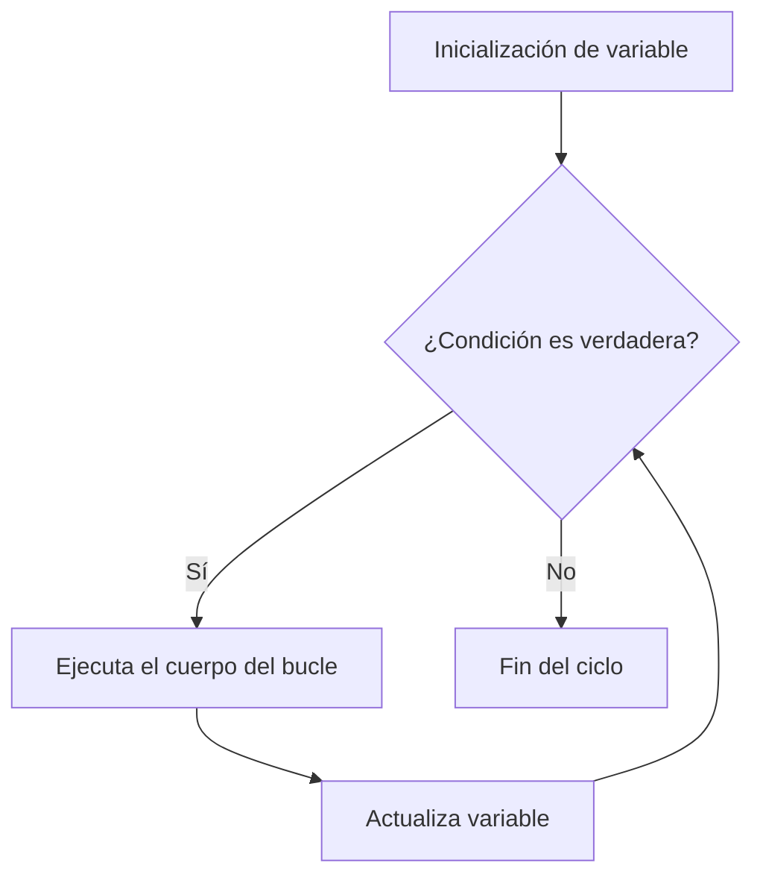
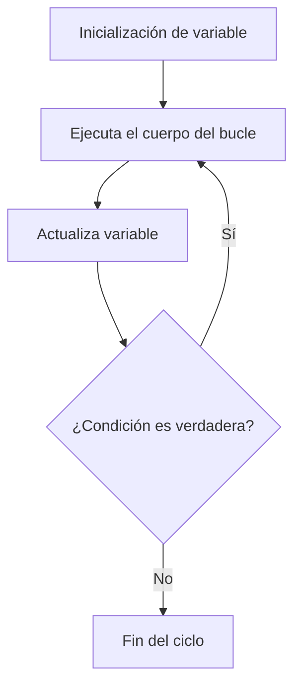
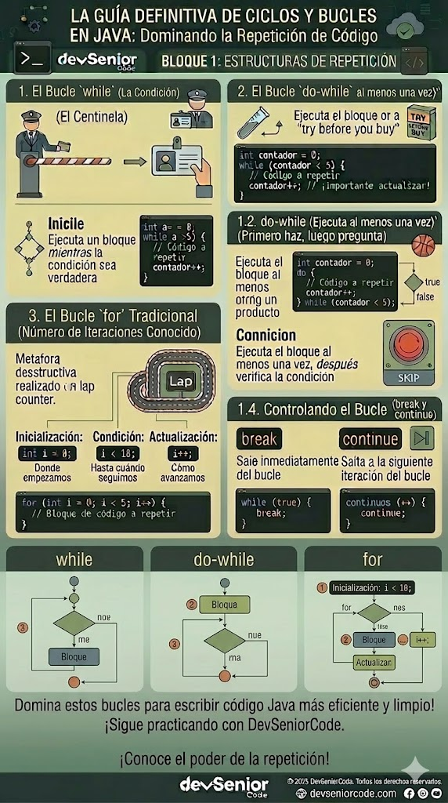

# Unidad 1 - Clase 5: El Dominio de la Iteración: Control de Flujo y Eficiencia Estructural en Java

**Objetivo**: Dominar las estructuras repetitivas desde una perspectiva de arquitectura senior, comprendiendo no solo la sintaxis de los bucles `while`, `do-while` y `for` en **Java 25**, sino también su impacto en la eficiencia algorítmica, la gestión de estado y el rendimiento en memoria. El alumno aprenderá a elegir la estructura óptima para procesos de lógica de negocio compleja, evitando deudas técnicas como el código espagueti o fugas de recursos por iteraciones mal gestionadas.

## 🚀 Setup de Clase

Para esta sesión, nos enfocaremos en el control manual y la optimización de bajo nivel aprovechando las capacidades de **Java 25**.

### 1. Configuración del JDK y Entorno de Alto Rendimiento

Asegúrate de tener instalada la versión de Java 25 (LTS).

- **Comando**: `java --version` (Debe retornar 25 o superior).

### 2. VS Code Power-Up: El Workspace del Desarrollador Backend

Configura tu entorno para que el compilador sea tu primer auditor de calidad:

- **Extension Pack for Java** (Microsoft): Vital para el soporte de las últimas JEPs.
- **SonarLint**: Configurado para detectar "Cognitive Complexity"

## 🧠 Inmersión Teórica: Estructuras Repetitivas

### El Arte de ser Senior: La Responsabilidad del Ciclo y Predictibilidad

Un desarrollador Junior ve un bucle como una forma de "repetir algo". Un **Desarrollador Senior** lo ve como una **transición de estado determinista** y un potencial cuello de botella. En un entorno de backend, cada iteración es un compromiso de CPU y latencia. El dominio de la iteración implica entender el **Invariante del Bucle**: aquella condición que debe ser verdadera antes y después de cada repetición para garantizar que el algoritmo es correcto.

La auditoría de lógica en bucles implica analizar la **Complejidad Ciclomática**. Si un bucle tiene demasiados saltos condicionales (`if/else`) internos, el "Branch Predictor" de la CPU física fallará. Esto provoca un _pipeline stall_, donde el procesador debe descartar instrucciones ya cargadas, reduciendo drásticamente el rendimiento. Un Senior minimiza la lógica dentro del ciclo o utiliza técnicas como el "Loop Splitting" para separar responsabilidades y mejorar la predictibilidad del hardware.

### Evolución Comparativa de la Iteración en Java

| Característica | Era Legacy (Java 8 / 11) | Era Moderna (Java 25 LTS) |
| --- | --- | --- |
| **Control de Índice** | Gestión manual verbosa (`int i = 0`). | Inferencia con `var` y optimización de tipos de valor. |
| **Recorrido Segura** | Iteradores manuales propensos a errores de concurrencia. | `SequencedCollections` para flujos bidireccionales predecibles. |
| `Mecánica de Salto` | Uso indiscriminado de labels y breaks complejos. | Estructuras de control más limpias y Pattern Matching en colecciones. |
| **Optimización JVM** | Inlining básico y desenrollado limitado. | **Advanced Loop Unrolling** y **On-Stack Replacement (OSR)**. |
| **Impacto en Memoria** | Alta tasa de Cache Misses en listas de objetos. | Localidad de datos mejorada para iteraciones masivas (Valhalla-ready). |

### Disección Técnica: La Anatomía de la Repetición en la JVM

Bajo el capó de la **JVM 25**, la ejecución de un bucle no es estática. Cuando un bloque de código se ejecuta repetidamente, el JIT (Just-In-Time) lo marca como "Hot Code". Aquí entra en juego el **On-Stack Replacement (OSR)**: la JVM puede reemplazar un bucle que se está ejecutando en ese mismo instante por una versión compilada a código máquina mucho más eficiente, sin detener el programa.

Además, el compilador realiza **Loop Unrolling**. Por ejemplo, si tienes un bucle que suma 100 números, el JIT podría transformarlo en 25 instrucciones que sumen 4 números a la vez, eliminando el 75% de las comprobaciones de la condición del contador. Sin embargo, para que esto ocurra, el bucle debe ser "limpio" y predecible. Bucles con demasiados efectos secundarios o llamadas a métodos externos no inlined impiden estas optimizaciones, dejando tu código en un estado sub-óptimo que consume más energía y tiempo de CPU.

### Filosofía de Elección: ¿Cuándo usar qué?

1. **Iteración Basada en Estado (`while`)**: Se utiliza para procesos reactivos. Si la iteración depende de un evento externo (como un socket de red o un cambio en una base de datos), el `while` es el estándar. El riesgo aquí es la "Condición de Carrera" o el bloqueo infinito si el estado externo nunca cambia.
2. **Iteración de Intento Mínimo (`do-while`)**: Es la estructura de "post-validación". Un Senior la reserva para procesos donde el primer paso es obligatorio, como la lectura inicial de una configuración que luego debe validarse cíclicamente.
3. **Iteración Determinista (`for`)**: Es nuestra herramienta de precisión. Se elige cuando el espacio de búsqueda o la cantidad de datos es finita y conocida de antemano. Es la estructura que mejor se lleva con el optimizador de la JVM debido a su estructura rígida de `(inicio; fin; paso)`.

## 🔍 Deep Dive: Mecánica Interna de la Iteración

### Arquitectura de Decisiones Iterativas

La lógica iterativa no es lineal, es un sistema de saltos condicionales a nivel de instrucciones de CPU (Assembly). Para un desarrollador, entender este flujo es vital para reducir la carga cognitiva del procesador.

### 1. El Motor de Predicción de Ramas (Branch Prediction)

A nivel de hardware, cuando el procesador llega a la condición de un bucle (ej. `i < 100`), no espera a que la comparación termine para cargar la siguiente instrucción. La CPU **predice** que el bucle continuará (porque lo ha hecho las últimas 99 veces) y carga preventivamente las instrucciones del cuerpo del bucle.

- **Implicación**: Si tu bucle tiene una lógica de salida errática o demasiados `if` internos impredecibles, la CPU "fallará" en su predicción, teniendo que vaciar su tubería de ejecución (_Pipeline Flush_). Esto puede hacer que un bucle sea hasta 10 veces más lento sin que haya un error de sintaxis.

### 2. Loop Unrolling: Eficiencia en la Micro-Gestión

El compilador JIT de Java 25 es agresivo con el desenrollado de bucles. Si el compilador detecta un bucle `for` pequeño, transforma esto:

```java
for (int i = 0; i < 3; i++) { 
    calcular(); 
}
```

En esto (a nivel de bytecode/máquina):

```java
calcular();
calcular();
calcular();
```

- **Consecuencia**: Se eliminan las instrucciones de incremento de `i` y las comparaciones de `i < 3`. Menos instrucciones significa menos ciclos de reloj y mayor velocidad de ejecución. Como Senior, diseñas bucles con límites claros para facilitar que el JIT realice esta optimización.

### 3. On-Stack Replacement (OSR) y HotSpot

Java monitoriza cuántas veces se ejecuta un bucle. Si un bucle `while` se vuelve "caliente" (hot), Java no espera a que el método termine para optimizarlo. Mediante `OSR`, la JVM compila el bucle a código nativo optimizado y lo "inyecta" en la pila de ejecución mientras el programa está corriendo. Es como cambiar el motor de un avión en pleno vuelo. Esto garantiza que procesos de larga duración mantengan una eficiencia máxima.

### 4. Localidad de Datos y Cache Locality

Cuando iteras sobre una estructura de datos (como un array de números), el procesador no trae solo un número a la vez desde la RAM. Trae una **Línea de Caché** completa (usualmente 64 bytes).

- **Fundamento**: Si iteras secuencialmente (0, 1, 2...), aprovechas que los siguientes datos ya están en la caché ultra-rápida de la CPU. Si iteras de forma aleatoria o saltando posiciones grandes, obligas a la CPU a buscar en la RAM constantemente (Cache Miss), degradando el rendimiento aunque la lógica sea correcta.

## 📖 Conceptos del Lenguaje

En Java 25, la repetición se fundamenta en tres estructuras principales, cada una con un propósito arquitectónico distinto.

### 1. El Bucle `while` (Evaluación Pre-condicional)

Es la forma más pura de repetición condicional. El bloque de código se ejecuta **solo si** la condición es verdadera desde el inicio. Si la condición es falsa en el primer intento, el cuerpo del bucle nunca se ejecuta.



- **Inicialización**: Debe realizarse **antes** de declarar el bucle. Es responsabilidad del programador preparar las variables que se evaluarán.
- **Incremento o Actualización**: Debe ocurrir obligatoriamente **dentro** del cuerpo del bucle. Si se omite, la condición nunca cambiará, creando un **bucle infinito** que agotará los recursos del sistema.

```java
// 1. Inicialización manual
var contador = 0; 

while (contador < 5) {
    println("Iteración número: " + contador);
    
    // 2. Incremento/Actualización manual
    contador++; 
}
```

### 2. El Bucle `do-while` (Evaluación Post-condicional)

A diferencia del `while`, esta estructura garantiza que el bloque de código se ejecute al menos una vez, ya que la condición se comprueba al final del ciclo.



- **Explicación**: El bucle `do-while` ejecuta el cuerpo al menos una vez, luego evalúa la condición. Si la condición es verdadera, repite el ciclo; si es falsa, termina.

- **Inicialización**: Se define externamente antes de la palabra clave `do`.
- `Incremento o Actualización`: Se gestiona manualmente dentro del bloque `{}`. Es vital asegurar que el estado cambie antes de llegar a la evaluación final del `while`.

```java
// 1. Inicialización
String entrada;

do {
    println("Procesando datos...");
    entrada = readln("Escriba 'salir' para finalizar:"); 
    
    // Actualización basada en interacción
} while (!entrada.equals("salir"));
```

### 3. El Bucle `for` (Control Integrado y Determinista)

Es la estructura más sofisticada y segura para iteraciones donde el número de pasos es conocido de antemano. Su diseño integra la gestión del ciclo en la propia declaración, minimizando el riesgo de olvidar la actualización de variables.

- **Sintaxis Integrada**: `for (inicialización; condición; incremento)`.
- **Encapsulamiento**: Las variables inicializadas en la cabecera del `for` mueren al terminar el bucle, lo que evita "ensuciar" la memoria con variables temporales.

```java
// Inicialización, condición e incremento en una sola línea
for (var i = 0; i < 10; i++) {
    println("Índice actual del sensor: " + i);
}
```

### 4. Modificadores de Flujo: `break` y `continue` (Análisis de Comportamiento)

Estas sentencias permiten al desarrollador de software alterar el flujo natural de un bucle basándose en eventos dinámicos. Su uso correcto mejora la legibilidad y la eficiencia, mientras que su uso excesivo puede generar código confuso.

- **Sentencia `break` (Interrupción Absoluta)**: Actúa como un "punto de salida de emergencia". Cuando el flujo de ejecución encuentra un `break`, Java aborta inmediatamente el bucle actual, ignorando cualquier repetición restante y saltando a la primera línea de código situada después del bloque repetitivo.
- **Sentencia `continue` (Interrupción de Iteración)**: Funciona como un "filtro de exclusión". Cancela únicamente la vuelta actual. El control vuelve de inmediato a la cabecera del ciclo para evaluar la condición (en `while`/`do-while`) o realizar el incremento y luego evaluar (en `for`).

### Ejemplos Prácticos por Bucle

#### Uso en Bucle `while`

```java
var i = 0; 
while (i < 10) {
    i++; 
    if (i == 3) {
        continue; // Salta el procesamiento del 3
    }
    if (i == 7) {
        break;    // Aborta la ejecución al llegar a 7
    }
    println("Procesando en while: " + i);
}
```

#### Uso en Bucle `do-while`

```java
var n = 0; 
do {
    n++; 
    if (n % 2 == 0) {
        continue; // Descarta números pares inmediatamente
    }
    if (n > 8) {
        break;         // Límite de seguridad
    }
    println("Valor impar detectado: " + n);
} while (n < 20);
```

#### Uso en Bucle `for`

```java
for (var x = 1; x <= 10; x++) {
    // Cláusula de guarda: si es 5, no ejecutamos la lógica principal
    if (x == 5) {
        println("[Log] Saltando valor restringido: 5");
        continue;
    }
    if (x == 9) {
        break; // Finalización anticipada por cumplimiento de meta
    }
    println("Valor procesado en for: " + x);
}
```



## 💻 Laboratorio de Aplicación Práctica: Motor de Liquidación de Activos (Fintech)

Implementaremos un motor que procesa una cartera de activos financieros, calculando el interés y aplicando ajustes de mercado hasta alcanzar un umbral de seguridad. Usaremos las nuevas APIs de entrada y salida simplificadas de **Java 25**.

💡 **VS Code Pro-Tip**: Usa `Ctrl + Shift + O` para navegar rápidamente entre las etiquetas de tus bucles y métodos dentro del archivo.

Implementación de Referencia (Java 25 - Estilo Implícito)

```java
import java.util.Random;

/**
 * Motor de Simulación Financiera.
 * Implementación usando Clases Implícitas de Java 25.
 */
void main() {
    var random = new Random();
    
    println("=== MOTOR DE LIQUIDACIÓN FINANCIERA JAVA 25 LTS ===");
    
    double portfolioValue = 50000.0;
    final double MARGIN_CALL_LIMIT = 10000.0;
    int cycle = 0;

    // EJEMPLO 1: WHILE - Simulación de volatilidad de mercado
    while (portfolioValue > MARGIN_CALL_LIMIT) {
        cycle++;
        // Fluctuación de mercado manual (-2000 a +2000)
        double marketChange = (random.nextDouble() - 0.5) * 4000; 
        portfolioValue += marketChange;

        println("[Ciclo %d] Valor actual: $%.2f".formatted(cycle, portfolioValue));

        // Protección de ejecución
        if (cycle >= 50) {
            println(">> Límite de simulación alcanzado por seguridad del sistema.");
            break; 
        }
        
        if (Math.abs(marketChange) < 10) {
            continue; 
        }
        
        println("   * Auditoría: Cambio significativo detectado.");
    }

    // EJEMPLO 2: FOR - Ajustes fiscales de cierre (5 periodos)
    println("\n--- Aplicando Ajustes Fiscales Finales ---");
    for (var period = 1; period <= 5; period++) {
        double adjustment = portfolioValue * 0.01;
        portfolioValue -= adjustment;
        println("Periodo %d: Ajuste aplicado -$%.2f | Nuevo Saldo: $%.2f".formatted(period, adjustment, portfolioValue));
    }

    // EJEMPLO 3: DO-WHILE - Validación de cierre
    String input;
    do {
        println("\n¿Desea archivar el reporte final? (Si/No)");
        input = readln().trim().toLowerCase();
        
        if (input.equals("si")) {
            println("Reporte archivado con éxito.");
        }
    } while (!input.equals("si") && !input.equals("no"));

    println("Operación finalizada correctamente.");
}
```

## 💪 Reto de Consolidación: "The Market Protocol Bot"

**Escenario**: Estás desarrollando el motor de un bot de intercambio que opera por ciclos de recursos.

1. **Requisito 1 (While)**: El bot debe operar mientras su "Reserva de Datos" sea superior al 15%. Cada ciclo de operación consume un 4% de reserva.
2. **Requisito 2 (For)**: Dentro de cada ciclo de reserva, el bot debe consultar 4 fuentes de precios distintas.
3. **Requisito 3 (Control)**: Si una fuente devuelve un valor de `0.0` (error), usa `continue`. Si el precio detectado es menor a `50.0`, usa `break`. Para cada bloque condicional debe usarse llaves `{}`.
4. **Requisito 4 (Do-While)**: Al finalizar, solicita al usuario que ingrese el código de seguridad "99" para apagar el sistema usando `readln()`, repitiendo la petición hasta que sea correcto.

### 🛠️ Aplicaciones Adicionales a Desarrollar

#### Filtro de Telemetría Aeroespacial (Cláusulas de Guarda)

Diseña una aplicación que procese 100 lecturas de un sensor de presión. Si una lectura es negativa, es un error de hardware y debe ser saltada usando `continue` para no ensuciar las estadísticas. Si la presión supera los 2000 PSI, es una emergencia crítica: el bucle debe detenerse inmediatamente con `break` y alertar al operador. El código debe estar aplanado (sin múltiples niveles de indentación) utilizando llaves `{}` en cada bloque.

#### Generador de Matriz de Precios Multi-región (Anidamiento)

Crea una herramienta que genere una tabla de precios para 5 regiones diferentes (filas) y 3 categorías de productos (columnas). Utiliza bucles `for` anidados para calcular el precio final de cada celda multiplicando un `precioBase` por un `factorRegional` y un `factorCategoria`. La salida debe ser una cuadrícula visualmente clara en la consola usando `println()`.

#### Protocolo de Handshake Segura (Retry Logic)

Implementa un simulador de conexión que utilice un bucle `do-while` para intentar establecer un "Handshake" con un servidor. El sistema debe permitir hasta 3 intentos de conexión. En cada intento, solicita un token al usuario con `readln()`. Si el token es "AUTH123", la conexión es exitosa y se rompe el ciclo. Si después de los 3 intentos no hay éxito, el programa debe informar el bloqueo de seguridad por intentos fallidos.

## 📚 Recursos de Maestría

- [JEP 495: Simple Source Files and Instance Main Methods](https://openjdk.org/jeps/495): Especificación oficial sobre la simplificación de la estructura de archivos Java, permitiendo la ejecución de código de nivel de entrada sin la carga ceremonial de clases explícitas.
- [Project Valhalla: Value Objects and Performance](https://openjdk.org/projects/valhalla/): Iniciativa de la JVM para optimizar el diseño de memoria, permitiendo que los bucles sobre grandes colecciones de datos sean significativamente más rápidos al mejorar la localidad de caché.
- [Inside Java - Deep Dive into JIT Loop Optimizations](https://inside.java/tag/jit/): Blog técnico oficial de Oracle que desglosa las técnicas de HotSpot para optimizar bucles, incluyendo unrolling, inlining y OSR (On-Stack Replacement).

---

Recuerden que un desarrollador de software no nace, se construye ciclo a ciclo. Dominar la iteración es el primer paso para dominar el sistema completo. **¡Nos vemos en el código!**
