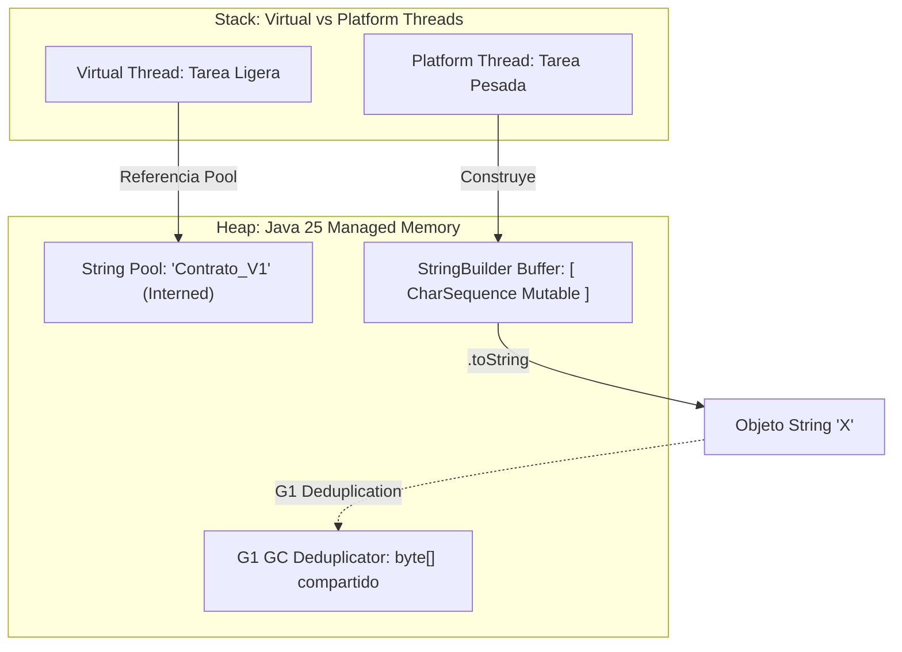

# Unidad 1 - Clase 6: Manipulación Avanzada de Cadenas y la Ciencia de la Modularidad en Java

**Objetivo**: Dominar la gestión de memoria y la legibilidad de datos textuales en **Java 25** mediante el uso de **Text Blocks**, inmutabilidad estratégica y optimización crítica del **String Pool**. En esta sesión, el desarrollador senior aprenderá a orquestar flujos de datos textuales diferenciando entre la inmutabilidad de `String` y la mutabilidad controlada de `StringBuilder`. Al finalizar, el estudiante diseñará sistemas con lógica modular basada en funciones atómicas, utilizando los nuevos estándares de documentación en Markdown integrados en el JDK.

## 🚀 Setup de Clase

Para operar con la versión de soporte a largo plazo (LTS) de Java 25, configuremos un entorno de alto rendimiento:

1. **JDK 25**: Instalación obligatoria para acceder a las optimizaciones estables del G1 GC en deduplicación de Strings y soporte total para comentarios en Markdown.
2. **Extensiones Cruciales en VS Code**:
    - **Extension Pack for Java**: Soporte nativo para Java 25.
    - **Language Support for Java™ by Red Hat**: Configurado para reconocer el nivel de lenguaje 25.
    - **SonarLint**: Para auditar la eficiencia de las cadenas en tiempo real.

## 🧠 Inmersión Teórica: Cadenas y la Estructura de Funciones

### El Arte de ser Senior: Pensamiento Sistémico en Cadenas

En Java 25, la gestión de cadenas ya no es solo sobre sintaxis, sino sobre **economía de recursos**. Un desarrollador senior entiende que cada `String` en el Heap es un compromiso de memoria que impacta directamente en la latencia del sistema.

1. **Inmutabilidad Definitiva (`String`)**: Java 25 consolida la seguridad de los Strings. Al ser inmutables, son candidatos perfectos para el **String Pool**. El senior utiliza literales y Text Blocks para asegurar que la JVM pueda reutilizar instancias, reduciendo la fragmentación del Heap.
2. **Mutabilidad Estratégica (`StringBuilder`)**: Para procesos de construcción masiva (generación de logs, informes financieros o payloads complejos), el senior evita el operador `+`. Java 25 optimiza el uso de `StringBuilder` internamente, pero el control explícito del desarrollador garantiza una asignación de memoria predecible.
3. **Funciones como Contratos**: La modularidad en Java 25 se beneficia de un tipado más fuerte y una mejor inferencia. Las funciones son la base de la programación funcional dentro de Java, permitiendo transformaciones de datos puras.

### Evolución Comparativa: El Camino hacia Java 25

| Característica | Era Legacy (Java 11/17) | Java 25 (Estado Actual) | Implicación para el Desarrollador |
| --- | --- | --- | --- |
| **Documentación** | Javadoc tradicional HTML. | Markdown Documentation (JEP 494). | Documentación mucho más legible y mantenible con `///`. |
| **Cadenas Multi-línea** | Text Blocks (Primeras versiones). | Text Blocks Optimizados. | Gestión de indentación incidental con costo cero en runtime. |
| **Rendimiento** | Concatenación básica. | Vectorización en String Concat. | El JIT usa instrucciones SIMD para manipular Strings más rápido. |
| **Deduplicación** | Proceso pesado de GC. | G1 GC String Deduplication. | Activado por defecto para reducir el footprint de memoria. |
| **Modularidad** | Métodos extensos. | Funciones Atómicas Atemporales. | Enfoque en la inmutabilidad y transparencia referencial. |

## 🔍 Deep Dive: Gestión de Memoria y Ciclo de Vida

### La Anatomía del String Pool en la Era de los Hilos Virtuales

En Java 25, el **String Pool** (o _Intern Map_) reside en el **Heap**, pero su interacción con el recolector de basura **G1 (Garbage First)** ha sido optimizada. Cuando un desarrollador senior utiliza literales de cadena o invoca `String.intern()`, no solo está ahorrando memoria, está reduciendo la presión sobre el recolector de basura.

### Diagrama de Arquitectura: Pool vs. Buffer en Java 25



### Análisis Interno 1: Deduplicación Automática y SIMD

Java 25 utiliza instrucciones **SIMD (Single Instruction, Multiple Data)** para acelerar la comparación y concatenación de cadenas. A nivel de CPU, esto permite procesar múltiples caracteres en un solo ciclo de reloj.

- **Consecuencia**: Las aplicaciones que procesan grandes volúmenes de texto (como parsers de logs o motores de búsqueda) experimentan una mejora de rendimiento de hasta un $15\%$ sin cambiar una sola línea de código.
- **G1 GC String Deduplication**: Si el recolector de basura detecta dos objetos `String` diferentes que contienen exactamente el mismo `byte[]` de datos, modifica sus referencias internas para que compartan el mismo arreglo de bytes, liberando la memoria duplicada.

## 📖 Conceptos del Lenguaje y Buenas Prácticas

### Cadenas Inmutables vs Mutables en Sistemas de Alta Disponibilidad

#### 1. Inmutabilidad (`String`): La Fortaleza del Diseño

Un `String` en Java es un objeto cuyo estado no puede ser modificado después de su creación. El desarrollador senior debe dominar las funciones integradas que permiten transformar datos sin violar esta inmutabilidad, ya que cada método de la clase `String` devuelve una nueva instancia con el resultado.

##### Funciones Esenciales y Ejemplos de Uso

- **Inspección y Validación**:
  - `length()`: Devuelve el número de caracteres.
  - `isEmpty()`: Verifica si la cadena no contiene caracteres (longitud 0).
  - `isBlank()`: Detecta si la cadena solo tiene espacios en blanco.

  ```java
  String input = "  ";
  int longitud = input.length(); // 2
  boolean vacio = input.isEmpty(); // false
  boolean blanco = input.isBlank(); // true (Recomendado para validación)
  ```

- **Búsqueda y Comparación**:
  - `contains(CharSequence s)`: Verifica si la cadena contiene una secuencia específica.
  - `startsWith(String prefix)`: Verifica si la cadena comienza con un prefijo específico.
  - `endsWith(String suffix)`: Verifica si la cadena termina con un sufijo específico.
  - `equals(Object anObject)`: Compara dos cadenas para verificar si son iguales.
  - `equalsIgnoreCase(String anotherString)`: Compara dos cadenas ignorando mayúsculas y minúsculas.

  **Nota**: Para comparación de cadenas **NUNCA** uses `==`.

  ```java
  String documento = "Contrato_V1_Firmado_2026";

  // Búsqueda y comparación
  boolean contieneFirma = documento.contains("Firmado"); // true
  boolean iniciaConContrato = documento.startsWith("Contrato"); // true
  boolean terminaCon2026 = documento.endsWith("2026"); // true
  boolean esIgual = documento.equals("Contrato_V1_Firmado_2026"); // true
  boolean esIgualIgnorandoCaso = documento.equalsIgnoreCase("contrato_v1_firmado_2026"); // true
  ```

- **Transformación y Segmentación (Parsing)**:
  - `substring(int begin, int end)`: Extrae una parte de la cadena entre los índices especificados.
  - `trim()`: Elimina espacios en blanco al inicio y al final, pero no maneja correctamente todos los caracteres de espacio Unicode.
  - `strip()`: Elimina espacios en blanco al inicio y al final. En Java moderno, `strip()` es preferible a `trim()` para manejar correctamente los caracteres Unicode de espacio.
  - `replace(CharSequence target, CharSequence replacement)`: Reemplaza todas las ocurrencias de una secuencia con otra.

  ```java
  String rawData = "   ID001|Laptop Pro|1500.00|Stock   ";
  String cleanedData = rawData.strip(); // "ID001|Laptop Pro|1500.00|Stock"
  String id = cleanedData.substring(0, 5); // "ID001"
  String sanitizedData = cleanedData.replace("Laptop Pro", "Laptop X"); // "ID001|Laptop X|1500.00|Stock"
  ```

  - `split(String regex)`: Divide la cadena en un arreglo basado en una expresión regular.
  - `split(String regex, int limit)`: Variante crucial para el rendimiento. Controla cuántas veces se aplica el patrón.

  ```java
  String row = "ID001|Laptop Pro|1500.00|Stock";
  // El pipe '|' es un meta-carácter en Regex, requiere escape doble '\\|'
  String[] parts = row.split("\\|"); 

  // Optimización: Solo queremos el ID y el nombre
  String[] fastParts = row.split("\\|", 2); 
  // ["ID001", "Laptop Pro|1500.00|Stock"]
  ```

- **Operaciones de Java Moderno (LTS)**:
  - `formatted(Object... args)`: Permite formatear cadenas de manera más legible que `String.format()`, especialmente útil con Text Blocks.
  - `repeat(int count)`: Repite la cadena un número específico de veces, ideal para generar patrones o tablas visuales en consola.
  - `lines()`: Devuelve un Stream de líneas, facilitando el procesamiento de texto multi-línea sin necesidad de dividir manualmente por saltos de línea.

  ```java
  String template = """
      Nombre: %s
      Edad: %d
      """;
  String formatted = template.formatted("Alice", 30);
  String pattern = "-".repeat(30); // "------------------------------"
  String multiLine = "Línea 1\nLínea 2\nLínea 3";
  multiLine.lines().forEach(System.out::println);
  ```

##### Pilares Técnicos de la Inmutabilidad

- **Seguridad de Hilos (Thread Safety)**: Los objetos `String` pueden compartirse libremente entre miles de hilos sin riesgo de corrupción.
- **Seguridad de Red y Sistema**: Evita el ataque _Time-of-Check to Time-of-Use_ al no poder alterarse los datos de conexión tras ser validados.
- **Caché de HashCode**: El hashCode se calcula una sola vez y se almacena en caché, agilizando búsquedas en colecciones.

#### 2. Mutabilidad Controlada (`StringBuilder`): La Eficiencia de Construcción

Mientras que `String` es ideal para el almacenamiento seguro, `StringBuilder` es la herramienta de construcción por excelencia. Funciona mediante un arreglo interno (`byte[]` en Java 25) que crece dinámicamente, permitiendo modificaciones _in-place_ sin crear nuevos objetos en el Heap por cada cambio.

##### Funciones Críticas de `StringBuilder`

- `append(Data x)`: El método principal. Sobrecargado para aceptar cualquier tipo de dato (primitivos, objetos, `null`). Agrega el contenido al final del búfer actual.
- `insert(int offset, Data x)`: Permite inyectar contenido en una posición específica, desplazando los caracteres existentes hacia la derecha.
- `delete(int start, int end)` y `deleteCharAt(int index)`: Elimina una secuencia o un carácter específico. Es fundamental para "limpiar" plantillas dinámicas.
- `reverse()`: Invierte el orden de los caracteres en el búfer. Una operación optimizada de bajo nivel.
- `setLength(int newLength)`: Una técnica senior para vaciar el búfer sin instanciar un nuevo `StringBuilder`. Si se pasa `0`, el contenido actual se descarta pero se mantiene la capacidad del arreglo interno.
- `capacity()` vs `length()`: `length()` es el número de caracteres actuales; `capacity()` es el tamaño del arreglo interno antes de requerir una nueva asignación de memoria.

##### Ejemplo de Ingeniería de Datos con `StringBuilder`

```java
void main(String[] args) {
    // Inicialización con capacidad predefinida para evitar redimensionamiento
    var report = new StringBuilder(128); 

    // append() encadenado (Fluent API)
    report.append("LOG REPORT")
          .append("\n----------\n")
          .append("Status: ")
          .append("ACTIVE");

    // insert() para corregir o inyectar metadatos en el encabezado
    report.insert(0, "[CONFIDENCIAL] ");

    // reverse() - Caso de uso: inversión de tokens de seguridad
    var token = new StringBuilder("ABC-123");
    var secureToken = token.reverse().toString(); // "321-CBA"

    // setLength(0) - Reutilización del búfer en un proceso masivo
    println(report.toString());
    report.setLength(0); // Búfer vacío, listo para el siguiente log sin nueva reserva de Heap
}
```

**Regla de Oro Senior**: Si la concatenación ocurre dentro de un bucle, implica lógica condicional compleja o excede los tres pasos de construcción, **usa** `StringBuilder`.

| Escenario | Herramienta Recomendada | Razón Técnica |
| --- | --- | --- |
| **Claves de Caché / IDs** | `String` | Inmutabilidad y HashCode pre-calculado. |
| **Tokens JWT / URLs** | `String` | Seguridad y compartición segura entre hilos. |
| **Generación de JSON/XML** | `StringBuilder` | Evita la saturación del Heap por objetos basura. |
| **Logs en Bucle** | `StringBuilder` | Minimiza las pausas del Garbage Collector (GC). |

#### 3. Text Blocks: La Claridad es Primordial

Los **Text Blocks** (`"""`) en Java 25 representan una evolución en la legibilidad del código. No son solo cadenas con saltos de línea; son una herramienta de ingeniería para integrar lenguajes como SQL, JSON, XML o HTML sin el ruido visual de los caracteres de escape.

##### 1. Indentación Incidental: El Algoritmo de Limpieza

El compilador de Java utiliza un algoritmo para determinar qué espacios a la izquierda son parte del formato del código fuente (indentación incidental) y cuáles son parte del contenido del texto.

- **El secreto del margen**: El margen izquierdo se determina por la línea que esté más a la izquierda o por la posición de las comillas de cierre `"""`.
- **Impacto**: Esto permite que el desarrollador mantenga el bloque de texto alineado con su lógica de métodos sin que esos espacios extra terminen en la base de datos o en el log.

```java
String sql = """
    SELECT *
        FROM clientes
        WHERE status = 'ACTIVO'
    """;
```

En este ejemplo, el margen izquierdo se determina por la línea más a la izquierda (`SELECT *`). Los espacios adicionales antes de `FROM` y `WHERE` se preservan, pero la indentación del bloque respecto al código fuente no se incluye en el contenido final del String. Así, el texto resultante es limpio y alineado, sin espacios accidentales.

```plain
SELECT *
    FROM clientes
    WHERE status = 'ACTIVO'
```

##### 2. Caracteres de Escape Modernos

Aunque los Text Blocks preservan saltos de línea, a veces necesitamos control fino:

- **El escape `\`**: Si colocas una barra invertida al final de una línea, el compilador ignora el salto de línea. Es ideal para mantener líneas de código legibles en el IDE que deben ser una sola línea larga en el String final.
- **El escape `\s`**: Preserva un solo espacio en blanco. Es útil para asegurar que el compilador no elimine espacios al final de una línea (trailing spaces) que podrían ser necesarios para ciertos formatos de archivo.

```java
String json = """
  {
    "nombre": "Alice",\
    "departamento": "Finanzas"\s
  }
  """;
```

- El `\` al final de la línea une `"nombre": "Alice",` y `"departamento": "Finanzas"` en una sola línea, eliminando el salto de línea.
- El `\s` al final de `"Finanzas"` preserva un espacio en blanco al final de esa línea.

```plain
{
  "nombre": "Alice","departamento": "Finanzas" 
}
```

Esto permite controlar exactamente cómo se formatea el contenido del Text Block, útil para generar archivos o cadenas donde los espacios y saltos de línea son críticos.

##### 3. Integración con `.formatted()`

Un desarrollador senior nunca concatena dentro de un Text Block. Utiliza la inmutabilidad a su favor mediante plantillas limpias:

```java
String query = """
    SELECT id, name, email 
    FROM users 
    WHERE status = '%s' 
    AND role = '%s'
    """.formatted("ACTIVE", "ADMIN");
```

```plain
SELECT id, name, email 
FROM users 
WHERE status = 'ACTIVE'
AND role = 'ADMIN'
```

##### 4. Implicaciones en Seguridad y Auditoría

Al usar Text Blocks, el código SQL o JSON es idéntico a lo que se vería en un editor de base de datos. Esto facilita enormemente la **auditoría de seguridad** y la detección visual de posibles vulnerabilidades, reduciendo la carga cognitiva al comparar el código con la especificación técnica.

#### 4. Funciones (Modularidad Pura)

En la transición hacia la arquitectura senior, el dominio de las funciones estáticas es el primer paso para entender la **Programación Funcional** y la **Transparencia Referencial**. En Java 25, los métodos estáticos se cargan en el **Metaspace**, una región de memoria nativa fuera del Heap, lo que los hace accesibles globalmente sin costo de instanciación.

##### 1. Pureza y Transparencia Referencial

Una función se considera "pura" cuando su salida depende exclusivamente de sus parámetros de entrada y no produce efectos secundarios (no modifica variables globales ni realiza I/O directo).

- **Transparencia Referencial**: Un desarrollador senior busca que una función pueda ser reemplazada por su valor de retorno sin alterar el comportamiento del programa. Esto facilita enormemente el **Testing Unitario**.

##### 2. Anatomía Senior de un Método en Java 25

Con la JEP 494, la documentación de funciones utiliza Markdown (`///`), permitiendo que el contrato de la función sea legible tanto en el código como en las herramientas de IA.

```java
/// # Validador de Identificadores Financieros
/// Esta función pura valida si un ID cumple con el estándar de la entidad.
/// - Recibe: `String` con el ID crudo.
/// - Retorna: `boolean` indicando validez.
boolean esIdentificadorValido(String id) {
    if (id == null || id.isBlank()) {
        return false;
    }
    return id.startsWith("TXN_") && id.length() > 10;
}
```

##### 3. El Principio de Responsabilidad Única (SRP) en Métodos

Un método senior no debe superar las 15-20 líneas de código. Si una función hace "demasiado", debe ser fragmentada en métodos privados de soporte.

- **Alta Cohesión**: Cada función debe resolver un único problema atómico (ej. `limpiarTexto`, `aplicarDescuento`, `formatearSalida`).
- **Bajo Acoplamiento**: Los métodos estáticos deben interactuar a través de tipos primitivos o inmutables (`String`, `Record`), minimizando la dependencia de estados compartidos.

##### 4. Sintaxis de Funciones en el Modelo Compacto (Java 25)

Java 25 permite el uso de **clases declaradas implícitamente**, lo que significa que puedes definir métodos directamente en el archivo sin el envoltorio `public class MiPrograma { ... }`. Esto simplifica la creación de herramientas y reduce el "ruido" sintáctico.

- **Anatomía de la Función Atómica**:

  ```mermaid
  graph LR
      E[Entrada: Parámetros] --> P[Proceso: Lógica]
      P --> S[Salida: Retorno o Void]
  ```

- **Funciones que no devuelven nada (`void`)**: Se utilizan cuando la función tiene un efecto secundario (imprimir en consola, guardar en un archivo, enviar un log). No producen un valor que pueda ser asignado a una variable.

  ```java
  void mostrarAlerta(String mensaje) {
      System.out.println("[ALERTA]: " + mensaje);
      // No hay sentencia return, o se usa 'return;' para salir prematuramente.
  }
  ```

- **Funciones que devuelven valores**: Deben especificar el **Tipo de Dato** del resultado. La palabra clave `return` es obligatoria y finaliza la ejecución de la función, enviando el valor al llamador.

  ```java
  double calcularIVA(double monto) {
      return monto * 0.19; // Retorna un valor de tipo double
  }
  ```

- **Definición y Paso de Parámetros**: Los parámetros son los datos que la función necesita para operar. En Java, el tipado es estricto: debes declarar el `Tipo` y el `nombre`.

  - **Pasaje por valor**: Java siempre pasa los parámetros por valor. En el caso de objetos (como `String`), lo que se pasa es el valor de la referencia a la memoria.

  ```java
  /// Función con múltiples parámetros de distintos tipos
  String formatearRegistro(String id, int nivel, boolean activo) {
      return "ID: %s | Nivel: %d | Activo: %b".formatted(id, nivel, activo);
  }
  ```

#### 5. Expresiones regulares: El Poder de la Validación y Transformación

Las **expresiones regulares** (regex) son patrones potentes para buscar, validar y transformar texto. En Java, se utilizan principalmente a través de la clase `Pattern` y los métodos de `String` como `matches()`, `replaceAll()`, y `split()`.

##### ¿Qué es una expresión regular?

Una expresión regular es una secuencia de caracteres que define un patrón de búsqueda. Permite identificar formatos específicos (como emails, números, fechas) y realizar operaciones de validación o extracción.

##### Uso básico en Java

- **Validación**: Comprobar si una cadena cumple un formato.
- **Extracción**: Obtener partes de una cadena que coinciden con el patrón.
- **Transformación**: Reemplazar o modificar partes del texto.

##### Cómo crear formatos de expresiones regulares (regex)

Para definir un formato con regex, identifica el patrón que debe cumplir el texto:

- **Caracteres literales**: Escribe los caracteres exactos que deben aparecer.
- **Meta-caracteres**: Usa símbolos especiales para definir clases de caracteres y repeticiones:
  - `\d` = dígito (0-9)
  - `\w` = letra o número
  - `.` = cualquier carácter
  - `+` = uno o más
  - `*` = cero o más
  - `?` = cero o uno
  - `^` = inicio de la cadena
  - `$` = fin de la cadena
  - `\` = escape para caracteres especiales
  - `[abc]` = cualquiera de a, b, c
  - `{n,m}` = entre n y m repeticiones

Ejemplo: Para validar un número de cuenta de 10 dígitos:  
`^\d{10}$`

Ejemplo: Para validar un email básico:  
`^[\w.-]+@[\w.-]+\.[a-zA-Z]{2,}$`

Puedes combinar y agrupar patrones usando paréntesis `()` y alternancia `|`.

**Recomendación senior**:

- Empieza por el formato esperado (ej. "ABC-1234") y tradúzcalo a regex:  
  - Letras: `[A-Z]{3}`
  - Guión: `-`
  - Dígitos: `\d{4}`
  - Resultado: `^[A-Z]{3}-\d{4}$`

###### Ejemplo: Validar un correo electrónico

```java
String email = "usuario@dominio.com";
boolean esValido = email.matches("^[\\w.-]+@[\\w.-]+\\.[a-zA-Z]{2,}$"); // true
```

###### Ejemplo: Extraer números de una cadena

```java
String texto = "Pedido #12345 entregado el 2024-06-01";
var matcher = java.util.regex.Pattern.compile("\\d+").matcher(texto);
while (matcher.find()) {
  System.out.println("Número encontrado: " + matcher.group());
}
// Salida: Número encontrado: 12345, 2024, 06, 01
```

###### Ejemplo: Reemplazar caracteres no numéricos

```java
String cuenta = "AB-123-CD";
String soloNumeros = cuenta.replaceAll("\\D", ""); // "123"
```

###### Ejemplo: Segmentar texto usando split con regex

```java
String registro = "ID001|Laptop Pro|1500.00|Stock";
String[] campos = registro.split("\\|"); // Divide por el carácter pipe '|'
```

##### Buenas prácticas senior

- Usa patrones pre-compilados (`Pattern.compile()`) para mejorar el rendimiento en procesos masivos.
- Documenta los patrones complejos con comentarios o ejemplos.
- Valida siempre la entrada antes de aplicar transformaciones para evitar errores de formato.

Las expresiones regulares son esenciales para la manipulación avanzada de cadenas, permitiendo validar, extraer y transformar datos de manera eficiente y modular en Java 25.

## 💻 Laboratorio de Aplicación Práctica: Motor de Generación de Documentación Legal para Pagos Trans-fronterizos (Cross-Border Payments)

En la industria **Fintech**, la agilidad es un factor competitivo crítico. Imagina que trabajas para una plataforma global de pagos que procesa miles de transacciones por second entre diferentes jurisdicciones (UE, EE.UU., LATAM). Cada transacción requiere la generación instantánea de un **Contrato de Términos y Condiciones** personalizado y un **Reporte de Cumplimiento (Compliance)** en formato digital para cumplir con las regulaciones internacionales.

**El Desafío Técnico**: La generación manual o mediante plantillas rígidas es ineficiente y propensa a errores legales. Como **Desarrollador Senior**, se te ha encomendado construir un motor que:

1. **Ingesta de Datos**: Reciba un flujo de datos crudos (en formato CSV o delimitado por punto y coma) proveniente de un sistema legado de procesamiento de tarjetas.
2. **Procesamiento de Alta Velocidad**: Segmente los datos de forma eficiente (usando `split`) sin saturar el Heap, garantizando que los metadatos de seguridad (Tokens) no se vean comprometidos gracias a la inmutabilidad de los Strings.
3. **Generación Multi-formato**: Produzca un documento legal con formato profesional utilizando **Text Blocks** para asegurar que el código fuente de la plantilla coincida exactamente con la salida visual, facilitando auditorías por parte del equipo legal.

💡 **VS Code Pro-Tip**: Al usar Java 25, puedes pasar el ratón sobre un método documentado con `///` y verás el renderizado Markdown completo directamente en el editor.

### Implementación de Referencia (Java 25)

```java
import java.time.LocalDate;

/// # Motor de Contratos Fintech v25.0
/// Esta clase demuestra el uso de **Text Blocks**, **Procesamiento de Cadenas** y **Modularidad Atómica**
/// utilizando el modelo de clase declarada implícitamente de Java 25.

void main() {
    // Datos de entrada simulados (formato plano proveniente de un Core Bancario)
    var rawData = "Algenib Wealth Management;2500000.00;USD";
    
    // Parsing manual sin arrays (usando técnicas de posicionamiento e índices)
    var firstSeparator = rawData.indexOf(";");
    var lastSeparator = rawData.lastIndexOf(";");
    
    // Extracción de fragmentos mediante substring
    var inversionista = rawData.substring(0, firstSeparator);
    var montoStr = rawData.substring(firstSeparator + 1, lastSeparator);
    var monto = Double.parseDouble(montoStr);
    
    // Orquestación de funciones atómicas para separar responsabilidades (SRP)
    var header = createHeader(inversionista);
    var body = createContractBody(inversionista, monto);
    var footer = createFooter();

    // Composición final utilizando inmutabilidad para garantizar la integridad
    var contratoCompleto = header + body + footer;

    println(contratoCompleto);
}

/// Genera el encabezado profesional del contrato.
String createHeader(String client) {
    return """
        ===================================================
        CONTRATO DE INVERSIÓN DE CAPITAL - JAVA 25 LTS
        Cliente: %s
        Fecha: %s
        ===================================================
        """.formatted(client.toUpperCase(), LocalDate.now());
}

/// Construye el cuerpo del contrato de forma dinámica.
String createContractBody(String name, double amount) {
    var sb = new StringBuilder();
    sb.append("\nCLÁUSULAS DE CUMPLIMIENTO:\n");
    
    var clausulaBase = """
        1. El inversionista %s se compromete a aportar la suma de $%.2f.
        2. La plataforma garantiza la seguridad de los activos.
        """.formatted(name, amount);
        
    sb.append(clausulaBase);
    return sb.toString();
}

/// Devuelve el pie de página legal estático.
String createFooter() {
    return """
        
        __________________________
        Firma Autorizada: AI-CORE-FINANCE
        Documento generado bajo protocolo Java 25.
        """;
}
```

## 💪 Reto de Consolidación: El Puente de Datos Legacy (ERP Integration)

Imagina que has sido contratado para modernizar la capa de integración de una multinacional de logística. El sistema central (un ERP de los años 90) emite registros de transacciones en una sola cadena de texto crudo con el formato `ID_TRANSACCION:NOMBRE_PRODUCTO:PESO_KG:CIUDAD_DESTINO`. Tu misión es construir un **Motor de Etiquetas** capaz de transformar este texto desordenado en tres formatos modernos y estructurados, asegurando la integridad de los datos y el rendimiento del sistema bajo una carga de millones de registros diarios.

**Objetivo Técnico**: Desarrollar un generador de reportes que aplique el **modelo compacto de Java 25** para procesar entradas y convertirlas en salidas visuales de alta fidelidad.

**Requisitos del Desarrollador Senior**:

1. **Documentación de Contrato (`///`)**: Todos los métodos deben poseer documentación Markdown detallando parámetros y lógica.
2. **Arquitectura Atómica**: El sistema debe tener tres funciones independientes:
    - `toShippingLabel`: Genera una etiqueta visual con marco usando Text Blocks.
    - `toAuditLine`: Genera una línea de auditoría simplificada usando `substring` y `toUpperCase`.
    - `toStatusReport`: Genera un resumen ejecutivo usando `StringBuilder`.
3. **Parsing Robusto**: Usar técnicas de posicionamiento (`indexOf`, `substring`) para extraer los datos de la cadena `"PKG123:Laptop Gamer:2.5:Madrid"`.
4. **Optimización de Memoria**: Usar `StringBuilder` para unir múltiples partes del reporte final.
5. **Estética Visual**: Usar `.repeat()` para crear líneas separadoras dinámicas basadas en la longitud de los textos.

## 🛠️ Aplicaciones Adicionales a Desarrollar

### Sistema de Ofuscación de Datos Críticos (PII Masking Engine)

En el cumplimiento de la normativa **GDPR**, las empresas Fintech deben ocultar información personalmente identificable (PII) antes de enviarla a sistemas de analítica externos.

- **Desafío Técnico**: Desarrollar un motor de ofuscación que reciba una cadena (nombre completo o número de cuenta) y oculte la sección central.
- **Lógica de Implementación**:
  - Extraer los primeros 2 caracteres y los últimos 2 usando `substring()`.
  - Calcular el número de caracteres ocultos restando los extremos al `length()` total.
  - Generar una máscara dinámica utilizando `.repeat("*")`.
- **Implicación Senior**: Explicar por qué la inmutabilidad de `String` garantiza que los datos originales en el **String Pool** permanezcan seguros mientras se crean copias ofuscadas para el reporte.

**Ejemplos de salidas esperadas**:

```plain
Entrada original: "Juan Martinez"
Salida ofuscada: "Ju*******ez"
```

```plain
Entrada original: "1234567890"
Salida ofuscada: "12******90"
```

### Generador Dinámico de Banners de Seguridad (Security CLI Art)

Las herramientas de ciberseguridad internas requieren una interfaz de línea de comandos (CLI) que genere un banner de acceso visualmente impactante al iniciar sesión, basado en el nivel de autorización del auditor.

- **Desafío Técnico**: Implementar un generador que utilice **Text Blocks** para definir la estructura del logo ASCII corporativo y la combine con datos dinámicos del usuario.
- **Lógica de Implementación**:
  1. Utilizar **.formatted()** para inyectar el nombre del usuario y su rol en la plantilla multi-línea.
  2. Usar `.repeat()` para crear bordes horizontales cuya longitud se ajuste automáticamente al mensaje de bienvenida más largo.
  3. Aplicar `.strip()` para normalizar cualquier entrada del sistema que pueda contener espacios accidentales.

**Ejemplo de salida esperada**:

```plain
===========================================
  ____   _   _   ____   _   _   _   _   
 / ___| | | | | |  _ \ | | | | | | | |  
| |     | |_| | | |_) || |_| | | |_| |  
| |___  |  _  | |  __/ |  _  | |  _  |  
 \____| |_| |_| |_|    |_| |_| |_| |_|  
===========================================
Bienvenido, AUDITOR_JAVA25
Rol: SENIOR_SECURITY
===========================================
```

### Analizador de Logs de Seguridad en Tiempo Real (Security Log Stream)

Un sistema de monitoreo de seguridad recibe bloques de texto de logs cada segundo y debe identificar intentos de acceso no autorizados (palabras clave como `ACCESS_DENIED`, `LOGIN_FAIL` o `UNAUTHORIZED`).

- **Desafío Técnico**: Construir un procesador de texto que detecte eventos críticos en tiempo real, manteniendo la latencia mínima.
- **Lógica de Implementación**:
  1. Lee cada línea del log a medida que llega, sin almacenar grandes volúmenes de datos en memoria.
  2. Aplicar `indexOf` y `contains` directamente sobre cada línea para buscar palabras clave de seguridad.
  3. Utilizar `substring` y `equalsIgnoreCase()` para extraer y comparar el contexto del evento, sin almacenar resultados en arrays.
- **Implicación Senior**: Explicar cómo la inmutabilidad de `String` y el procesamiento secuencial permiten auditar grandes volúmenes de logs sin saturar el Heap ni crear objetos temporales innecesarios.

**Ejemplo del funcionamiento**:

**Entrada de log:**

```plain
2024-06-01 10:15:23 LOGIN_SUCCESS user=alice
2024-06-01 10:16:01 ACCESS_DENIED user=bob
2024-06-01 10:16:45 LOGIN_FAIL user=charlie
2024-06-01 10:17:10 UNAUTHORIZED user=dave
2024-06-01 10:18:00 LOGIN_SUCCESS user=eva
```

**Salida esperada:**

```plain
Evento crítico detectado: ACCESS_DENIED (user=bob)
Evento crítico detectado: LOGIN_FAIL (user=charlie)
Evento crítico detectado: UNAUTHORIZED (user=dave)
```

## 📚 Recursos de Maestría

- [OpenJDK 25 LTS Release](https://openjdk.org/projects/jdk/25/): Repositorio oficial con las notas de lanzamiento y especificaciones técnicas de la versión de soporte extendido.
- [JEP 495 - Implicitly Declared Classes](https://openjdk.org/jeps/495): Guía detallada sobre la sintaxis compacta que permite ejecutar métodos sin envoltorios de clases formales.
- [Inside Java - String Optimizations](https://inside.java): Portal técnico de Oracle centrado en el rendimiento interno de la JVM y optimización de cadenas.
- [Java Pattern API (Regex)](https://docs.oracle.com/en/java/javase/25/docs/api/java.base/java/util/regex/Pattern.html): Documentación esencial para dominar los meta-caracteres utilizados en el método split.
- [Regex101](https://regex101.com/): Herramienta interactiva para probar y entender expresiones regulares.

---

Sé como un **String inmutable**: mantén tu integridad técnica mientras concatenas éxitos. **¡Sigue modularizando tu camino a la maestría!**
