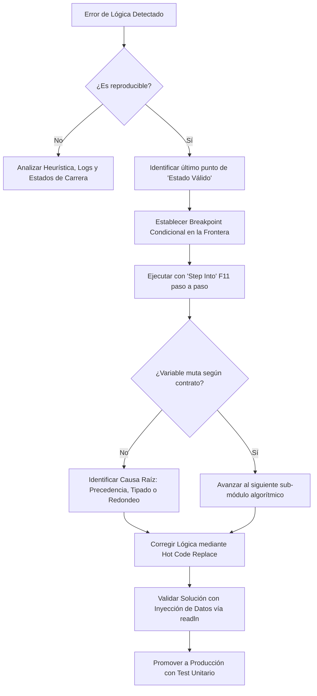

# Unidad 1 - Clase 7: El Arte de la Guerra contra el Bug: Algoritmia y Debugging de Grado Senior

**Objetivo**: Transformar la mentalidad del desarrollador de un **_solucionador de problemas por ensayo y error_** a un **desarrollador de diagnóstico**. En esta sesión de alta intensidad, diseccionaremos estrategias de resolución de problemas mediante el enfoque de "_Divide y Vencerás_", interpretaremos _Stack Traces_ de alta complejidad y dominaremos el ecosistema de depuración de **VS Code** bajo el paradigma de Java 25. Aprenderás a aislar la causa raíz de errores lógicos en sistemas de misión crítica sin depender de estructuras de datos complejas, enfocándote puramente en la pureza algorítmica y el estado de la memoria.

## 🚀 Setup de Clase

Para un Desarrollador Senior, el entorno de desarrollo es su quirófano. Un diagnóstico preciso requiere herramientas calibradas al milímetro y una configuración que elimine cualquier distracción cognitiva.

1. **JDK 25**: Es imperativo utilizar la versión que soporte la **JEP 495** (Implicitly Declared Classes) y la **JEP 477** (Implicitly Imported Classes y Static Methods). Esta configuración reduce drásticamente la verbosidad del código, permitiendo que el _Stack Trace_ se centre exclusivamente en la lógica de negocio y no en la infraestructura de clases.

2. **Extensiones de VS Code**:
    - **Extension Pack for Java**: Provee el motor de introspección de código y el Language Server.
    - **Debugger for Java**: Configurado para habilitar el _Hot Code Replace_, permitiendo modificar el cuerpo de un método y aplicar los cambios "en caliente" sin reiniciar la sesión de depuración.

## 🧠 Inmersión Teórica: Lógica Algorítmica y Estrategias de Diagnóstico

### El Arte de ser Senior: La Ingeniería de la Hipótesis

Un programador Junior _cambia cosas_ hasta que el error desaparece, a menudo introduciendo efectos secundarios o _parches_ que oscurecen la deuda técnica. Un Senior aplica el **Método Científico de Diagnóstico**:

1. **Observación**: Identificar el comportamiento anómalo (síntoma) y determinar su reproducibilidad. Si un error no es reproducible, estamos ante una condición de carrera o un estado inconsistente de memoria.
2. **Hipótesis**: Formular una teoría basada en el flujo de datos.
    - ¿Es un desbordamiento de tipo?
    - ¿Es una precedencia de operadores errónea?
    - ¿Es un cortocircuito en una evaluación booleana?
    - etc.
3. **Experimentación**: Usar el debugger para validar o refutar la teoría. Aquí, el Senior no busca _si funciona_, busca _por qué el estado actual difiere del esperado_.
4. **Aislamiento**: Separar el módulo fallido utilizando la técnica de _Divide y Vencerás_ hasta llegar a la instrucción atómica que genera el fallo.

### Estrategias de Resolución: Divide y Vencerás (D&V) Aplicado al Debugging

En el contexto del debugging profesional, D&V no es solo una estrategia de ordenamiento; es una técnica de reducción del espacio de búsqueda del bug.

- **Punto de Corte Binario**: Si tienes un proceso de 200 líneas, coloca un breakpoint en la línea 100. Si las variables en ese punto tienen valores correctos, el bug está en la segunda mitad. Has eliminado el 50% del código sospecho en un solo paso. Repite el proceso hasta que el bug quede acorralado en un bloque de 5 a 10 líneas.

- **Aislamiento de Flujo**: Desconecta las dependencias externas inyectando valores específicos mediante `readln()` de Java 25. Esto permite simular escenarios de borde (_edge cases_) que en un entorno integrado serían difíciles de replicar (por ejemplo, saldos negativos extremos o scores crediticios nulos).

### Evolución Comparativa: La Era del Debugging Limpio

| Característica | Era Legacy (Java 8/11) | Era Moderna (Java 25) | Implicación Senior |
| --- | --- | --- | --- |
| **Boilerplate** | `public class Main { public static void main... }` | `void main() { ... }` (Clase Implícita) | Reduce la carga cognitiva. El foco está en el algoritmo, no en la sintaxis. |
| **Entrada de Datos** | `Scanner` con gestión de buffers compleja. | `readln("Prompt: ")` directo. | Facilita la inyección de datos para pruebas rápidas en el debugger. |
| **Stack Trace** | Lleno de proxies, reflexiones y ruido de clases. | Traces planos y directos al método de instancia. | Ahorra minutos críticos al identificar la línea exacta del fallo. |
| **Ciclo de Corrección** | `Detener` -> `Corregir` -> `Compilar` -> `Reiniciar`. | _Hot Code Replace_ (HCR). | Permite corregir la lógica "en vuelo" sin perder el estado de las variables. |

### Interpretación de Stack Traces Complejos: El Mapa Forense

Un _Stack Trace_ es la caja negra de un accidente aéreo. Leerlo correctamente separa a los desarrolladores de los codificadores:

- **Anatomía del Error**: El mensaje de la excepción (ej. `ArithmeticException: / by zero`) es el síntoma final, pero la causa raíz suele estar varios frames atrás.
- **Bottom-Up Reading**: Empezamos por el final para encontrar el "punto de origen" en nuestro código.
- **Chain of Causality**: Con el nuevo paradigma de Java 25, los traces son más cortos, lo que permite ver la relación directa entre la entrada de datos y el fallo lógico sin capas intermedias innecesarias.

## 🔍 Deep Dive: Debugging Profesional en VS Code

### Herramientas de Precisión Quirúrgica

1. **Watch Variables & Expressions**: La ventana "Watch" es tu monitor de signos vitales. No te limites a ver el valor de una variable; observa expresiones complejas en tiempo real. Por ejemplo, si sospechas de un error de redondeo, puedes monitorizar `(monto * tasa) - esperado`.
2. **Conditional Breakpoints**: Es el filtro de ruido definitivo. Si tu bucle falla solo en la iteración número 452, no presiones F5 451 veces. Usa un breakpoint condicional: `contador == 452`. O mejor aún, detén la ejecución solo si el resultado es anómalo: `resultado < 0`.
3. **Call Stack Navigation & Frame Dropping**: Esta es la _máquina del tiempo_ de VS Code. Si avanzaste un paso de más con `F10` (Step Over) y te saltaste la línea del error, puedes hacer clic derecho en el frame anterior en el _Call Stack_ y seleccionar _Restart Frame_. El debugger volverá al inicio de ese método manteniendo el estado de los objetos, permitiéndote repetir el análisis.

### Diagrama de Flujo: Diagnóstico Sistémico de Causa Raíz (Mermaid)



## 📖 Conceptos del Lenguaje: Algoritmia y Debugging en Java 25

Para un Desarrollador Senior, la sintaxis de Java 25 no es solo "azúcar sintáctico", sino un conjunto de herramientas de **auditoría y precisión**. A continuación, desglosamos las mejores prácticas aplicadas a la algoritmia y la depuración avanzada.

### 1. Aislamiento Algorítmico con Clases Implícitas (JEP 495)

La capacidad de escribir código sin la ceremonia de `public class` permite el **Sandboxing inmediato**.

- **Buena Práctica**: Ante un algoritmo sospechoso en un proyecto grande, extrae la lógica pura a una Clase Implícita. Al ser métodos de instancia por defecto en Java 25, el debugger puede acceder al estado de la clase (`this`) de forma mucho más limpia en el panel de variables, facilitando la inspección de campos globales al archivo sin el ruido de modificadores `static`.

### 2. Inyección de Datos Dinámica con `java.lang.IO` (JEP 477)

El uso de `readln()` y `println()` simplifica la creación de Test Harnesses manuales.

- **Algoritmia**: Al depurar, utiliza `readln` para pausar la ejecución y solicitar valores de entrada que fuercen condiciones de borde (_stress testing manual_).
- **Debugging**: Prefiere los **Logpoints** de VS Code sobre `println` para no contaminar el código fuente, pero utiliza `java.lang.IO.println` en el Debug Console para inspeccionar estados complejos de objetos sin alterar el flujo de ejecución.

### 3. Control de Precedencia y Evaluación de Cortocircuito

Muchos bugs de lógica Senior nacen de la ambigüedad en expresiones ternarias complejas o evaluaciones booleanas.

- **Precedencia**: En Java 25, la legibilidad es prioridad. **Regla de Oro**: Siempre usa paréntesis en operaciones mixtas (aritméticas + ternarias). Ejemplo: `double r = a + (b / c) + (cond ? d : e);`.
- **Watch Expressions**: Durante el debugging, descompón expresiones largas en el panel **Watch**. Si tienes `if (a() && b() || c())`, añade `a()`, `b()` y `c()` individualmente al Watch para ver cuál está causando el "cortocircuito" inesperado.

### 4. Precisión Numérica y Tipado Defensivo

Java 25 mantiene la rigidez del tipado, pero facilita la inspección de desbordamientos.

- **División Entera**: Es el bug más común y difícil de detectar. Siempre que operes con `double`, asegura que al menos un operando tenga literal decimal: `100.0`.
- **Práctica de Debugging**: Si sospechas de pérdida de precisión, usa el debugger para evaluar la expresión forzando un cast: `(double) txMes / 100`. Si el resultado cambia respecto a lo que ves en el código, has encontrado la causa raíz.

### 5. Exhaustividad Lógica con Pattern Matching

Aunque no usamos arrays todavía, la lógica de bifurcación (`switch`) en Java 25 permite el **Pattern Matching**.

- **Buena Práctica**: Usa `switch` con `yield` para asegurar que todas las ramas lógicas devuelven un valor. Si olvidas un caso, el compilador (y el linter de VS Code) te avisarán, eliminando la posibilidad de que una variable quede con un "estado fantasma" o `null` inesperado.

## 💻 Laboratorio de Aplicación Práctica

### Escenario de Negocio: Fintech de Micro-Comisiones "El Motor Oscuro"

El sistema de una pasarela de pagos internacional está filtrando dinero. El algoritmo de comisiones tiene un comportamiento errático: ciertos descuentos por fidelidad nunca se aplican, y bajo ciertas condiciones muy específicas, el sistema le termina debiendo dinero al cliente (comisión negativa). El código carece de errores de sintaxis, pero está minado de trampas lógicas silenciosas como divisiones enteras ocultas y sobreescritura de estados. Tu misión como Desarrollador es aislar y extirpar estos bugs.

### Implementación de Referencia (Código con Trampas Lógicas Nivel Senior)

```java
// Archivo: CalculadoraFintech.java
// Java 25: Clase Implícita (No requiere 'public class')

void main() {
    println("=== MOTOR DE COMISIONES HEURÍSTICO ===");
    
    // Captura de datos mediante el nuevo paradigma de java.lang.IO
    String cliente = readln("Nombre del cliente: ");
    double monto = Double.parseDouble(readln("Monto de transacción (USD): "));
    boolean esVIP = readln("¿Es cuenta VIP? (s/n): ").equalsIgnoreCase("s");
    boolean esPromo = readln("¿Es día de promoción activa? (s/n): ").equalsIgnoreCase("s");
    int transaccionesMes = Integer.parseInt(readln("Transacciones previas este mes: "));

    // Invocación del motor algorítmico
    double comision = procesarComisionAv(monto, esVIP, esPromo, transaccionesMes);

    println("\n" + "=".repeat(20));
    println("REPORTE DE AUDITORÍA");
    println("Cliente: " + cliente);
    println("Monto Base: $" + monto);
    println("Comisión Final: $" + comision);
    println("=".repeat(20));
}

double procesarComisionAv(double monto, boolean vip, boolean promo, int txMes) {
    double tasa = 0.05; // 5% de comisión estándar
    
    double bonoFidelidad = (txMes > 50) ? (txMes / 100) : 0.0;
    
    if (monto >= 10000) {
        tasa = 0.04; 
        
        if (vip) {
            tasa = tasa - (promo ? 0.015 : 0.005) + (50 / 1000);
        }
    } else if (monto <= 0) {
        println("ALERTA: Intento de transacción nula o negativa.");
        return 0;
    } else {
        tasa = (vip || promo) ? 0.03 : tasa;
    }

    // Aplicación del bono restándolo de la tasa.
    tasa -= bonoFidelidad;

    double subTotal = monto * tasa;
    
    double cashback = promo ? 15.0 : 0.0;
    double resultadoFinal = subTotal - cashback;
    
    return resultadoFinal;
}
```

## 💪 Reto de Consolidación: "La Fuga Silenciosa"

1. **Misión de Depuración Forense Avanzada**:
    - Ejecuta el código en VS Code usando el debugger (`F5`).
    - **Caso de Prueba 1 (Buscando la División Entera)**:
      - Ingresa `Monto: 5000`, `VIP: n`, `Promo: n`, `Transacciones: 80`.
      - **Acción**: Coloca un **Conditional Breakpoint** en la línea de `double bonoFidelidad...`. Entra con `F11` (Step Into). Usa el panel **WATCH** para evaluar la expresión cruda `txMes / 100` y luego `(double) txMes / 100`. Observa la diferencia crítica.
    - **Caso de Prueba 2 (Provocando Pérdida Financiera)**:
      - Ingresa `Monto: 400`, `VIP: n`, `Promo: s`, `Transacciones: 10`.
      - **Acción**: Observa cómo el sistema arroja una comisión negativa. Usa la "Navegación de Call Stack" para retroceder el frame (_Drop to frame_) y volver a ejecutar la lógica aplicando un parche virtual en tus variables.

2. **Misión de Refactorización y Blindaje**:
    - Corrige las **dos divisiones enteras ocultas** forzando literales decimales (ej. `100.0` en lugar de `100`).
    - Convierte la asignación destructiva de la tasa en una mutación segura (usando `-=`).
    - Blinda el cálculo final utilizando `Math.max(0, subTotal - cashback)` para garantizar matemáticamente que la empresa jamás deba dinero por procesar una transacción.

3. **Ejercicios de Maestría Adicionales**:
    - **La Trampa Booleana de De Morgan**: Crea una variable `booleana boolean alertaFraude = !(monto < 100000 && !vip);`. Usa expresiones _Watch_ para demostrar cómo reescribir esta condición de forma más legible sin cambiar su tabla de verdad.
    - **Watch Expressions como Tests**: Configura una expresión "Watch" que evalúe `tasa >= 0.0 && tasa <= 0.05`. Mientras debugueas paso a paso, asegúrate de que esa expresión jamás arroje `false` sin importar los inputs.

## 📚 Recursos de Maestría

- [JEP 495 - Official Docs](https://openjdk.org/jeps/495): Documentación técnica sobre Clases Implícitas y el método main de instancia en Java 25.
- [JEP 477 - Deep Dive](https://openjdk.org/jeps/477): Análisis detallado sobre la importación implícita de clases y métodos estáticos de IO.
- [VS Code Java Debugging Guide](https://code.visualstudio.com/docs/java/java-debugging): Guía exhaustiva sobre el uso de breakpoints, inspección de variables y Hot Code Replace en VS Code.
- [Practical Debugging Techniques for Java Developers](https://medium.com/@ayoubelmaalmi/practical-debugging-techniques-for-java-developers-c0a673ed4bea): Artículo avanzado con ejemplos de debugging en Java, incluyendo estrategias para interpretar stack traces complejos y técnicas de aislamiento de bugs.
