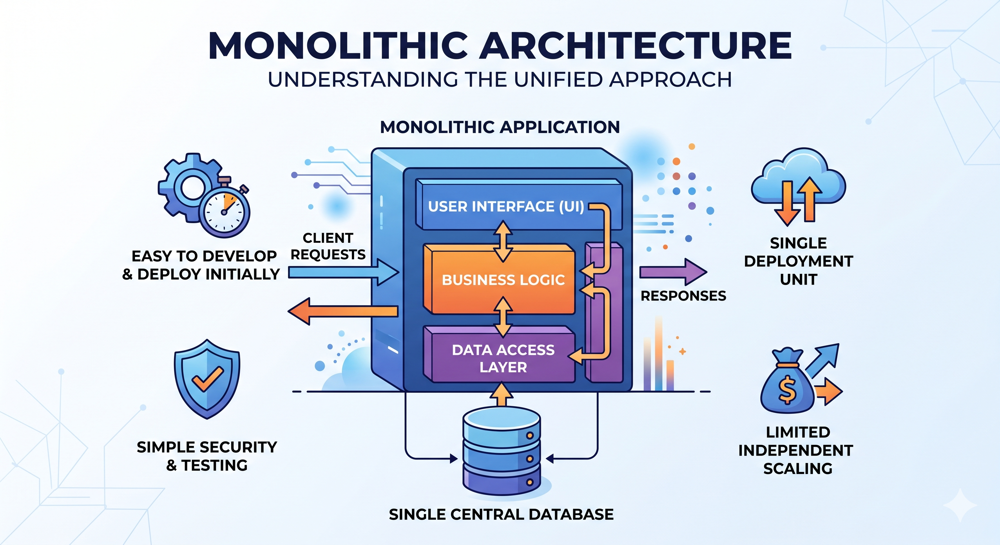
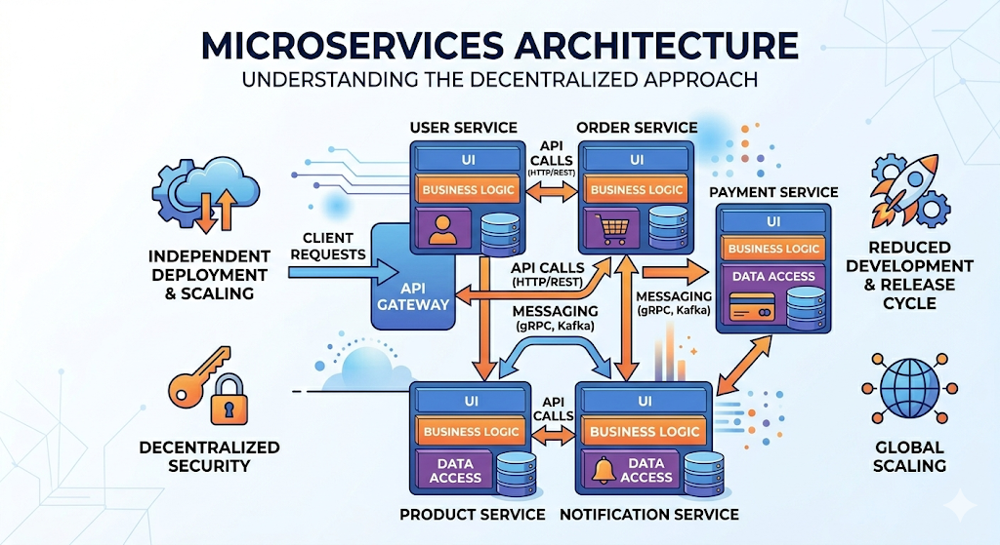
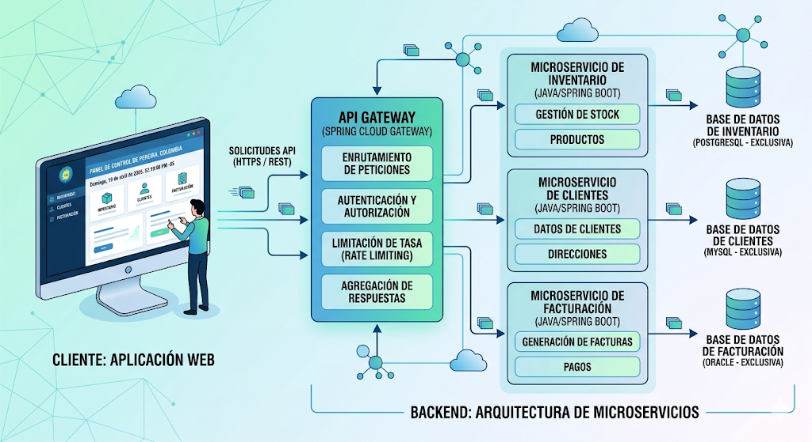
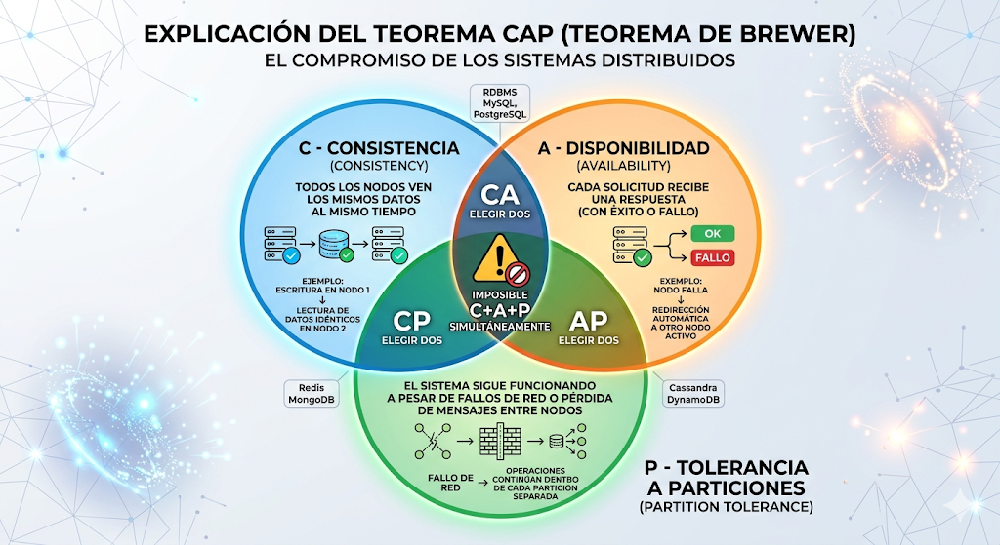
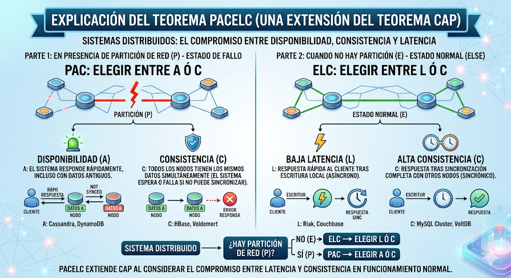
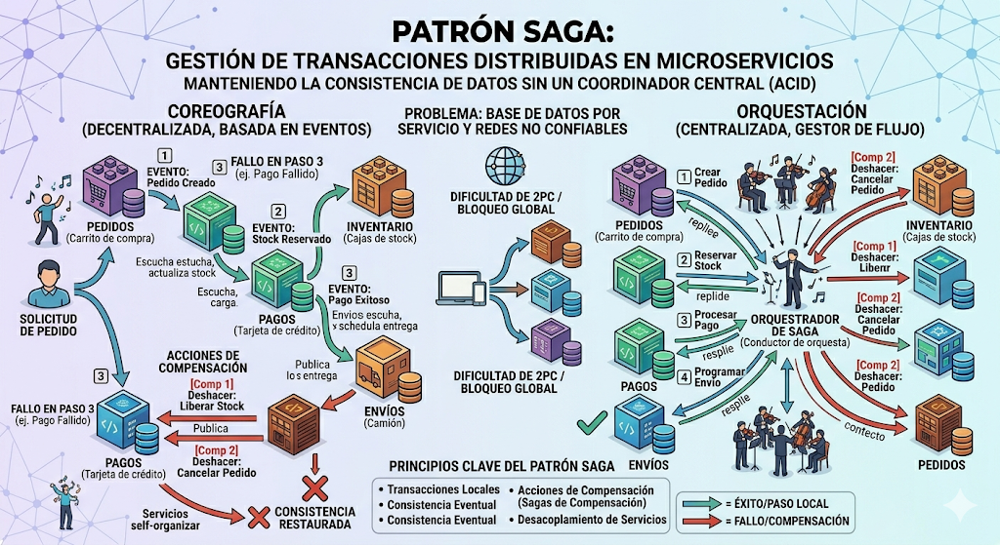
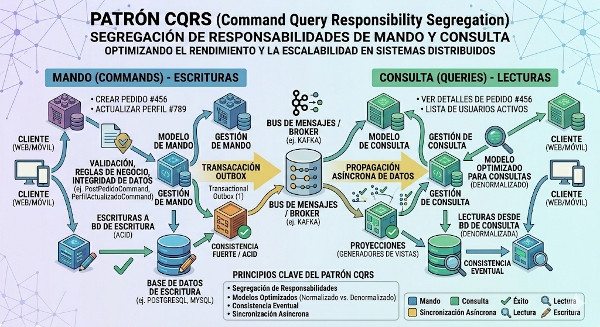
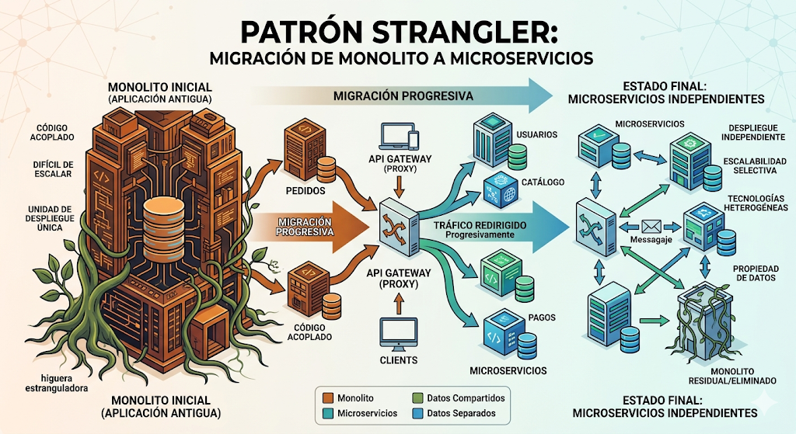

# Unidad 2 - Clase 1: De Monolito a Microservicios (Enfoque de Ingeniería de Sistemas Distribuidos)

**Objetivo**: Analizar la transición arquitectónica desde una perspectiva de diseño sistémico, evaluando los compromisos (trade-offs) técnicos, operativos y organizacionales. Se busca que el estudiante domine los patrones necesarios para mitigar la complejidad inherente a los sistemas distribuidos.

## 1. El Monolito: Anatomía, Virtudes y Límites

Antes de considerar una migración, es vital entender que el monolito no es un síntoma de deuda técnica "per se". Es una elección de diseño basada en la simplicidad de despliegue y la cohesión de datos.

### 1.1. Monolito Modular vs. Monolito Acoplado (Spaghetti)

- **Modularidad Lógica y Física**: En un monolito modular, los límites de los componentes están reforzados por modificadores de acceso y herramientas de construcción (como los módulos de Java o Maven). La comunicación es sincrónica, ejecutándose en el **Stack de Memoria** de la JVM. Esto elimina la necesidad de serialización JSON y reduce la latencia a nanosegundos ($\approx 0$ ns en términos de red).
- **El "Big Ball of Mud" (Gran Lodo)**: El riesgo del monolito no es su despliegue único, sino el entrelazamiento de datos. Cuando el módulo de "Facturación" consulta directamente las tablas de "Inventario" saltándose las reglas de negocio, se pierde la autonomía. La refactorización se vuelve un campo minado donde un cambio en un índice de base de datos puede colapsar módulos no relacionados.
- **Developer Experience (DX)**: Para un desarrollador, el monolito es sumamente cómodo. Puedes navegar por todo el código fuente, depurar con un solo punto de interrupción (breakpoint) y ejecutar toda la suite de pruebas en tu máquina local sin necesidad de infraestructura compleja.

### 1.2. El Límite de la Escalabilidad Vertical y Organizativa

- **Ley de Amdahl y Rendimientos Decrecientes**: Añadir más recursos (RAM/CPU) a una sola instancia tiene un techo físico y económico. Eventualmente, el costo de un servidor más grande crece exponencialmente mientras que la ganancia de rendimiento es marginal.
- **Escalabilidad Uniforme vs. Selectiva**: Si el módulo de "Generación de Reportes PDF" consume el 90% de la CPU, el monolito te obliga a clonar TODA la aplicación (incluyendo los módulos ligeros de "Login" o "Perfil") para escalar ese proceso. Esto genera un desperdicio masivo de recursos en la nube.
- **Bloqueo de Despliegue**: En equipos grandes (más de 30 personas), el monolito se convierte en un cuello de botella. Un error en una línea de código de un equipo impide que los otros 4 equipos puedan salir a producción, creando una dependencia de despliegue que ralentiza la innovación.

## 2. Microservicios: La Inevitabilidad de la Distribución

Migrar a microservicios no es una "actualización"; es un cambio de paradigma hacia la **Computación Distribuida**.

### 2.1. Bounded Contexts y la Semántica del Negocio

- **Domain-Driven Design (DDD)**: La frontera de un servicio se define por su lenguaje y su propósito. Un `Cliente` en el contexto de "Soporte Técnico" (tickets, historial de fallos) es semánticamente distinto a un `Cliente` en "Marketing" (preferencias de compra, segmentación).
- **Autonomía de Datos**: Cada microservicio debe ser "dueño" de su estado. Si el Servicio de Pedidos necesita datos de Clientes, debe haber una sincronización asíncrona o una llamada de API. El acoplamiento a nivel de base de datos es el error más costoso en esta arquitectura.

  

### 2.2. Autonomía de Ciclo de Vida y Versionado

- **Despliegue Independiente**: Permite que cada servicio use el lenguaje o framework más apto (Poliglotismo), aunque en Java solemos estandarizar con Spring Boot.
- **Contratos y Versionado**: Al distribuir el sistema, las APIs se vuelven contratos sagrados. Introducimos estrategias como:
  - **Versionado por URL**: `/v1/servicios` vs `/v2/servicios`.
  - **Versionado por Header**: `Accept: application/vnd.mi-app.v2+json`.
  - **Backward Compatibility**: El servicio A debe ser capaz de procesar peticiones del servicio B aunque B use una versión anterior del cliente.

## 3. El Balance del Arquitecto: Trade-offs

Migrar a microservicios no es un "upgrade" gratuito; es un intercambio de un conjunto de problemas por otro. Un arquitecto senior no pregunta "¿Qué es mejor?", sino "¿Qué problemas puedo permitirme gestionar?".

### 3.1. Ventajas: Los Drivers de la Descomposición

- **Escalabilidad Selectiva**: Capacidad de escalar solo los componentes con alta carga (ej. Servicio de Pagos en Black Friday) sin desperdiciar recursos en el resto del sistema.
- **Agilidad y Time-to-Market**: Equipos independientes que despliegan a producción sin depender del ciclo de vida de otros equipos (Desacoplamiento Organizativo).
- **Resiliencia (Aislamiento de Fallos)**: Un fallo crítico en el servicio de "Recomendaciones" no impide que el sistema de "Checkout" siga procesando transacciones.
- **Libertad Tecnológica**: Posibilidad de elegir el stack óptimo para cada problema (ej. Java para el núcleo, Python para analítica, Go para proxies de alta velocidad).

### 3.2. Desventajas: El "Impuesto" de la Distribución

- **Complejidad Operativa Exponencial**: Pasar de 1 artefacto a 50 requiere obligatoriamente una inversión masiva en infraestructura (Docker, Kubernetes, CI/CD avanzado).
- **Consistencia Eventual**: Abandonamos las transacciones ACID globales. Mantener los datos sincronizados a través de múltiples bases de datos es complejo y propenso a errores.
- **Latencia de Red**: Las llamadas a través de la red son órdenes de magnitud más lentas que las llamadas en memoria. Cada "salto" entre servicios degrada la latencia total percibida por el usuario.
- **Dificultad de Testing y Debugging**: Probar flujos que atraviesan 10 servicios requiere entornos de staging sofisticados y herramientas de trazabilidad distribuida.

## 4. El "Microservices Tax" y Fundamentos Teóricos

La distribución introduce leyes físicas que no existían en el monolito.

### 4.1. Las Falacias de la Computación Distribuida (Peter Deutsch)

Como desarrolladores, tendemos a olvidar que:

1. **La red no es confiable**: Los paquetes se pierden, los switches fallan.
2. **La latencia no es cero**: Enviar un JSON de 1KB por la red toma órdenes de magnitud más tiempo que pasar un puntero en memoria.
3. **El ancho de banda no es infinito**: El tráfico interno entre servicios puede saturar la red si no se diseña con cuidado.
4. **La topología cambia**: Los servicios aparecen y desaparecen (nodos que mueren, auto-scaling).

### 4.2. Teorema CAP y el Modelo PACELC

- **CAP**: En presencia de una partición de red (P), debes elegir entre Consistencia (C) o Disponibilidad (A).

  

- **PACELC**: Una extensión de CAP. Si hay una partición (P), eliges entre A y C. Pero **incluso cuando el sistema funciona normal (E - Else)**, debes elegir entre Latencia (L) y Consistencia (C).

  

- **Consistencia Eventual**: La mayoría de los microservicios operan en el modelo BASE (Basically Available, Soft state, Eventual consistency), opuesto a ACID. Esto significa que los datos se propagan en milisegundos, pero no hay garantía de que todos los nodos vean lo mismo instantáneamente.

### 4.3. La Ceguera Operativa

En un monolito, un error se rastrea en un único archivo de log. En microservicios, una petición puede fallar en el servicio 5 de una cadena de 10. Sin una estrategia de **Observabilidad**, diagnosticar un error se convierte en una tarea imposible de horas o días.

## 5. Catálogo de Patrones Avanzados

Para mitigar los riesgos de la distribución, el ecosistema de Java (Spring Cloud) y las arquitecturas modernas proponen un conjunto de patrones que actúan como "estándares de seguridad".

### 5.1. Edge e Infraestructura: API Gateway, Discovery & BFF

- **Service Discovery (El Directorio Dinámico)**:
  - _El Problema_: En infraestructuras dinámicas (Kubernetes o Auto-scaling en AWS), las instancias de servicios nacen y mueren con IPs aleatorias. Hardcodear IPs en archivos de configuración es una receta para el desastre operacional.
  - _La Solución_: Los microservicios se registran al arrancar en un servidor central (como **Netflix Eureka** o **Consul**). Proporcionan su nombre lógico (`order-service`) y su ubicación actual. Los clientes (otros servicios o el Gateway) resuelven el nombre en tiempo real.
  - **_Implicación_**: Permite **Balanceo de Carga en el lado del Cliente**. Si hay 3 instancias de un servicio, el Discovery las reporta todas y el cliente decide a cuál llamar (usando algoritmos como Round Robin).

- **API Gateway (Spring Cloud Gateway)**:
  - _Más que un Proxy_: Es el punto de control centralizado para todo el tráfico norte-sur (cliente-servidor).
  - _Responsabilidades Críticas_:
    - **Seguridad**: Valida tokens JWT una sola vez en el borde, evitando que cada microservicio repita la lógica.
    - **Rate Limiting**: Protege al sistema de abusos o ataques DoS limitando cuántas peticiones puede hacer un usuario por segundo.
    - **Agregación de Respuestas**: Si el frontend necesita datos de 3 servicios, el Gateway puede hacer las 3 llamadas en paralelo y devolver un único JSON, ahorrando latencia al usuario final.

- **BFF (Backend for Frontend)**:
  - _Optimización de Carga_: Un cliente web (Angular) en una red de fibra óptica puede manejar grandes JSONs. Un cliente móvil (iOS/Android) en una red 3G necesita respuestas mínimas.
  - _Estrategia_: Se crean Gateways específicos para cada interfaz. El BFF para móvil filtra campos innecesarios, reduciendo el ancho de banda y mejorando la duración de la batería del dispositivo.

### 5.2. Patrones de Resiliencia: La Ingeniería de Fallos

En sistemas distribuidos, **el fallo es la norma, no la excepción**.

- **Circuit Breaker (Resilience4j)**:
  - _Analogía_: Funciona como los fusibles de una casa. Si el servicio de "Pagos" empieza a fallar (latencia alta o errores 500), el circuito se "**Abre**".
  - _Efecto_: Las peticiones futuras fallan inmediatamente sin intentar llamar al servicio caído. Esto evita que los hilos de ejecución se acumulen esperando un timeout, lo cual podría tirar abajo a otros servicios sanos (efecto cascada).
  - _Fallback_: Permite definir una respuesta alternativa (ej: "Servicio temporalmente no disponible" o devolver datos en caché).

- **Bulkhead (Mamparos)**:
  - _Aislamiento de Recursos_: Si una funcionalidad pesada consume todos los hilos de un servidor, el resto de la aplicación muere. El patrón Bulkhead asigna "cuotas" de recursos (ej: pool de 10 hilos para Búsqueda y 20 para Pagos). Si los hilos de Pagos se agotan, Búsqueda sigue funcionando perfectamente.

### 5.3. Patrones de Datos Distribuidos

El reto más complejo en microservicios es mantener la integridad de los datos sin transacciones ACID globales.

- **Sagas (Transacciones Distribuidas)**:
  - _Concepto_: Una "transacción" que cruza varios servicios se divide en una serie de transacciones locales.
  - _Tipos_:
    - **Coreografía**: Los servicios intercambian eventos (Kafka/RabbitMQ). El Servicio A termina y publica "Orden Creada"; el Servicio B escucha y procesa el pago.
    - **Orquestación**: Un servicio central dirige el tráfico. Es más fácil de depurar pero introduce un punto único de fallo lógico.
  - _Compensación_: Si el paso 3 falla, el sistema debe ejecutar acciones inversas (ej: "Devolver Dinero", "Cancelar Orden") para volver a un estado consistente.

  

- **CQRS (Command Query Responsibility Segregation)**:
  - _El Problema_: En un monolito, haces un JOIN de 5 tablas para mostrar un perfil de usuario. En microservicios, el nombre está en `auth-service`, la foto en `profile-service` y las compras en `order-service`. Un JOIN de red entre servicios es carísimo.
  - _La Solución_: Separas el modelo de **Escritura** (Commands: crear, actualizar) del modelo de **Lectura** (Queries: consultar).
  - _Proyecciones_: Creas una base de datos optimizada para la lectura (ej: una vista materializada en MongoDB o Elasticsearch) que ya tiene todos los datos pre-unificados. Cuando ocurre un cambio en el modelo de escritura, se lanza un evento para actualizar esta proyección.
  - _Trade-off_: Ganas una velocidad de consulta masiva y desacoplamiento, pero introduces **Consistencia Eventual** (el usuario podría no ver su actualización durante unos milisegundos).

  

- **Transactional Outbox**:
  - _Evitando el "Dual Write"_: Cuando un servicio actualiza su DB y luego intenta enviar un mensaje a Kafka, la red puede fallar entre ambos pasos.
  - _Solución_: El servicio guarda el mensaje en una tabla especial (`OUTBOX`) dentro de la **misma transacción** que sus datos de negocio. Un proceso independiente lee esa tabla y publica en Kafka. Esto garantiza que si el dato se guardó, el evento se enviará tarde o temprano (At-least-once delivery).

### 5.4. Patrones de Observabilidad: La Lupa en el Sistema Distribuido

Sin observabilidad, gestionar 50 servicios es como intentar reparar un motor en la oscuridad total.

- **Distributed Tracing (Trazabilidad Distribuida)**:
  - _Trace ID vs Span ID_: Cada petición recibe un `Trace ID` único en el Gateway. Cada salto entre servicios genera un `Span ID`.
  - _Visualización_: Con herramientas como **Zipkin** o **Jaeger**, puedes ver una línea de tiempo exacta. Si una petición tardó 2 segundos, el Tracing te muestra que el Servicio B tardó 1.8 segundos por una consulta SQL lenta.

  

- **Centralized Logging (Agregación de Logs)**:
  - _El Stack ELK/EFK_: Elasticsearch indexa, Logstash/Fluentd recolecta y Kibana visualiza.
  - _Poder de búsqueda_: Permite buscar por `Trace ID` y ver todos los logs de 10 servicios distintos relacionados con esa única transacción de ese único usuario.

  

- **Metrics & Dashboards**:
  - _Monitorización Cuantitativa_: Usamos **Prometheus** para raspar métricas (CPU, Latencia, Tasa de Errores) y **Grafana** para visualizarlas.
  - _Alertas_: Configurar alertas automáticas: "Si la tasa de errores 5xx sube del 1% en el servicio de Inventario, notificar a Slack inmediatamente".

  

## 6. El Camino a la Descomposición: Estrategias de Migración

Migrar un sistema en producción es equivalente a cambiar el motor de un avión mientras está volando. No se puede apagar el sistema y empezar de cero.

### 6.1. El Patrón Strangler Fig (Higuera Estranguladora)

Este patrón, acuñado por Martin Fowler, se basa en una metáfora botánica: una higuera crece alrededor de un árbol existente hasta que finalmente lo reemplaza por completo.

- **El Proceso**: En lugar de reescribir el monolito, creamos una funcionalidad nueva en un microservicio externo.
- **La Redirección**: El API Gateway actúa como el "enrutador inteligente". Las peticiones a la ruta antigua se desvían al nuevo servicio, mientras que el resto del tráfico sigue yendo al monolito.
- **Muerte del Monolito**: Con el tiempo, el monolito pierde todas sus responsabilidades y puede ser "apagado".

### 6.2. Identificación de "Seams" (Costuras)

Una "costura" es un lugar en el código donde puedes alterar el comportamiento sin cambiar el código mismo (Michael Feathers).

- **¿Por dónde empezar?**
  1. **Bajo Acoplamiento**: Módulos que casi no tienen dependencias entrantes (ej. Servicio de Notificaciones).
  2. **Alto Valor de Negocio**: Partes que necesitan cambiar constantemente.
  3. **Necesidades de Escalabilidad**: Componentes que consumen demasiados recursos (ej. Procesamiento de imágenes).
- **Análisis de Dependencias**: Usar herramientas de visualización de grafos para entender qué tablas y clases se comparten. Si una tabla es tocada por 20 módulos, **no** es una buena costura inicial.

### 6.3. Anti-Corruption Layer (ACL)

Cuando extraes un servicio, este suele tener un modelo de datos moderno, pero aún necesita hablar con el monolito "sucio" y sus modelos antiguos.

- **La Capa de Traducción**: El ACL es un componente intermedio que traduce las peticiones y modelos del nuevo microservicio al lenguaje del monolito.
- **Beneficio**: Evita que el diseño del nuevo microservicio se "contamine" con los errores de diseño del pasado. El microservicio se mantiene puro y el ACL se encarga del "trabajo sucio" de integración.

### 6.4. El Desafío de la Migración de Datos (Data First)

Es el paso más difícil. No puedes separar el código si las bases de datos siguen compartiendo tablas.

- **Estrategia de 3 pasos**:
  1. **Lectura dual**: El microservicio lee de su nueva DB, pero si no encuentra el dato, lo busca en el monolito.
  2. **Escritura dual**: El microservicio escribe en ambas bases de datos para mantener la paridad.
  3. **Corte final**: Una vez que los datos están sincronizados, se eliminan los triggers o scripts de sincronización y el microservicio es el único dueño (Source of Truth).

## 7. Conclusión y Reto Técnico: Arquitectura en el Mundo Real

### Caso de Estudio Pro: "El Sistema de Créditos de Alto Rendimiento"

**Contexto de Negocio y Técnico**: Una Fintech líder en préstamos rápidos opera un monolito legado que gestiona el ciclo de vida completo del crédito: desde la solicitud inicial y validación de identidad (KYC), hasta el análisis de riesgo crediticio y el desembolso final. El núcleo del sistema es un motor de reglas que consulta 4 bureaus de crédito externos y 2 bases de datos gubernamentales. Este proceso es inherentemente lento, tardando en promedio 5 minutos por solicitud, y el sistema debe manejar picos de 10,000 solicitudes por hora durante campañas de marketing.

**Escenario de Crisis**: Los usuarios reportan que, tras enviar la solicitud, la aplicación de Angular muestra un spinner infinito o errores de "Gateway Timeout". Internamente, el equipo de infraestructura observa que las conexiones a la base de datos se agotan, ya que el monolito mantiene transacciones ACID abiertas durante los 5 minutos que duran las llamadas externas. Esto provoca un efecto dominó: los usuarios que solo quieren consultar su saldo también sufren caídas, ya que el pool de hilos de la JVM está totalmente saturado.

**Desafíos para el Estudiante (Resolución de Ingeniería)**:

1. **Desafío de Observabilidad Crítica**: Si implementas **Distributed Tracing** (Micrometer/Zipkin), describe exactamente qué buscarías en el dashboard. ¿Cómo diferenciarías un retardo causado por la serialización JSON en tu API Gateway de un retardo de red en el servicio de validación interna o una espera de I/O en la base de datos de un proveedor externo? Explica cómo el `Trace ID` te permitiría correlacionar logs de error dispersos en 3 microservicios distintos para una misma solicitud fallida.
2. **Estrategia de CQRS y Experiencia de Usuario (UX)**: Al implementar CQRS, el modelo de lectura (Read Model) se actualiza de forma asíncrona mediante eventos de Kafka. Si un cliente solicita un crédito y refresca la pantalla instantáneamente, es probable que la proyección aún no refleje la nueva solicitud (Consistencia Eventual).
   - ¿Qué técnica técnica aplicarías para mitigar esto: **Optimistic UI** (simular el cambio en el cliente), **Polling asíncrono**, o el uso de WebSockets para empujar la actualización? Justifica tu elección basándote en el impacto en los recursos del servidor.
3. **Desafío de Resiliencia y Fallo Parcial**: Uno de los bureaus externos de crédito tiene un SLA inestable.
   - ¿Cómo configurarías un **Circuit Breaker** (Resilience4j) para evitar que las fallas de este proveedor saturen tu sistema?
   - Si el bureau falla y el circuito se abre, ¿qué estrategia de **Fallback** propondrías para no denegar el crédito inmediatamente? (Ej: usar un score de riesgo interno almacenado en caché o encolar la petición para procesamiento posterior).
4. **Diseño de Sagas y Compensación**: Si el proceso de crédito requiere: (1) Reservar fondos en el servicio de Tesorería, (2) Validar riesgo, (3) Notificar al cliente.
   - Describe la **Saga de Compensación** necesaria si el paso 2 (Validación de Riesgo) determina que el cliente no es apto. ¿Cómo asegurarías que los fondos reservados en el paso 1 se liberen de forma fiable si el servicio de Tesorería está temporalmente fuera de línea?

---

La arquitectura de microservicios no se trata de dividir código, sino de **aislar fallos y escalar responsabilidades**. La observabilidad es tu único seguro de vida en producción, y los patrones de datos (Sagas, CQRS) son las herramientas para mantener el orden en un sistema que es, por naturaleza, eventualmente consistente.
