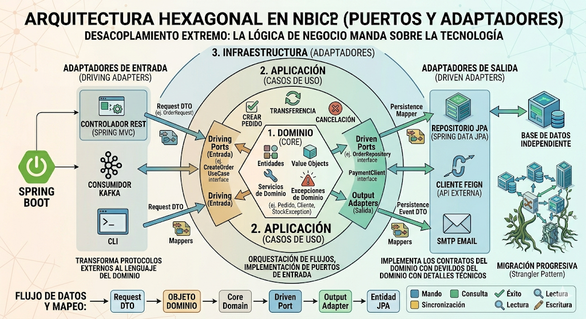

# Unidad 2 - Clase 2: Arquitectura Hexagonal (Puertos y Adaptadores)

**Objetivo**: Comprender la filosofía de "Puertos y Adaptadores" para lograr un desacoplamiento absoluto entre la lógica de negocio y los detalles tecnológicos (frameworks, bases de datos, APIs). Al finalizar, el estudiante podrá diseñar sistemas que sean agnósticos a la infraestructura y altamente testeables.

## 1. El Problema de la Arquitectura Tradicional en Capas

Antes de "hexagonalizar" nuestras aplicaciones, debemos realizar una autocrítica profunda sobre por qué la clásica arquitectura de 3 capas (`UI` -> `Business` -> `Data`) es insuficiente para sistemas de alta complejidad y larga vida.

### 1.1. La Transitoriedad de la Tecnología vs. la Permanencia del Negocio

En una arquitectura tradicional, la capa de negocio suele depender directamente de la capa de acceso a datos (JPA/Hibernate). Esto crea una "**fuga de abstracciones**" donde los detalles técnicos dictan cómo se escribe el negocio.

- **Contaminación del Dominio**: Tus entidades de negocio terminan llenas de anotaciones de persistencia (`@Entity`, `@Table`, `@Column`). Esto significa que si decides cambiar Hibernate por una base de datos NoSQL como MongoDB, tendrías que modificar tus reglas de negocio, lo cual es un pecado arquitectónico. El negocio se vuelve esclavo del esquema de la base de datos y de las limitaciones del ORM.
- **El Atrapamiento del Framework**: En las 3 capas, el framework (Spring) suele permearlo todo. Si el framework queda obsoleto o presenta vulnerabilidades críticas, la migración es casi una reescritura total porque el código de negocio está "pegado" a las clases del framework.

### 1.2. Dificultad de Testing y Velocidad de Desarrollo

- **Tests Frágiles y Lentos**: Para probar una regla de negocio simple (ej. "un crédito no puede superar el 30% del ingreso"), terminas necesitando levantar un contexto de Spring completo y una base de datos en memoria (H2). Esto hace que los tests sean lentos, difíciles de configurar y propensos a fallar por razones ajenas a la lógica (como errores de configuración de Spring).
- **Dependencia de la Infraestructura**: Los desarrolladores a menudo se ven bloqueados porque "la base de datos aún no está lista" o "el servicio externo de pagos no tiene ambiente de pruebas". La Arquitectura Hexagonal permite programar el 100% del negocio sin haber decidido siquiera qué base de datos se usará.

## 2. Anatomía de las Capas: El Corazón, el Contrato y el Detalle

La arquitectura hexagonal organiza el código en círculos concéntricos, donde la regla de oro es: "**Las dependencias siempre apuntan hacia adentro**". El centro no conoce nada del exterior.


### 2.1. Dominio (Core - El Interior del Hexágono)

Es el lugar más sagrado de la aplicación. Aquí reside la lógica pura, el conocimiento que genera dinero para la empresa.

- **Entidades y Value Objects**: Objetos de negocio que contienen lógica y validaciones. Un `Email` como Value Object asegura que siempre sea válido antes de entrar al sistema. No conocen la existencia de Spring, JPA o JSON.
- **Servicios de Dominio**: Orquestan lógica que involucra múltiples entidades y no pertenecen a una sola de forma natural.
- **Excepciones de Dominio**: Errores específicos del negocio (ej. `SaldoInsuficienteException`). Estas excepciones deben ser lanzadas aquí y capturadas en los adaptadores para convertirlas en códigos HTTP (400, 404, etc.).
- **Restricción Estricta**: Cero dependencias externas. Solo Java puro (POJOs). Si importas `org.springframework.*` en esta capa, has roto la arquitectura.

### 2.2. Aplicación (Casos de Uso)

Actúa como una capa de orquestación y mensajería entre el mundo exterior y el dominio.

- **Implementa los Casos de Uso**: Representan las acciones que un usuario puede realizar (ej. `RealizarTransferencia`, `AprobarSolicitudCredito`).
- **Define los Puertos (Interfaces)**: Aquí se definen los contratos. La capa de aplicación dice: "Para cumplir este caso de uso, necesito algo que guarde pedidos". No le importa si es MySQL, una API REST externa o un archivo de texto.
- **Manejo de Flujo**: Coordina la recuperación de entidades a través de puertos, ejecuta la lógica del dominio y guarda los resultados nuevamente a través de puertos.

### 2.3. Infraestructura (Adaptadores - El Exterior)

Aquí residen los detalles técnicos, las "herramientas" que la aplicación usa para comunicarse con el mundo.

- **Adaptadores de Entrada**: Controladores REST, Consumidores de Kafka, CLI (Línea de comandos).
- **Adaptadores de Salida**: Implementaciones de Repositorios (JPA, JDBC), Clientes de APIs (Feign, WebClient), Envío de Emails (SMTP, SendGrid).
- **Flexibilidad**: Esta capa es intercambiable. Puedes tener un adaptador JPA para producción y un adaptador de archivos para pruebas locales.

## 3. Puertos y Adaptadores: El Mecanismo de Intercambio

La arquitectura hexagonal es conocida como "Puertos y Adaptadores" porque funciona como un computador con puertos USB: el computador (dominio) define el puerto, y tú puedes conectar un ratón, un teclado o un disco duro (adaptadores) siempre que cumplan el contrato del puerto.


### 3.1. Puertos de Entrada (Driving Ports)

Son las puertas por las que el mundo exterior "conduce" (drive) a la aplicación.

- **Definición**: Suelen ser interfaces que definen los métodos que la aplicación ofrece al exterior (ej. CreateOrderUseCase).
- **Adaptador de Entrada**: Es el encargado de transformar el estímulo externo (un JSON en un POST de HTTP) en una llamada al puerto. El controlador de Spring es solo un adaptador que "traduce" HTTP al lenguaje del dominio.

### 3.2. Puertos de Salida (Driven Ports)

Son las puertas por las que la aplicación sale a buscar algo afuera (es "conducida" o driven por la lógica).

- **Inversión de Control (IoC)**: Este es el punto clave. La aplicación define la interfaz `UserRepository`. La infraestructura implementa esa interfaz usando, por ejemplo, `JpaUserRepository`.
- **Beneficio**: El dominio nunca depende de `JpaRepository`. Depende de su propia interfaz. Esto permite que el dominio sea el jefe y la infraestructura el empleado.

### 3.3. Actores Primarios vs. Secundarios

- **Actores Primarios (Drivers)**: Son los que inician la interacción. Un usuario haciendo clic en Angular, un proceso de cron o un test unitario.
- **Actores Secundarios (Driven Actors)**: Son los que son llamados por la aplicación para completar una tarea. La base de datos que guarda el registro o el servicio de SMS que notifica al cliente.

## 4. Desacoplamiento Extremo: El Rol de los DTOs y Mappers

Para mantener la pureza del hexágono, el intercambio de información debe ser cuidadosamente mediado. El "veneno" de la infraestructura (anotaciones, tipos de datos específicos) no debe filtrarse.

### 4.1. La Trampa de la Reutilización de Objetos

Es tentador usar la misma clase `@Entity` de JPA para recibir el JSON en el controlador y para la lógica de negocio. Esto es un error grave:

- **Acoplamiento de Contratos**: Si el frontend te pide cambiar el nombre de un campo JSON, terminarías cambiando el nombre de una columna en la base de datos.
- **Seguridad**: Podrías permitir accidentalmente que un usuario actualice campos sensibles (como `rol` o `saldo`) solo porque esos campos existen en la entidad que usas como entrada.

### 4.2. El Flujo de Transformación de Datos

Para lograr el desacoplamiento extremo, seguimos un flujo de mapeo constante:

1. **Request DTO**: Objeto simple (Record en Java) que representa la entrada del usuario.
2. **Input Mapper**: Convierte el DTO en un **Objeto de Dominio**. Aquí es donde aplicamos la lógica de "Capa Anticorrupción": si el mundo exterior envía datos sucios, los limpiamos antes de que toquen el Core.
3. **Core Domain**: Procesa la lógica de negocio usando solo objetos de dominio.
4. **Persistence Mapper**: Al llegar al adaptador de salida, convertimos el Objeto de Dominio en una **Entidad JPA**. Esto permite que la entidad JPA tenga una estructura optimizada para la base de datos (ej. relaciones `@ManyToOne`) que no necesariamente coincida con la lógica de negocio.

## 5. Ventajas y Desafíos: El Balance del Arquitecto (25 min)

Como toda decisión de arquitectura, usar Puertos y Adaptadores es un _trade-off_ (intercambio). Aquí analizamos por qué y cuándo adoptarlo.

### 5.1. Ventajas (Los "Pros")

1. **Testeabilidad Superior**: Al estar aislada de la infraestructura, puedes probar la lógica de negocio en milisegundos usando tests unitarios puros, sin levantar Spring ni bases de datos.
2. **Independencia Tecnológica**: Puedes cambiar la base de datos (de PostgreSQL a MongoDB) o el mecanismo de entrada (de REST a gRPC) sin tocar una sola línea de la lógica de negocio.
3. **Soberanía del Dominio**: El equipo se enfoca en resolver problemas de negocio, no problemas de frameworks. El código es más legible y cercano al lenguaje del experto de dominio.
4. **Mantenibilidad a Largo Plazo**: El sistema no se vuelve "viejo" tan rápido porque el núcleo está protegido de la obsolescencia de las librerías externas.
5. **Paralelismo en el Desarrollo**: Un equipo puede trabajar en la lógica del dominio mientras otro configura la infraestructura, usando Mocks de los puertos.

### 4.2. Desventajas y Desafíos (Los "Contras")

1. **Complejidad Inicial y "Boilerplate"**: Requiere crear muchas más clases (Interfaces, Mappers, DTOs distintos para cada capa). Esto puede parecer excesivo para aplicaciones pequeñas (CRUDs simples).
2. **Curva de Aprendizaje**: Para desarrolladores acostumbrados a la arquitectura de 3 capas tradicional, entender la inversión de dependencia y el flujo de mapeo puede ser frustrante al principio.
3. **Indirección de Código**: Seguir el flujo de una petición puede ser más difícil, ya que siempre pasas por interfaces y mappers, lo que añade saltos de archivo en el IDE.
4. **Costo de Performance (Mínimo)**: El mapeo constante de objetos entre capas consume un poco de CPU y memoria. En el 99% de las aplicaciones empresariales es despreciable, pero en sistemas de ultra-baja latencia es un factor a considerar.
5. **Riesgo de Sobre-ingeniería**: Aplicar esto a un microservicio que solo guarda un log es un desperdicio de recursos. El arquitecto debe saber cuándo "menos es más".

## 6. Implementación en el Mundo Real con Spring Boot

En esta arquitectura, Spring Boot es un **detalle de implementación**. No es el centro; es un adaptador de infraestructura que provee Inyección de Dependencias y servidores HTTP.



### 6.1. Gestión de Beans y Transacciones

- **Configuración de Beans**: Puristas evitan usar `@Service` en el dominio. En su lugar, crean una clase `@Configuration` en la capa de infraestructura que define manualmente los beans de la capa de aplicación. Esto mantiene el dominio 100% libre de bibliotecas de terceros.
- **El Dilema de `@Transactional`**: Las transacciones son un concepto de persistencia (infraestructura), pero la delimitación de dónde empieza y termina una transacción es una regla de negocio.
  - _Opción recomendada_: Colocar `@Transactional` en los servicios de la **Capa de Aplicación**. Aunque es una anotación de Spring, es el compromiso aceptado para mantener la integridad de los casos de uso sin ensuciar el Dominio.

### 6.2. Estructura de Paquetes Recomendada

```plain
com.miempresa.pedidos
├── domain
│   ├── exception (Excepciones de dominio)
│   ├── model (Entidades, Value Objects)
│   ├── service (Lógica pura de dominio)
│   └── ports
|       └── out (Puertos de salida - Interfaces)
├── application
│   ├── usecase (Puertos de entrada - Interfaces)
│   └── service (Implementación de Casos de Uso)
└── infrastructure
    ├── config (Configuración de Spring, Beans)
    ├── input
    │   ├── rest (Controllers, Mappers de entrada)
    |   │   └── dto (Objetos de intercambio de la aplicación)
    │   └── queue (Consumidores de mensajes)
    └── output
        ├── jpa (Entidades JPA, Repositorios de Spring Data)
        └── adapter (Implementación de los Puertos de salida)
```

[Proyecto Ejemplo](https://github.com/cesar-devsenior/M12-product-hexagonal){:target="\_blank"}

## 7. Conclusión y Reto Técnico: "El Banco Sin Base de Datos"

Caso de Estudio: "El Sistema de Créditos Resiliente"

Retomemos el sistema de la Clase 1. Debemos asegurar que el motor de crédito pueda funcionar bajo cualquier circunstancia tecnológica.

**Desafíos de Ingeniería para el Estudiante**:

1. **Independencia Total de Framework**: Supón que Spring Boot presenta una falla de seguridad crítica y debemos migrar a Micronaut o Quarkus. Si tu arquitectura hexagonal es correcta, ¿qué archivos deberías tocar?. El 100% de tu lógica de aprobación de crédito debe permanecer intacta.
2. **Testing en Aislamiento (Unit Testing)**: Crea un test para el caso de uso `EvaluarRiesgo`. Este test no debe usar `@SpringBootTest` ni cargar ningún contexto. Debes inyectar un "Mock" del puerto de salida (`BureauCreditoPort`). Si el test tarda más de 100ms, algo estás haciendo mal.
3. **El Adaptador In-Memory**: Implementa un adaptador de salida que guarde los resultados en un `ConcurrentHashMap`. Gracias a la inyección de dependencias por interfaces, deberías poder cambiar entre la base de datos real y este mapa de memoria simplemente cambiando un calificador o un perfil de Spring, sin tocar una sola línea del caso de uso.

**Pregunta de Reflexión Final**: Si el dominio no conoce a JPA, ¿cómo modelamos relaciones complejas entre entidades? (ej. Un `Cliente` tiene muchas `Cuentas`, y cada `Cuenta` tiene muchas `Transacciones`). ¿Dejamos que el dominio tenga listas de objetos o solo IDs? ¿Cómo mantenemos la integridad referencial sin un ORM?

---

La Arquitectura Hexagonal es una inversión a largo plazo. Requiere más clases, más mappers y un pensamiento más abstracto inicialmente. Sin embargo, para aplicaciones de larga vida (5+ años) y lógica de negocio que cambia constantemente, es la única forma de garantizar que el software sea un activo y no una deuda técnica insostenible.
