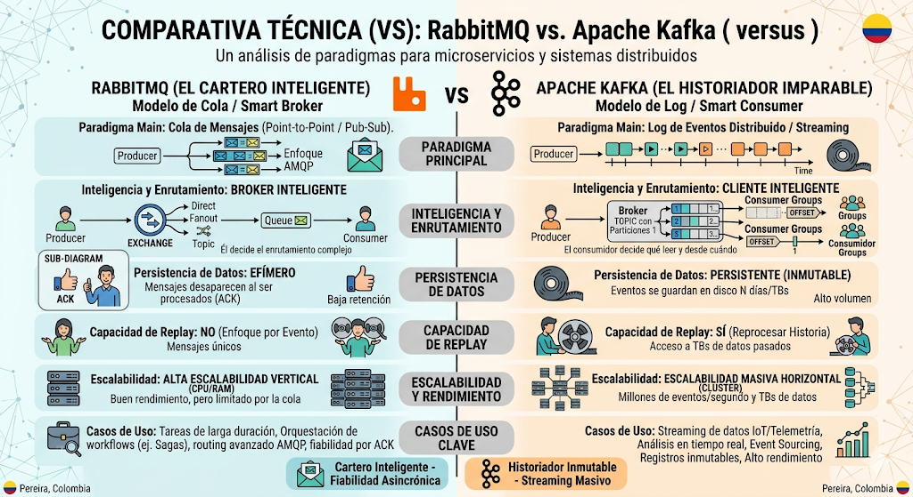
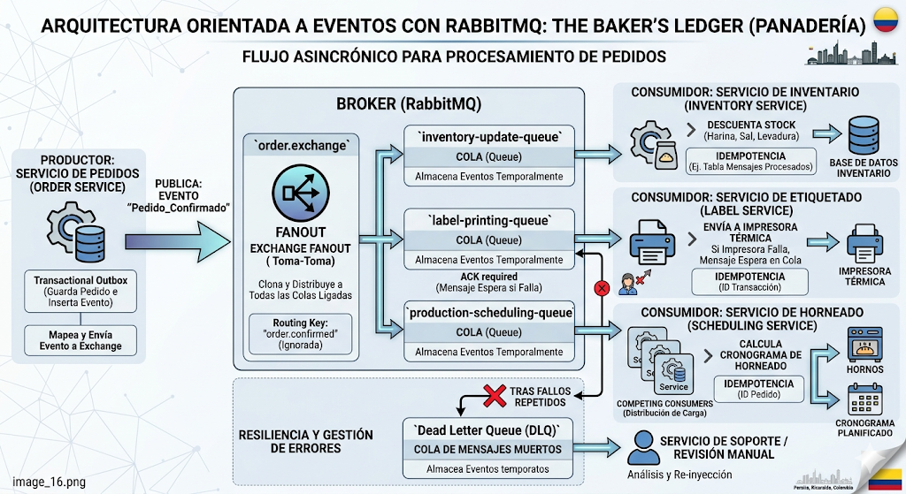
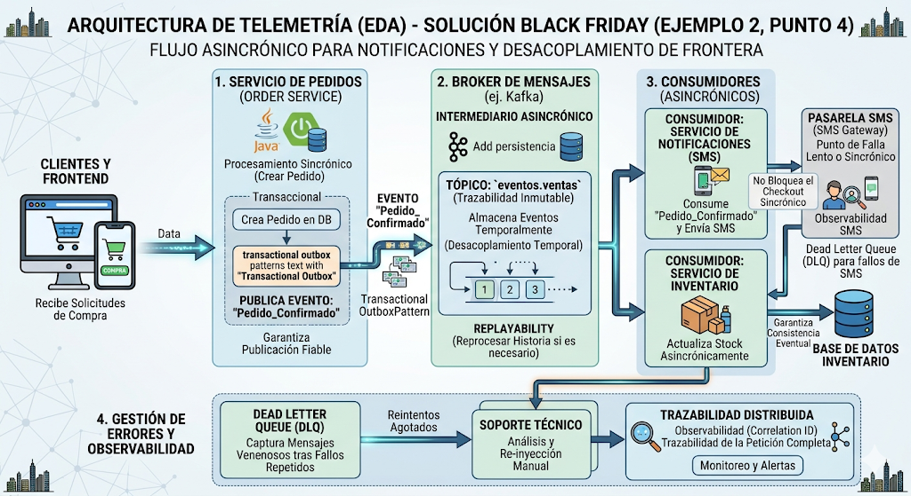

# Unidad 2 - Clase 3: Arquitectura Orientada a Eventos (EDA)

**Objetivo**: Comprender la necesidad estratégica de la arquitectura orientada a eventos (EDA) para resolver el acoplamiento temporal y espacial en sistemas distribuidos de alta escala. Analizar los criterios técnicos de selección entre RabbitMQ y Kafka, dominar patrones de resiliencia como la idempotencia, y diseñar estrategias robustas de gestión de errores y observabilidad para entornos asíncronos complejos.

## 1. El "Por Qué" de la EDA: Superando el Acoplamiento Temporal

En las arquitecturas monolíticas o en las primeras etapas de los microservicios, la comunicación suele ser puramente REST o gRPC (Sincrónica). Aunque este modelo es intuitivo y fácil de depurar inicialmente, a medida que el ecosistema de servicios crece, esta dependencia directa se transforma en un riesgo sistémico que limita la agilidad y la disponibilidad.

### 1.1. La Trampa del Sincronismo (Request/Response)

El modelo de petición/respuesta tradicional crea un **Acoplamiento Temporal** y una **Dependencia de Disponibilidad Crítica**. Esto significa que para que una transacción de usuario sea exitosa, todos los servicios involucrados en la cadena deben estar operativos y responder en una ventana de milisegundos aceptable.

- **El Efecto Dominó y Fallos en Cascada**: Imaginemos que el Servicio de Pedidos llama a Pagos, Inventario y Logística de forma sincrónica. Si el servicio de Logística (que quizás es el menos crítico para el flujo inmediato de compra) tiene una latencia alta o está caído, la transacción entera falla. Matemáticamente, la disponibilidad de tu sistema se reduce al producto de la disponibilidad de cada nodo involucrado ($Availability_{Total} = A \times B \times C...$). Cuantos más servicios sumes a la cadena sincrónica, más probable es que el sistema falle.
- **Agotamiento de Recursos (Thread Exhaustion)**:En plataformas de alta concurrencia como un Black Friday, el sincronismo es letal. Mientras el Servicio A espera la respuesta del Servicio B, mantiene hilos de ejecución de la JVM bloqueados. Si las respuestas de red se ralentizan, los hilos se agotan rápidamente esperando, lo que provoca que servicios sanos dejen de aceptar peticiones, derribando toda la infraestructura por simple "espera de red".
- **Presión de Red y Ancho de Banda**: Las llamadas sincrónicas constantes generan un tráfico "ruidoso" de red este-oeste que escala linealmente con cada nueva funcionalidad, dificultando la optimización de los túneles de comunicación y aumentando los costos de transferencia de datos en la nube.

### 1.2. La Solución: "Disparar y Olvidar" (Fire and Forget)

La EDA propone que los servicios se comuniquen mediante hechos irrefutables que ya ocurrieron (**Eventos**). En lugar de pedir permiso ("¿Puedes procesar este pago?"), el servicio notifica un hecho ("Se ha realizado un pedido").

- **Desacoplamiento Temporal**: El emisor publica el mensaje en un intermediario (Broker) y libera sus recursos (hilos, memoria) de inmediato. El receptor puede estar bajo mantenimiento o procesando una carga alta; el mensaje esperará en el broker de forma persistente y segura hasta que el consumidor esté listo.
- **Escalabilidad de Carga (Load Leveling)**: Los eventos actúan como un amortiguador (buffer). Si el sistema recibe un pico de 10,000 pedidos por segundo, los servicios de inventario o facturación pueden consumirlos a su propio ritmo constante (ej. 1,000 por segundo) sin colapsar la base de datos ni degradar la experiencia del usuario frontal, quien ya recibió su confirmación de "procesando".

## 2. ¿Cuándo funciona bien la EDA? (Casos de Éxito y Tipologías)

La arquitectura de eventos no es una bala de plata; introduce complejidad en la trazabilidad, por lo que brilla especialmente en estos escenarios de alto impacto:

1. **Sistemas de Alta Concurrencia y Reactividad**: Donde la latencia percibida por el usuario debe ser mínima. El usuario recibe un "Estamos procesando tu solicitud" mientras el trabajo pesado ocurre en segundo plano.
2. **Procesos de Larga Duración e Integración de Terceros**: Tareas como validaciones de identidad en bureaus de crédito externos, generación de reportes masivos o procesamiento de video. Si el proveedor externo tarda 1 minuto en responder, no queremos que nuestro servidor web mantenga una conexión abierta todo ese tiempo.
3. **Auditoría, Cumplimiento y Event Sourcing**: En banca o salud, donde no basta con saber el "estado actual" de una cuenta, sino que se necesita el historial inmutable de cada cambio para auditorías legales.
4. **Arquitecturas de Datos y Analítica**: Para alimentar sistemas de búsqueda (Elasticsearch), dashboards en tiempo real o modelos de Machine Learning sin interferir con la base de datos transaccional de producción.

### Tipos de Eventos

Es crucial para un arquitecto distinguir cómo viaja la información dentro del sistema, ya que cada tipo altera el nivel de acoplamiento y autonomía de los servicios:

- **Event Notification (Notificación Simple)**: El mensaje es minimalista, llevando apenas lo necesario para avisar que algo cambió (ej. `{ "orderId": 123, "status": "CREATED" }`).
  - **Implicación**: El consumidor recibe el aviso, pero si necesita saber el total de la compra o los artículos, debe realizar una llamada REST de vuelta al productor.
  - **Pros/Contras**: Es muy seguro en términos de privacidad (no viajan datos sensibles en el broker) y el mensaje es ligero, pero genera un "tráfico de retorno" que puede sobrecargar al productor si hay muchos consumidores.
- **Event-Carried State Transfer (Transferencia de Estado)**: El mensaje lleva la "foto completa" del recurso en ese instante (ej. `{ "id": 123, "total": 150.0, "items": [...], "customerEmail": "..." }`).
  - **Implicación**: El consumidor es **totalmente autónomo**. No necesita llamar a nadie; tiene todo lo necesario para procesar su lógica o incluso guardar una copia local de esos datos para consultas rápidas (Patrón CQRS).
  - **Pros/Contras**: Reduce la latencia y el acoplamiento al mínimo, pero aumenta el tamaño de los mensajes y existe el riesgo de que el consumidor trabaje con datos "obsoletos" si hay retrasos en el broker (Consistencia Eventual).
- **Domain Events vs. Integration Events**:
  - **Domain Events**: Son internos a un microservicio (o contexto delimitado). Representan cambios granulares que interesan a la lógica interna.
  - **Integration Events**: Son versiones "curadas" y simplificadas de los eventos de dominio destinadas a ser consumidas por otros sistemas. No queremos exponer el modelo interno de nuestra base de datos al exterior; solo enviamos lo que el contrato público permite.

## 3. RabbitMQ vs. Apache Kafka: ¿Cuál elegir?

La elección tecnológica no es por preferencia personal, sino por el modelo de consumo de datos que el negocio requiere.

| Característica          | RabbitMQ (El Cartero Inteligente)                                                                      | Kafka (El Historiador Imparable)                                                                   |
| ----------------------- | ------------------------------------------------------------------------------------------------------ | -------------------------------------------------------------------------------------------------- |
| **Paradigma**           | Cola de Mensajes (Punto a Punto o Pub-Sub).                                                            | Log de Eventos Distribuido y Persistente.                                                          |
| **Modelo de Datos**     | **Efímero**: El mensaje se elimina del broker en cuanto el consumidor confirma (ACK) su procesamiento. | **Persistente**: Los mensajes se guardan en disco por días o TBs, permitiendo lecturas múltiples.  |
| **Inteligencia**        | **Broker Inteligente**: Gestiona enrutamiento complejo (exchanges), reintentos y prioridades.          | **Cliente Inteligente**: El broker es simple; el consumidor decide desde qué punto leer (Offset).  |
| **Capacidad de Replay** | **No**. Una vez confirmado y borrado, es imposible recuperarlo desde el broker.                        | **Sí**. Puedes "rebobinar" y volver a procesar datos de hace 7 días si hubo un error en tu código. |
| **Escalabilidad**       | Alta, pero limitada por la memoria del nodo central para gestionar colas.                              | **Masiva y Elástica**: Diseñado para manejar billones de eventos y petabytes de datos en clusters. |
| **Protocolo**           | AMQP, MQTT, STOMP.                                                                                     | Protocolo binario propio optimizado sobre TCP.                                                     |



**Regla de Oro de Ingeniería**:

- Usa **RabbitMQ** cuando el flujo de trabajo es lineal, necesitas prioridades de mensajes o el mensaje debe ser destruido por seguridad tras su uso.
- Usa **Kafka** cuando necesitas una "Fuente de Verdad" persistente, quieres alimentar múltiples microservicios con el mismo flujo de datos o haces análisis de datos masivos.

## 4. Ejemplos de Arquitectura en el Mundo Real

### 4.1. Gestión de Panadería Industrial (RabbitMQ)

En una operación como "**The Baker's Ledger**", la orquestación de tareas dispares es el núcleo del éxito. Aquí RabbitMQ actúa como el "Gerente de Planta" que asigna trabajos de forma inteligente.

- **El Escenario Detallado**: Un pedido de 500 baguettes entra al sistema. Este hecho dispara un flujo de trabajo que involucra hardware físico (impresoras), procesos de cálculo (programación de hornos) y actualizaciones de estado contable.
- **Mecánica del Intercambio (Exchange)**: El Servicio de Pedidos publica un mensaje al `Exchange` de tipo **Fanout**. RabbitMQ, por diseño, clona este mensaje y lo envía a todas las colas vinculadas.
- **Autonomía ante Fallos de Hardware**: El servicio de etiquetado depende de impresoras térmicas que a menudo fallan. Si la impresora está fuera de línea, la cola `label-printing-queue` simplemente acumula los mensajes.
  - _Resiliencia_: Cuando el técnico repara la impresora, el servicio consume los 50 pedidos pendientes en segundos. El flujo de producción no se detiene; solo se desplaza en el tiempo.
- **Patrón de Competing Consumers**: Si la demanda de horneado crece, podemos levantar 3 instancias del `Scheduling Service`. RabbitMQ repartirá los mensajes entre ellas (Round Robin), asegurando que ninguna instancia se sature.
- **Mensajería con Prioridad**: Si llega un pedido de "Boda" o un cliente "VIP", RabbitMQ puede mover este mensaje al frente de la cola, algo fundamental en una industria donde el tiempo de fermentación es crítico.



### 4.2. Telemetría de Flota de Volquetas (Kafka)

Kafka se convierte en la "Caja Negra" inmutable de toda la flota. Aquí no estamos enviando tareas, estamos registrando el flujo del tiempo.

- **El Escenario Detallado**: 500 volquetas en zonas de construcción enviando ráfagas de 10 sensores cada una por segundo. Estamos hablando de 5,000 eventos por segundo que no pueden perderse si queremos analizar el rendimiento del motor o detectar robos de combustible.
- **Kafka como "Fuente Única de Verdad"**: A diferencia de RabbitMQ, Kafka no borra los datos. Esto permite que el sistema tenga "memoria".
- **Diversidad de Consumo (Fan-out masivo)**:
  - **Servicio de Mapas (Consumo de baja latencia)**: Lee solo el _final_ del log para actualizar la posición en tiempo real. No le importa lo que pasó hace una hora.
  - **Servicio de Alertas (Stream Processing)**: Analiza ventanas de tiempo. Si la velocidad promedia > 60km/h durante 5 minutos en una zona escolar, dispara una notificación push al supervisor.
  - **Servicio de Analítica (Consumo Histórico)**: Una vez al día, este servicio "rebobina" el tópico desde la medianoche para calcular el consumo total de combustible de la flota.
- **Escalabilidad mediante Particiones**: Kafka divide el tópico `telemetría` en 10 particiones. Esto permite que tengamos 10 servidores procesando datos en paralelo, cada uno encargado de un grupo de volquetas. Si la flota crece a 5,000 vehículos, simplemente añadimos más particiones y servidores sin apagar el sistema.
- **Capacidad de Auditoría**: Si un cliente reclama que un camión dañó una acera hace tres días, el equipo legal puede re-procesar los eventos de esa fecha exacta para verificar la telemetría del GPS, proporcionando una prueba técnica irrefutable.



## 5. Buenas Prácticas y Estrategias de Supervivencia

### 5.1. Idempotencia: El Mandamiento #1

En sistemas distribuidos, la red no es confiable. Puede ocurrir que un consumidor procese un mensaje, pero el aviso de confirmación (ACK) se pierda. El broker, por seguridad, volverá a enviar el mensaje.

- **Técnica**: Tu consumidor debe tener una Clave de Idempotencia (ej. un ID de transacción). Antes de procesar, verifica en una tabla rápida si ese ID ya fue gestionado. Si ya existe, ignoramos el mensaje con éxito (success) pero sin repetir la acción (ej. sin cobrar de nuevo al cliente).

### 5.2. Dead Letter Queues (DLQ) y Reintentos

Los mensajes "venenosos" son aquellos que siempre hacen fallar al código (ej. un JSON con formato inválido).

- **Estrategia**: Implementa una política de reintentos con retraso exponencial (ej. reintentar a los 5s, 30s, 5m). Si tras 3 intentos sigue fallando, mueve el mensaje a una DLQ.
- **Acción**: El equipo de soporte técnico debe tener alertas sobre la DLQ para inspeccionar manualmente el mensaje, corregir el bug y re-inyectarlo al flujo normal.

### 5.3. Observabilidad: Distributed Tracing

En EDA es fácil perder el rastro de una petición que salta entre 5 servicios.

- **Práctica**: Utiliza un Correlation ID (Trace ID) que viaje dentro del cuerpo del evento. Herramientas como Zipkin o Jaeger te permitirán visualizar una línea de tiempo: la petición nació en el Gateway, viajó por Kafka, fue procesada por Pedidos y terminó en Notificaciones, aunque todo haya ocurrido de forma asíncrona.

## 6. Laboratorio Práctico: Publicación y Consumo de Eventos con Apache Kafka en Spring Boot

**Objetivo**: Crear una aplicación Spring Boot moderna que publique eventos en un tópico de Kafka y los consuma asincrónicamente. Utilizaremos el módulo `spring-boot-docker-compose` para que el framework gestione el ciclo de vida del contenedor de Kafka automáticamente, y añadiremos una Interfaz Gráfica (Kafka UI) para monitorear los mensajes.

### 6.1. Configuración del Proyecto (Dependencias)

Si utilizas [Spring Initializr](https://start.spring.io), asegúrate de seleccionar las siguientes dependencias. Este es el fragmento clave de tu `pom.xml` (Maven):

```xml
<dependencies>

  <!-- Starter oficial de Spring para Apache Kafka -->
  <dependency>
    <groupId>org.springframework.boot</groupId>
    <artifactId>spring-boot-starter-kafka</artifactId>
  </dependency>

  <!-- Para exponer un endpoint REST y probar la publicación -->
  <dependency>
    <groupId>org.springframework.boot</groupId>
    <artifactId>spring-boot-starter-webmvc</artifactId>
  </dependency>

  <!-- MAGIA DE SPRING BOOT: Gestiona Docker Compose automáticamente -->
  <dependency>
    <groupId>org.springframework.boot</groupId>
    <artifactId>spring-boot-docker-compose</artifactId>
    <scope>runtime</scope>
    <optional>true</optional>
  </dependency>
</dependencies>
```

### 6.2. Infraestructura como Código (Docker Compose con Kafka UI)

Crea un archivo llamado `compose.yaml` en el directorio raíz de tu proyecto (junto al `pom.xml`).

Este archivo ahora levantará no solo el broker de Kafka, sino también una consola web gráfica que te permitirá inspeccionar los tópicos y los mensajes en tiempo real.

`compose.yaml`

```yaml
services:
  kafka:
    image: apache/kafka:latest
    ports:
      - "9092:9092"
    environment:
      # Configuramos dual-listeners: uno para Docker interno (29092) y otro para tu host/Spring Boot (9092)
      KAFKA_NODE_ID: 1
      KAFKA_PROCESS_ROLES: broker,controller
      KAFKA_LISTENERS: PLAINTEXT://:29092,CONTROLLER://:9093,PLAINTEXT_HOST://:9092
      KAFKA_ADVERTISED_LISTENERS: PLAINTEXT://kafka:29092,PLAINTEXT_HOST://localhost:9092
      KAFKA_CONTROLLER_LISTENER_NAMES: CONTROLLER
      KAFKA_LISTENER_SECURITY_PROTOCOL_MAP: CONTROLLER:PLAINTEXT,PLAINTEXT:PLAINTEXT,PLAINTEXT_HOST:PLAINTEXT
      KAFKA_INTER_BROKER_LISTENER_NAME: PLAINTEXT
      KAFKA_CONTROLLER_QUORUM_VOTERS: 1@localhost:9093
      # Configuraciones para entornos de desarrollo con un solo nodo
      KAFKA_OFFSETS_TOPIC_REPLICATION_FACTOR: 1
      KAFKA_TRANSACTION_STATE_LOG_REPLICATION_FACTOR: 1
      KAFKA_TRANSACTION_STATE_LOG_MIN_ISR: 1

  # Consola visual para gestionar Kafka
  kafka-ui:
    image: provectuslabs/kafka-ui:latest
    ports:
      - "8081:8080" # Se expone en el puerto 8081 para no chocar con Spring Boot (8080)
    environment:
      KAFKA_CLUSTERS_0_NAME: local-cluster
      KAFKA_CLUSTERS_0_BOOTSTRAPSERVERS: kafka:29092
    depends_on:
      - kafka
```

**Nota de Arquitectura**: Observa que no necesitamos declarar variables de entorno en el `application.yml` de Spring Boot para conectarnos a Kafka. El módulo `spring-boot-docker-compose` hace el "Service Connection" mágicamente a través del puerto expuesto.

### 6.3. Implementación del Código (Java)

Vamos a crear un escenario simple: Un servicio de "Notificaciones" que emite alertas y un consumidor que las lee.

#### 6.3.1. El Productor (Publisher)

Crearemos un controlador REST que actuará como nuestro adaptador de entrada para disparar eventos. Utilizaremos `KafkaTemplate` para enviar el mensaje al broker.

`NotificationController.java`

```java
package com.miempresa.kafka.controller;

import org.slf4j.Logger;
import org.slf4j.LoggerFactory;
import org.springframework.http.ResponseEntity;
import org.springframework.kafka.core.KafkaTemplate;
import org.springframework.web.bind.annotation.\*;

@RestController
@RequestMapping("/api/notifications")
public class NotificationController {

    private static final Logger log = LoggerFactory.getLogger(NotificationController.class);
    private static final String TOPIC = "topic-notifications";

    private final KafkaTemplate<String, String> kafkaTemplate;

    // Inyección de dependencias por constructor
    public NotificationController(KafkaTemplate<String, String> kafkaTemplate) {
        this.kafkaTemplate = kafkaTemplate;
    }

    @PostMapping
    public ResponseEntity<String> enviarNotification(@RequestBody String mensaje) {
        log.info("📡 Produciendo evento hacia Kafka: {}", mensaje);

        // Disparar y olvidar (Fire and forget)
        kafkaTemplate.send(TOPIC, mensaje);

        return ResponseEntity.ok("Evento publicado en el broker con éxito: " + mensaje);
    }

}
```

#### 6.3.2. El Consumidor (Subscriber)

Ahora creamos un servicio que estará escuchando (suscrito) al tópico. Usaremos la anotación `@KafkaListener`.

`NotificationListener.java`

```java
package com.miempresa.kafka.consumer;

import org.slf4j.Logger;
import org.slf4j.LoggerFactory;
import org.springframework.kafka.annotation.KafkaListener;
import org.springframework.stereotype.Service;

@Service
public class NotificationListener {

    private static final Logger log = LoggerFactory.getLogger(NotificationListener.class);

    // Escucha el tópico y se asigna a un Consumer Group
    @KafkaListener(topics = "topic-notifications", groupId = "grupo-notifications-1")
    public void consumirMensaje(String mensaje) {
        log.info("✅ Evento consumido exitosamente desde Kafka: {}", mensaje);

        // Aquí iría tu lógica de negocio (ej. enviar un email, guardar en BD, etc.)
    }

}
```

### 6.4. Ejecución, Consola UI y Pruebas

1. **Asegúrate de tener Docker Desktop o el motor de Docker en ejecución** en tu máquina.
2. Inicia tu aplicación Spring Boot (ej. ejecutando la clase `Application.java` o con `./mvnw spring-boot:run`).
3. Observa los logs en la consola: Verás que Spring Boot detecta el `compose.yaml` y levanta automáticamente tanto `Kafka` como `Kafka UI`.

#### 6.4.1. Explora la Consola de Kafka (Kafka UI)

Antes de enviar el mensaje, abre tu navegador y entra a la interfaz gráfica:
👉 [http://localhost:8081](http://localhost:8081)

Allí podrás ver tu cluster local, inspeccionar los "Topics", ver quiénes están suscritos ("Consumers") e incluso producir mensajes manualmente sin usar tu aplicación.

### 6.4.2. Prueba el flujo asíncrono

Abre una terminal y haz una petición POST a tu controlador:

```bash
curl -X POST http://localhost:8080/api/notifications \
 -H "Content-Type: text/plain" \
 -d "Alerta: Servidor de BD con alta latencia"
```

### 6.4.3. Resultados esperados

1. **En la consola de Spring Boot** verás el ciclo de vida del evento:

   ```plain
   202X-XX-XX ... : 📡 Produciendo evento hacia Kafka: Alerta: Servidor de BD con alta latencia
   202X-XX-XX ... : ✅ Evento consumido exitosamente desde Kafka: Alerta: Servidor de BD con alta latencia
   ```

2. **En Kafka UI (http://localhost:8081)**:
   - Ve a la sección **Topics** -> Selecciona `topic-notifications` -> Ve a la pestaña **Messages**.
   - ¡Podrás ver visualmente el mensaje de alerta guardado en el log de eventos de Kafka!
