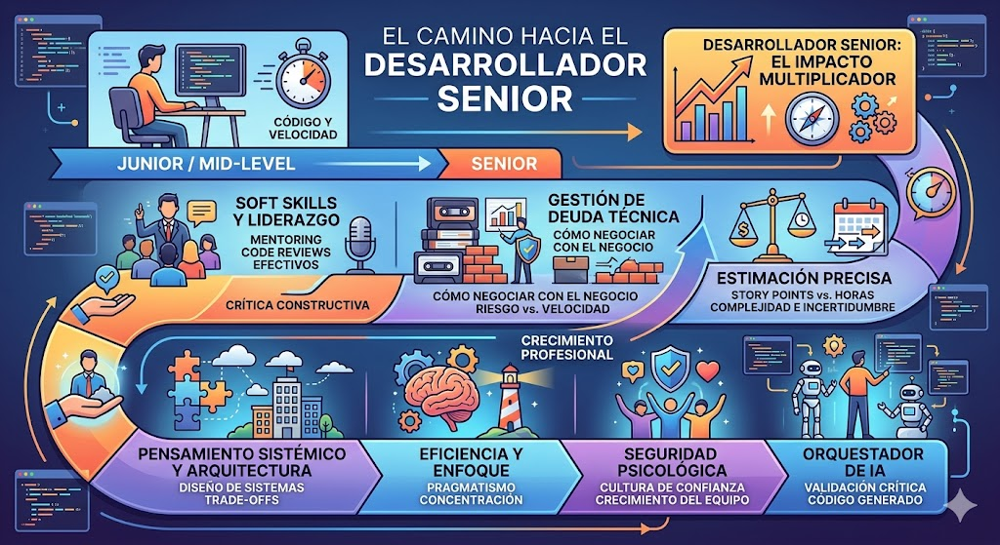

# Unidad 2 - Clase 7: El Camino del Desarrollador Senior

## Introducción: El Cambio de Paradigma

La transición a Senior implica pasar de ser un **solucionador de problemas técnicos** a ser un **habilitador de soluciones de negocio**. Un Senior no es el que pica más código; es el que hace que todo el equipo escriba mejor código. Este cambio requiere entender que el código es solo una herramienta, no el fin último. La madurez profesional se alcanza cuando el desarrollador prioriza la mantenibilidad, la escalabilidad humana y el valor entregado por encima de la complejidad técnica o el brillo personal.

## 1. El Senior no es el que más codifica

### El Arte del Mentoring y la Multiplicación de Impacto

Un desarrollador Senior entiende que su activo más valioso no es su conocimiento individual, sino la capacidad de elevar el nivel promedio del equipo.

- **Multiplicador de Fuerza**: Si tú escribes 100 líneas, avanzas tú. Si dedicas tiempo a formar a 5 Juniors para que escriban 50 líneas de alta calidad cada uno, el equipo avanza 250 líneas con una base sólida. El éxito del Senior se mide por la autonomía que adquieren sus pupilos.
- **Sponsorship vs. Mentoring**: Mientras que el _mentoring_ enseña "cómo hacer las cosas", el _sponsorship_ implica usar tu influencia para dar visibilidad al talento emergente. Esto significa delegar tareas críticas a otros y asegurar que reciban el crédito ante los stakeholders, preparando así la siguiente generación de líderes.
- **Pair Programming Estratégico**: No es sentarse a ver cómo el otro escribe; es guiar el proceso de pensamiento. Un Senior usa el pair programming para transferir contexto del negocio y "olfato" para detectar bugs antes de que ocurran.

### Code Reviews: De la Crítica a la Construcción

El Code Review no es un campo de batalla para el ego ni una fase de auditoría policial, sino un punto de control de calidad y, sobre todo, una herramienta educativa bidireccional.

- **Regla de Oro: _La Pregunta sobre la Afirmación_**: Siempre pregunta "por qué" o "¿cuál fue tu razonamiento aquí?" antes de marcar algo como error. El autor puede tener un contexto de una limitación técnica o un requisito de negocio que tú desconoces.
- **Crítica Constructiva y Empática**:
  - **Enfoque Junior (Directivo)**: "Esto está mal, cámbialo porque es ineficiente".
  - **Enfoque Senior (Educativo)**: "Entiendo este enfoque y funciona correctamente para los requisitos actuales. Sin embargo, ¿has considerado cómo se comportará este bucle si el array de entrada crece a 10,000 elementos? Quizás una estructura de Set nos daría una búsqueda $O(1)$ y evitaría cuellos de botella en el futuro".
  - **Estandarización y Automatización**: Un Senior sabe que discutir sobre espacios, comas o nombres de variables en un PR es un desperdicio de tiempo. La solución es implementar linters y formatters automáticos (como Prettier o ESLint). El tiempo del humano se reserva para la lógica de negocio y la arquitectura.

## 2. Gestión de Deuda Técnica y Negociación

La deuda técnica es una herramienta financiera: puede ayudarte a moverte rápido hoy, pero los intereses acumulados pueden quebrar el proyecto si no se gestionan.

### Cómo negociar con el Negocio y Traducir el Valor

El negocio rara vez entiende el término "refactorización", pero entiende perfectamente los conceptos de "riesgo", "coste de oportunidad" y "velocidad de entrega".

- **Traducción a Impacto Económico**: No digas "el código está sucio y hay que limpiarlo". Di: "Actualmente, la complejidad en el módulo de pagos es tan alta que cualquier cambio pequeño nos toma 3 días en lugar de 4 horas, y el riesgo de romper el sistema es del 30%. Si invertimos esta semana en estabilizarlo, recuperaremos esa inversión en el próximo mes gracias a la velocidad ganada".
- **La Regla del 20% y el Mantenimiento Continuo**: Un Senior no espera a que el sistema explote para pedir permiso. Integra el mantenimiento como parte del coste de cada tarea o negocia un margen fijo del sprint (el 20% es el estándar de la industria) dedicado exclusivamente a mejorar la infraestructura y pagar deuda.
- **El Cuadrante de la Deuda**: Es vital categorizar la deuda:
  - **Imprudente e Intencionada**: "No tenemos tiempo para tests, salgamos así". (Debe evitarse).
  - **Prudente e Intencionada**: "Necesitamos validar el mercado en 48 horas; usemos una solución temporal y la corregiremos si el producto tiene éxito". (Es aceptable si hay un plan de retorno).
  - **Inadvertida**: Aquella que surge porque aprendimos una mejor forma de hacer las cosas seis meses después. (Es parte natural de la evolución).

## 3. Estimación: El Gran Desafío de la Predictibilidad

Estimar es una de las tareas más difíciles en ingeniería porque implica predecir el futuro basándose en requisitos a menudo vagos.

### Story Points vs. Horas: La Lógica del Esfuerzo Relativo

- **El Fallo de las Horas**: El tiempo es una medida absoluta, pero la capacidad es altamente subjetiva. Una "hora" de un Senior no rinde lo mismo que una "hora" de un Junior. Además, estimar en horas no tiene en cuenta la ley de Parkinson ni las interrupciones constantes (reuniones, correos, incidentes).
- **Story Points (La Triada de la Complejidad)**: Los puntos miden el esfuerzo relativo basándose en tres factores:
  1. **Complejidad**: ¿Qué tan difícil es la lógica técnica?
  2. **Incertidumbre**: ¿Qué tanto desconocemos de la implementación o de las dependencias externas?
  3. **Esfuerzo/Volumen**: ¿Cuántas piezas hay que tocar, aunque la tarea sea sencilla?
- **Estrategia de Descomposición (Divide y Vencerás)**: Un Senior es capaz de ver cuando una tarea es "demasiado grande para ser verdad". Si una historia recibe un 13 o un 21 en la escala de Fibonacci, el Senior detiene la conversación: "No entendemos esto lo suficiente". El trabajo entonces es desglosar esa épica en tareas de 3 o 5 puntos, donde el riesgo es manejable y la visibilidad es clara.

## 4. Pensamiento Sistémico y Arquitectura

Un desarrollador Senior no solo escribe funciones que funcionan; diseña sistemas que sobreviven al tiempo y a las personas.

- **Trade-offs (El Arte de los Compromisos)**: Un Senior sabe que no existe la "mejor tecnología" o el "patrón perfecto", solo soluciones con diferentes pros y contras. Ante una propuesta, un Senior siempre pregunta: "¿Qué estamos sacrificando aquí? ¿Consistencia por disponibilidad? ¿Velocidad de desarrollo por rendimiento?".
- **Escalabilidad Humana y Código Aburrido**: El código "inteligente" o excesivamente complejo que solo el autor entiende es una deuda técnica andante. El Senior aboga por el "código aburrido": simple, explícito y fácil de borrar o modificar por cualquier otro miembro del equipo meses después.
- **Manejo de la Incertidumbre y Fallos**: El Senior diseña asumiendo que las cosas van a fallar. Implementa circuit breakers, estrategias de reintento y asegura una "degradación elegante" (_graceful degradation_) para que el fallo de un servicio secundario no tumbe toda la plataforma.

## 5. El Senior como Puente (Comunicación y Negocio)

- **Comunicación con No-Técnicos (Empatía Cognitiva)**: Un Senior actúa como traductor. Es capaz de explicar por qué una caída en la base de datos afecta la conversión de ventas, sin necesidad de hablar de índices o bloqueos. Su objetivo es que el Product Manager tome decisiones informadas basadas en la realidad técnica.
- **Resolución de Conflictos Técnicos**: Las discusiones sobre arquitecturas pueden volverse personales. El Senior actúa como moderador, bajando las revoluciones y reconduciendo la charla hacia datos objetivos y objetivos de negocio, evitando que el equipo se bloquee por parálisis por análisis.
- **Ética y el Poder del "No"**: La responsabilidad última de la integridad del sistema recae en los perfiles experimentados. Un Senior debe ser capaz de decir "no" (o "no de esta manera") cuando una presión externa pone en riesgo la seguridad de los datos de los usuarios o la estabilidad a largo plazo del producto.

## 6. Eficiencia, Enfoque y Pragmatismo

- **Deep Work y Protección del Equipo**: El Senior sabe que el contexto técnico se pierde con cada interrupción. Por ello, protege los bloques de tiempo de concentración y sabe identificar qué reuniones son innecesarias o podrían haber sido un documento asíncrono.
- **Evitar la Sobre-ingeniería (YAGNI)**: "You Ain't Gonna Need It". El impulso de construir una arquitectura microservicios para un producto que aún no tiene 100 usuarios es un error de Junior. El Senior aplica el pragmatismo: construye lo necesario para hoy, pero dejando la puerta abierta para escalar mañana.
- **Aprender a Desaprender**: La industria evoluciona cada semana. El Senior mantiene una curiosidad insaciable pero crítica. No adopta cada nuevo framework por moda (_hype-driven development_), sino que evalúa si realmente resuelve un problema que el equipo tiene actualmente.

## 7. Inteligencia Emocional y Seguridad Psicológica

El liderazgo técnico moderno no se basa en el rango jerárquico, sino en la confianza y el respeto mutuo.

- **Seguridad Psicológica como Motor de Innovación**: Según estudios (como el Proyecto Aristóteles de Google), la característica nº1 de los equipos de alto rendimiento es la seguridad psicológica. El Senior es el encargado de crear un espacio donde un Junior se sienta seguro diciendo "no entiendo esto" o "cometí un error borrando la tabla de staging". Sin miedo al juicio, el equipo aprende y corrige más rápido.
- **Humildad Intelectual y Vulnerabilidad**: No hay nada más inspirador para un equipo que ver a su referente técnico decir: "Me equivoqué en esta decisión técnica, busquemos cómo arreglarlo juntos". Esto rompe el pedestal del Senior y fomenta una cultura de responsabilidad compartida en lugar de una de culpa.
- **Gestión de Expectativas y Honestidad Radical**: El Senior no oculta los problemas. Si se detecta un retraso, informa proactivamente a los stakeholders con un plan de mitigación. La confianza se gana siendo honesto cuando las cosas van mal, no solo cuando van bien.

## 8. El Senior en la Era de la IA

La Inteligencia Artificial ha cambiado la velocidad del desarrollo, pero ha elevado el listón del criterio técnico necesario.

- **De Escritor de Código a Revisor Crítico**: En un mundo donde la IA puede generar cientos de líneas en segundos, el Senior se convierte en un auditor de calidad. Su labor no es escribir el código, sino validar que el output de la IA cumple con los estándares de seguridad, no introduce deuda técnica oculta y se integra armoniosamente en la arquitectura global.
- **Curación de Contexto y Prompt Engineering**: La IA es solo un espejo del contexto que recibe. El Senior es quien define la estrategia, los límites del sistema y las reglas de negocio para que las herramientas de IA produzcan resultados útiles y no "alucinaciones" técnicas peligrosas.
- **El Guardián del "Por Qué"**: La IA domina el "cómo" (sintaxis y patrones comunes), pero el Senior domina el "por qué" (visión estratégica, necesidades específicas del cliente, ética del software). La IA acelera la tarea, pero el Senior lidera la dirección de la solución.

## Conclusión: La Huella del Senior

Ser Senior es, en última instancia, una transición desde el "yo" hacia el "nosotros". Es tener la madurez para entender que tu éxito individual es irrelevante si el proyecto fracasa o si el equipo termina quemado. El Senior es el arquitecto del código, pero también el guardián de la cultura y el facilitador de la visión de negocio.

> "Tu legado no serán las líneas de código que escribiste, sino las carreras de los desarrolladores que ayudaste a construir y los problemas reales que resolviste para las personas."
