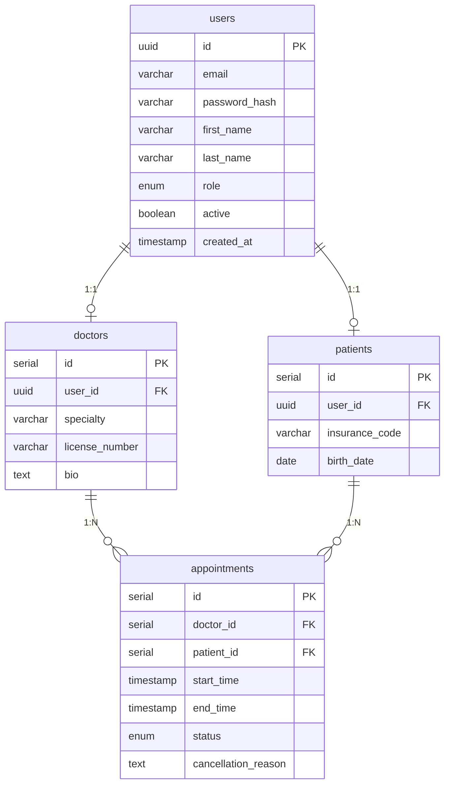
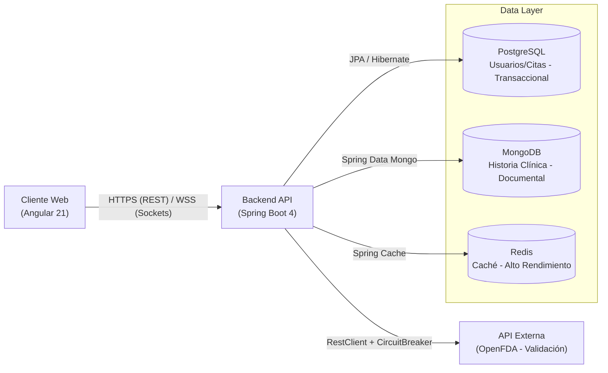

# Documento de Especificación de Requisitos de Software (SRS)

## Proyecto: Sistema de Gestión Hospitalaria "MediCare"

- **Versión**: 1.0
- **Estado**: Aprobado para Desarrollo y Arquitectura

## 1. Introducción

### 1.1 Propósito

El propósito principal de este documento es definir de manera exhaustiva los requisitos funcionales y no funcionales para el sistema "MediCare". Este documento servirá como la fuente única de verdad para el equipo de desarrollo, arquitectura y aseguramiento de calidad (QA). El sistema "MediCare" se concibe como la plataforma central para la transformación digital de la gestión operativa, clínica y administrativa de una red de clínicas médicas modernas, reemplazando procesos manuales y sistemas legados fragmentados por una solución unificada y escalable.

### 1.2 Alcance del Producto

MediCare es una solución integral **Full Stack** diseñada para cubrir el ciclo de vida completo de la atención al paciente. El alcance del sistema incluye:

- **Portal del Paciente**: Una interfaz de autogestión que permite a los usuarios reservar citas, visualizar su historial médico y gestionar su perfil personal sin intervención administrativa, reduciendo la carga operativa del call center.
- **Portal del Médico**: Un espacio de trabajo optimizado para la gestión de agendas en tiempo real y el registro de notas clínicas con estructuras de datos flexibles, adaptables a diferentes especialidades médicas.
- **Panel Administrativo**: Herramientas para controlar la seguridad, gestionar usuarios y roles, y auditar todas las operaciones críticas del sistema para garantizar el cumplimiento normativo.

Técnicamente, el sistema integrará bases de datos relacionales (PostgreSQL) para garantizar la integridad transaccional en citas y facturación, y bases de datos documentales (MongoDB) para ofrecer la flexibilidad necesaria en el registro clínico. Todo esto será expuesto a través de una API REST segura y eficiente, consumida por una SPA (Single Page Application) moderna y responsiva.

## 2. Actores del Sistema

| Actor | Descripción Detallada |
| --- | --- |
| **Paciente (Patient)** | Usuario final que busca atención médica. Puede ser un usuario nuevo o recurrente. Se registra libremente en la plataforma y tiene permisos limitados a su propia información y gestión de citas. |
| **Médico (Doctor)** | Profesional de la salud empleado por la clínica o asociado externo. Requiere una cuenta creada y validada por un Administrador. Interactúa principalmente con la agenda y los módulos de historia clínica. |
| **Administrador (Admin)** | Personal de TI o gestión operativa de la clínica. Tiene acceso total a la configuración del sistema, gestión de usuarios, roles y visualización de logs de auditoría. Es responsable del mantenimiento de los catálogos maestros. |
| **Sistema Externo (API)** | Servicio automatizado de terceros (ej. OpenFDA o sistemas de seguros) con el que MediCare se comunica para validar datos críticos como la existencia de medicamentos o la elegibilidad del seguro. |

## 3. Requerimientos Funcionales (RF)

### Módulo 1: Gestión de Identidad y Acceso (IAM)

- **RF-001 (Registro de Pacientes)**: El sistema debe permitir el auto-registro de Pacientes mediante un formulario público. Se deben solicitar datos obligatorios como nombre, apellido, email y una contraseña segura. El sistema debe validar que el email no esté previamente registrado para evitar duplicidad de cuentas.
- **RF-002 (Autenticación Segura)**: El sistema debe autenticar a todos los usuarios (Pacientes, Médicos, Admins) mediante credenciales (email/password). Tras una validación exitosa, el sistema generará y devolverá un **JWT (JSON Web Token)** firmado. Este token incluirá "claims" con información del usuario y tendrá una vigencia limitada (ej. 2 horas) para minimizar riesgos de seguridad.
- **RF-003 (Control de Acceso Basado en Roles - RBAC)**: El sistema debe restringir estrictamente el acceso a los endpoints de la API basándose en los roles asignados en el token:
  - `ROLE_ADMIN`: Acceso total.
  - `ROLE_DOCTOR`: Acceso a agenda propia y registros médicos asignados.
  - `ROLE_PATIENT`: Acceso exclusivo a sus propios datos y citas.

### Módulo 2: Gestión de Citas (Core)

- **RF-004 (Búsqueda Avanzada)**: Los pacientes deben poder buscar médicos disponibles utilizando filtros dinámicos por especialidad o búsqueda por nombre. La interfaz de búsqueda debe ser reactiva (type-ahead), mostrando resultados sugeridos a medida que el usuario escribe para mejorar la experiencia de usuario.
- **RF-005 (Agendamiento de Citas)**: Un paciente autenticado puede reservar un bloque horario específico con un médico. El proceso debe confirmar la selección y persistir la cita en estado "PENDIENTE" o "CONFIRMADA" según la configuración.
- **RF-006 (Validación Estricta de Conflictos)**: El sistema impedirá terminantemente agendar una cita si el médico seleccionado ya tiene otra cita asignada activa en ese mismo rango de fecha y hora. Esta validación debe manejar la concurrencia para evitar condiciones de carrera.
- **RF-007 (Gestión de Cancelaciones)**: Un paciente puede cancelar una cita previamente agendada.
  - _Regla de Negocio_: Para evitar huecos improductivos en la agenda médica, no se permite cancelar con menos de **24 horas** de antelación al inicio de la cita. El sistema debe validar la hora actual contra la hora de la cita.
- **RF-008 (Notificación Real-Time)**: Cuando un paciente agenda o cancela una cita exitosamente, el médico asignado (si tiene la sesión activa) debe recibir una notificación visual inmediata (tipo Toast) en su panel de control, actualizando su vista de agenda sin necesidad de recargar la página manualmente.

### Módulo 3: Historia Clínica Electrónica

- **RF-009 (Gestión de Notas Clínicas)**: El médico debe poder crear, editar y consultar notas de evolución asociadas a una cita finalizada. Estas notas constituyen el registro legal y médico de la atención.
- **RF-010 (Flexibilidad de Datos Clínicos)**: Dado que cada especialidad requiere registrar información diferente, el sistema debe permitir guardar estructuras de datos variables en la nota clínica (ej. un Cardiólogo guarda presión arterial, un Dermatólogo guarda descripción de lesiones) sin alterar el esquema de la base de datos relacional. Para esto se utilizará MongoDB como almacén de documentos flexible.
- **RF-011 (Gestión de Adjuntos)**: El usuario debe poder subir archivos, como una imagen de perfil o documentos médicos (resultados de laboratorios, radiografías). El sistema debe validar el tipo de archivo (MIME type) y el tamaño máximo permitido, optimizando su almacenamiento y asociando la URL del recurso al registro correspondiente.

### Módulo 4: Integraciones y Resiliencia

- **RF-012 (Validación Externa de Medicamentos)**: Al momento de generar una prescripción en una nota clínica, el sistema debe consultar una API externa confiable para validar la existencia y correcta denominación del medicamento ingresado.
- **RF-013 (Tolerancia a Fallos y Degradación)**: Si la API externa no responde en un tiempo definido (ej. 2 segundos) o retorna error, el sistema debe aplicar un patrón de **Circuit Breaker** para degradarse elegantemente. Esto permitirá al médico guardar la nota con una advertencia visual de "Verificación Pendiente" en lugar de bloquear el proceso de guardado o mostrar un error técnico.

## 4. Requerimientos No Funcionales (RNF)

### RNF-01: Arquitectura y Tecnología

- **Backend Moderno**: Implementado en **Java 25** utilizando **Spring Boot 4**. Se debe seguir una Arquitectura de Capas estricta (Controller, Service, Repository) para asegurar la mantenibilidad y testabilidad del código.
- **Frontend Reactivo**: Desarrollado en **Angular 21+**, utilizando una arquitectura basada en Componentes Standalone y Signals para la gestión del estado, garantizando un alto rendimiento en el cliente.
- **Diseño de Interfaz**: Uso del framework **Tailwind CSS** con un enfoque Mobile-First para asegurar que la aplicación sea accesible y funcional en dispositivos móviles y de escritorio.

### RNF-02: Datos y Persistencia Híbrida

- **Estrategia de Persistencia Políglota**:
  - **PostgreSQL**: Para datos estructurados que requieren integridad referencial fuerte y transacciones ACID complejas (Usuarios, Citas, Facturación).
  - **MongoDB**: Para datos semi-estructurados o con esquemas evolutivos como las Notas Clínicas y los Logs de Auditoría masivos.
- **Gestión de Esquema**: El esquema de la base de datos relacional debe gestionarse y versionarse mediante scripts de migración automatizados (**Flyway**), prohibiendo la modificación automática del esquema (`ddl-auto`) en entornos productivos.

### RNF-03: Seguridad y Privacidad

- **Protección de Credenciales**: Las contraseñas nunca deben almacenarse en texto plano; se debe utilizar un algoritmo de hash fuerte y lento (como BCrypt) con "salt" aleatorio.
- **Exposición de Datos**: El sistema no debe exponer IDs secuenciales de base de datos ni estructuras internas en la API pública. Se debe implementar el patrón **DTO (Data Transfer Object)** para todas las respuestas y peticiones.
- **Comunicación Segura**: Todo el tráfico de datos entre el cliente y el servidor debe realizarse sobre HTTPS (simulado en entorno local con certificados autofirmados si es necesario) para proteger la confidencialidad de los datos médicos.

### RNF-04: Rendimiento y Escalabilidad

- **Concurrencia con Virtual Threads**: El backend debe configurarse para utilizar hilos virtuales (Project Loom), permitiendo manejar una alta concurrencia de operaciones de entrada/salida (I/O) con un consumo de recursos significativamente menor que los hilos de plataforma tradicionales.
- **Caché de Segundo Nivel**: Los datos de acceso frecuente y baja volatilidad (como catálogos de médicos, especialidades y configuración) deben almacenarse en una caché distribuida (**Redis**) para garantizar tiempos de respuesta inferiores a 50ms en operaciones de lectura.
- **Optimización de Recursos**: Las imágenes subidas por los usuarios deben comprimirse y optimizarse en el cliente antes de ser enviadas al servidor para reducir el consumo de ancho de banda y almacenamiento.

### RNF-05: Calidad y Observabilidad

- **Estrategia de Testing**: Se exige una cobertura de pruebas unitarias superior al 70% en el Backend (JUnit/Mockito) y Frontend (Vitest). Además, se debe implementar al menos un flujo crítico (ej. Agendar Cita) cubierto por pruebas End-to-End (Cypress) automatizadas.
- **Trazabilidad**: Los logs deben estar estructurados (formato JSON preferiblemente) e incluir identificadores de correlación (Trace ID) para permitir el seguimiento de una petición a través de todas las capas del sistema.

## 5. Modelo de Datos (Detallado)

### 5.1 Entidades Relacionales (PostgreSQL)

Diseñado para garantizar la integridad referencial, consistencia de datos y soporte a transacciones complejas.



- **User (`users`)**:
  - `id` (PK, UUID): Identificador único global, preferido sobre secuenciales para evitar enumeración.
  - `email` (Unique, Not Null): Credencial de acceso principal.
  - `password_hash` (Not Null): Hash de seguridad.
  - `first_name`, `last_name`: Datos personales básicos para visualización.
  - `role` (Enum): Define los permisos ('ADMIN', 'DOCTOR', 'PATIENT').
  - `active` (Boolean): Bandera para permitir el borrado lógico sin perder histórico.
  - `created_at`: Timestamp automático para auditoría de creación.
- **Doctor (`doctors`)**:
  - `id` (PK, Serial): Identificador interno.
  - `user_id` (FK, Unique): Relación 1:1 estricta con la tabla `users`.
  - `specialty` (String/Enum): Especialidad médica (ej. Cardiología, Pediatría).
  - `license_number` (String, Unique): Número de matrícula profesional para validación legal.
  - `bio` (Text): Descripción extensa para el perfil público del médico.
- **Patient (`patients`)**:
  - `id` (PK, Serial): Identificador interno.
  - `user_id` (FK, Unique): Relación 1:1 estricta con la tabla `users`.
  - `insurance_code` (String): Número de póliza o seguro médico.
  - `birth_date` (Date): Fundamental para cálculos automáticos de edad y factores de riesgo.
- **Appointment (`appointments`)**:
  - `id` (PK, Serial): Identificador único de la cita.
  - `doctor_id` (FK): Relación N:1 con doctors.
  - `patient_id` (FK): Relación N:1 con patients.
  - `start_time` (Timestamp): Fecha y hora exacta de inicio de la consulta.
  - `end_time` (Timestamp): Fecha y hora de fin (calculado automáticamente según duración estándar o asignado manualmente).
  - `status` (Enum): Máquina de estados de la cita: 'PENDING', 'CONFIRMED', 'CANCELLED', 'COMPLETED'.
  - `cancellation_reason` (Text, Nullable): Campo obligatorio solo si el estado pasa a 'CANCELLED'.

### 5.2 Colecciones Documentales (MongoDB)

Diseñado para manejar la variabilidad de los datos clínicos y soportar grandes volúmenes de escritura histórica.

- **MedicalRecord (`medical_records`)**:
  - `_id` (ObjectId): Identificador único del documento.
  - `appointmentId` (Long, Indexed): Vínculo fuerte con la cita SQL para integridad cruzada.
  - `patientId` (Long): Indizado para permitir búsquedas rápidas del historial completo de un paciente.
  - `doctorId` (Long): Identifica al autor profesional de la nota.
  - `createdAt` (ISODate): Fecha de creación del registro.
  - `sections` (Array of Objects): Estructura dinámica que permite almacenar diferentes tipos de datos según la especialidad.

    ```json
    [
      { "type": "symptoms", "content": ["fiebre alta", "tos seca"] },
      { "type": "diagnosis", "content": "Bronquitis Aguda" },
      { "type": "prescription", "drugs": [{ "name": "Ibuprofeno", "dose": "400mg", "frequency": "8h" }] },
      { "type": "vitals", "data": { "bp": "120/80", "weight": "70kg" } }
    ]
    ```

  - `attachments` (Array of Strings): Lista de URLs que apuntan a imágenes o documentos almacenados en el sistema de archivos o cloud storage.
- **AuditLog (`audit_logs`)**:
  - `_id` (ObjectId).
  - `entityType` (String): Nombre de la entidad afectada (ej. "Appointment", "User").
  - `entityId` (String): ID específico de la entidad afectada.
  - `action` (String): Tipo de operación realizada ("CREATE", "UPDATE", "DELETE", "LOGIN").
  - `performedBy` (String): Email o ID del usuario que realizó la acción.
  - `timestamp` (ISODate): Momento exacto del evento.
  - `changes` (Object): Snapshot o diferencial del cambio para análisis forense `{ "oldStatus": "PENDING", "newStatus": "CONFIRMED" }`.

## 6. Diagrama de Arquitectura (Alto Nivel)

El siguiente diagrama ilustra el flujo de datos y la interacción entre los componentes del sistema MediCare.


